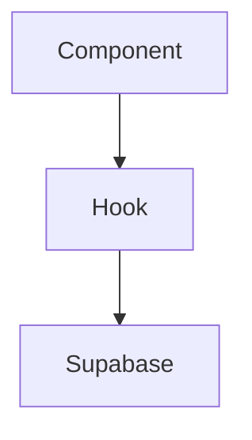

# 📋 Development Guidelines - Supernet Fiber Connect

**Versão:** 2.0.0  
**Data:** 2025-01-19  
**Status:** ✅ Aprovado em Auditoria

---

## 🎯 Objetivo

Este documento define **todas as diretrizes obrigatórias** para desenvolvimento de novas funcionalidades no sistema Supernet Fiber Connect, garantindo:
- ✅ Aprovação em auditorias de código
- ✅ Consistência arquitetural
- ✅ Segurança e conformidade (LGPD)
- ✅ Performance e escalabilidade
- ✅ Manutenibilidade de longo prazo

---

## 1. 🔷 TypeScript Strict Mode

### ❌ PROIBIDO
```typescript
// NUNCA use any types
function processData(data: any) { ... }

// NUNCA use type assertions desnecessários
const user = data as any;

// NUNCA ignore erros de tipo
// @ts-ignore
```

### ✅ OBRIGATÓRIO
```typescript
// Sempre tipar explicitamente
interface UserData {
  id: string;
  name: string;
  email: string;
}

function processData(data: UserData): ProcessedResult {
  // Lógica com tipos seguros
}

// Usar tipos do Supabase
import { Database } from '@/integrations/supabase/types';
type Profile = Database['public']['Tables']['profiles']['Row'];

// Criar types/interfaces customizados quando necessário
interface ValidationResult {
  isValid: boolean;
  errors: string[];
}
```

### 🔍 Checklist TypeScript
- [ ] Zero `any` types no código
- [ ] Interfaces/types definidos para objetos complexos
- [ ] Tipos do Supabase importados de `types.ts`
- [ ] Funções com tipos de retorno explícitos
- [ ] Props de componentes React tipados

---

## 2. 🎨 Design System

### ❌ CORES DIRETAS PROIBIDAS
```tsx
// NUNCA
<div className="text-white bg-blue-500 border-red-600">
<Button className="bg-purple-700 hover:bg-purple-800">

// NUNCA use hex/rgb direto
<div style={{ color: '#ffffff', backgroundColor: '#3b82f6' }}>
```

### ✅ TOKENS SEMÂNTICOS OBRIGATÓRIOS
```tsx
// SEMPRE usar tokens do design system
<div className="text-foreground bg-primary border-border">
<Button variant="default">  {/* usa hsl(var(--primary)) */}

// Cores definidas em index.css e tailwind.config.ts
<Card className="bg-card text-card-foreground">
<Alert className="bg-destructive/10 text-destructive">
```

### 📐 Estrutura de Cores (HSL)
```css
/* index.css - SEMPRE em HSL */
:root {
  --primary: 222 47% 11%;
  --foreground: 222 47% 11%;
  --background: 0 0% 100%;
  --card: 0 0% 100%;
  --border: 214 32% 91%;
  /* ... */
}

/* tailwind.config.ts - Referências HSL */
colors: {
  primary: 'hsl(var(--primary))',
  foreground: 'hsl(var(--foreground))',
  // ...
}
```

### 🎭 Componentes Shadcn
```tsx
// Customizar variantes, NÃO classes diretas
const buttonVariants = cva(
  "base-classes",
  {
    variants: {
      variant: {
        default: "bg-primary text-primary-foreground hover:bg-primary/90",
        premium: "bg-gradient-to-r from-primary to-primary-glow",
      }
    }
  }
);

// Usar variantes criadas
<Button variant="premium">Premium Action</Button>
```

### 🔍 Checklist Design System
- [ ] Nenhuma cor direta (hex, rgb, nome)
- [ ] Apenas tokens HSL de `index.css`
- [ ] Variantes Shadcn customizadas quando necessário
- [ ] Suporte a dark/light mode automático
- [ ] Gradientes definidos como CSS variables

---

## 3. 🏗️ Arquitetura de Componentes

### 📁 Estrutura de Pastas
```
src/
├── components/
│   ├── [feature-name]/        # Ex: campaigns, agents, monitoring
│   │   ├── FeatureList.tsx     # Lista/Grid
│   │   ├── FeatureForm.tsx     # Formulário
│   │   ├── FeatureCard.tsx     # Card individual
│   │   └── index.ts            # Barrel export
│   ├── ui/                     # Shadcn components
│   └── layout/                 # Layouts globais
├── hooks/
│   ├── use-[feature].ts        # Hooks de negócio
│   └── use-[entity]-query.ts   # React Query hooks
├── lib/
│   ├── utils.ts                # Funções utilitárias
│   └── validations/            # Schemas Zod
└── pages/
    └── [Feature].tsx           # Páginas principais
```

### ✅ Componentes Focados (< 300 linhas)
```tsx
// ❌ EVITAR: Componente monolítico
function CampaignManager() {
  // 800 linhas de código...
}

// ✅ CORRETO: Componentes pequenos
function CampaignList() { /* 50 linhas */ }
function CampaignForm() { /* 100 linhas */ }
function CampaignStats() { /* 80 linhas */ }

// Page composition
function CampaignsPage() {
  return (
    <>
      <CampaignStats />
      <CampaignList />
      <CampaignForm />
    </>
  );
}
```

### 🪝 Hooks Customizados
```tsx
// hooks/use-campaign-query.ts
export function useCampaignQuery(campaignId: string) {
  return useQuery({
    queryKey: ['campaign', campaignId],
    queryFn: async () => {
      const { data, error } = await supabase
        .from('campaigns')
        .select('*')
        .eq('id', campaignId)
        .single();
      
      if (error) throw error;
      return data;
    },
  });
}
```

### 🔍 Checklist Arquitetura
- [ ] Componentes < 300 linhas
- [ ] Um componente por arquivo
- [ ] Hooks customizados extraídos
- [ ] Lógica de negócio separada da UI
- [ ] Barrel exports (`index.ts`)

---

## 4. 🛡️ Backend & Supabase

### 🔐 Row Level Security (RLS)

#### ❌ NUNCA DESABILITAR RLS
```sql
-- PROIBIDO
ALTER TABLE public.users DISABLE ROW LEVEL SECURITY;

-- PROIBIDO
CREATE POLICY "allow_all" ON public.users FOR ALL USING (true);
```

#### ✅ POLÍTICAS RESTRITIVAS
```sql
-- CORRETO: Acesso baseado em auth
CREATE POLICY "users_select_own"
ON public.profiles FOR SELECT
USING (auth.uid() = user_id);

CREATE POLICY "users_update_own"
ON public.profiles FOR UPDATE
USING (auth.uid() = user_id);

-- CORRETO: Acesso baseado em role
CREATE POLICY "admin_full_access"
ON public.system_logs FOR ALL
USING (
  EXISTS (
    SELECT 1 FROM public.profiles
    WHERE id = auth.uid()
    AND role = 'admin'
  )
);

-- CORRETO: Leitura pública, escrita autenticada
CREATE POLICY "public_read"
ON public.blog_posts FOR SELECT
USING (published = true);

CREATE POLICY "authenticated_insert"
ON public.blog_posts FOR INSERT
WITH CHECK (auth.uid() = author_id);
```

### 📊 Estrutura de Tabelas
```sql
-- SEMPRE incluir
CREATE TABLE public.example (
  id UUID PRIMARY KEY DEFAULT gen_random_uuid(),
  user_id UUID NOT NULL,  -- NUNCA nullable se usado em RLS
  created_at TIMESTAMPTZ NOT NULL DEFAULT now(),
  updated_at TIMESTAMPTZ NOT NULL DEFAULT now(),
  
  -- Dados do negócio
  name TEXT NOT NULL CHECK (length(trim(name)) >= 3),
  status TEXT NOT NULL DEFAULT 'active',
  
  -- Metadados opcionais
  metadata JSONB DEFAULT '{}'::jsonb
);

-- Índices para performance
CREATE INDEX idx_example_user_id ON public.example(user_id);
CREATE INDEX idx_example_status ON public.example(status);
CREATE INDEX idx_example_created_at ON public.example(created_at DESC);

-- Trigger para updated_at
CREATE TRIGGER update_example_updated_at
  BEFORE UPDATE ON public.example
  FOR EACH ROW
  EXECUTE FUNCTION public.update_updated_at_timestamp();

-- RLS ativo
ALTER TABLE public.example ENABLE ROW LEVEL SECURITY;
```

### 🔍 Checklist Database
- [ ] RLS habilitado em todas as tabelas
- [ ] Políticas restritivas (não usar `true`)
- [ ] Colunas `user_id` NOT NULL quando usadas em RLS
- [ ] Índices em foreign keys e WHERE clauses
- [ ] Triggers para `updated_at`
- [ ] Validações no banco (CHECK constraints)

---

## 5. ⚡ Edge Functions

### 📋 Estrutura Padrão
```typescript
// supabase/functions/[function-name]/index.ts
import { serve } from 'https://deno.land/std@0.168.0/http/server.ts';
import { createClient } from 'https://esm.sh/@supabase/supabase-js@2';

const corsHeaders = {
  'Access-Control-Allow-Origin': '*',
  'Access-Control-Allow-Headers': 'authorization, x-client-info, apikey, content-type',
};

serve(async (req) => {
  // CORS preflight
  if (req.method === 'OPTIONS') {
    return new Response(null, { headers: corsHeaders });
  }

  try {
    // 1. Criar cliente Supabase
    const supabaseClient = createClient(
      Deno.env.get('SUPABASE_URL') ?? '',
      Deno.env.get('SUPABASE_ANON_KEY') ?? '',
      {
        global: {
          headers: { Authorization: req.headers.get('Authorization')! },
        },
      }
    );

    // 2. Validar autenticação
    const {
      data: { user },
      error: authError,
    } = await supabaseClient.auth.getUser();

    if (authError || !user) {
      throw new Error('Unauthorized');
    }

    // 3. Validar input (Zod)
    const body = await req.json();
    // ... validação

    // 4. Lógica de negócio com logs estruturados
    console.log(JSON.stringify({
      level: 'info',
      correlation_id: crypto.randomUUID(),
      user_id: user.id,
      action: 'function_started',
      timestamp: new Date().toISOString(),
    }));

    // ... processamento

    // 5. Retornar resposta
    return new Response(
      JSON.stringify({ success: true, data: result }),
      {
        headers: { ...corsHeaders, 'Content-Type': 'application/json' },
        status: 200,
      }
    );
  } catch (error) {
    console.error(JSON.stringify({
      level: 'error',
      error: error.message,
      stack: error.stack,
      timestamp: new Date().toISOString(),
    }));

    return new Response(
      JSON.stringify({ error: error.message }),
      {
        headers: { ...corsHeaders, 'Content-Type': 'application/json' },
        status: error.message === 'Unauthorized' ? 401 : 500,
      }
    );
  }
});
```

### 🔐 Circuit Breaker Pattern
```typescript
// Para APIs externas (IXC, Evolution)
class CircuitBreaker {
  private failureCount = 0;
  private lastFailureTime: number | null = null;
  private readonly threshold = 5;
  private readonly timeout = 60000; // 60s

  async execute<T>(fn: () => Promise<T>): Promise<T> {
    if (this.isOpen()) {
      throw new Error('Circuit breaker is OPEN');
    }

    try {
      const result = await fn();
      this.onSuccess();
      return result;
    } catch (error) {
      this.onFailure();
      throw error;
    }
  }

  private isOpen(): boolean {
    if (this.failureCount >= this.threshold) {
      if (Date.now() - (this.lastFailureTime ?? 0) < this.timeout) {
        return true;
      }
      this.reset();
    }
    return false;
  }

  private onSuccess() {
    this.reset();
  }

  private onFailure() {
    this.failureCount++;
    this.lastFailureTime = Date.now();
  }

  private reset() {
    this.failureCount = 0;
    this.lastFailureTime = null;
  }
}
```

### 📝 Logs Estruturados
```typescript
interface LogEntry {
  level: 'debug' | 'info' | 'warn' | 'error';
  correlation_id: string;
  user_id?: string;
  action: string;
  duration_ms?: number;
  metadata?: Record<string, unknown>;
  timestamp: string;
}

function log(entry: Omit<LogEntry, 'timestamp'>) {
  console.log(
    JSON.stringify({
      ...entry,
      timestamp: new Date().toISOString(),
    })
  );
}

// Uso
const correlationId = crypto.randomUUID();
log({
  level: 'info',
  correlation_id: correlationId,
  action: 'api_call_started',
  metadata: { endpoint: '/clients' },
});
```

### 🔍 Checklist Edge Functions
- [ ] CORS headers configurados
- [ ] Autenticação validada
- [ ] Input validado (Zod)
- [ ] Logs estruturados com `correlation_id`
- [ ] Circuit breaker para APIs externas
- [ ] Error handling completo
- [ ] Timeouts configurados
- [ ] Secrets via `Deno.env.get()`

---

## 6. 🔒 Segurança & Validação

### 🛡️ Validação de Input (Zod)

#### ❌ NUNCA CONFIAR NO INPUT
```typescript
// PROIBIDO: Usar input direto
async function createUser(req: Request) {
  const body = await req.json();
  // Usar body.email direto é PERIGOSO
  await supabase.from('users').insert({ email: body.email });
}
```

#### ✅ SEMPRE VALIDAR
```typescript
import { z } from 'zod';

// Definir schema
const CreateUserSchema = z.object({
  name: z.string().trim().min(3).max(100),
  email: z.string().email().max(255).toLowerCase(),
  phone: z.string().regex(/^\d{10,11}$/),
  cpf: z.string().regex(/^\d{11}$/),
});

// Validar antes de usar
async function createUser(req: Request) {
  const body = await req.json();
  
  // Validação com Zod
  const validationResult = CreateUserSchema.safeParse(body);
  
  if (!validationResult.success) {
    return new Response(
      JSON.stringify({ 
        error: 'Validation failed', 
        details: validationResult.error.errors 
      }),
      { status: 400 }
    );
  }
  
  const validData = validationResult.data;
  
  // Agora é seguro usar
  await supabase.from('users').insert(validData);
}
```

### 🔐 Schemas de Validação Comuns
```typescript
// lib/validations/common.ts
export const CPFSchema = z
  .string()
  .transform((val) => val.replace(/\D/g, ''))
  .refine((val) => val.length === 11, 'CPF inválido');

export const PhoneSchema = z
  .string()
  .transform((val) => val.replace(/\D/g, ''))
  .refine((val) => val.length >= 10 && val.length <= 11, 'Telefone inválido');

export const EmailSchema = z
  .string()
  .email('Email inválido')
  .max(255)
  .toLowerCase()
  .trim();

export const CEPSchema = z
  .string()
  .transform((val) => val.replace(/\D/g, ''))
  .refine((val) => val.length === 8, 'CEP inválido');
```

### 🚫 XSS & Injection Prevention
```typescript
// SEMPRE sanitizar HTML se necessário
import DOMPurify from 'dompurify';

function sanitizeHtml(dirty: string): string {
  return DOMPurify.sanitize(dirty, {
    ALLOWED_TAGS: ['b', 'i', 'em', 'strong', 'a', 'p', 'br'],
    ALLOWED_ATTR: ['href'],
  });
}

// NUNCA usar dangerouslySetInnerHTML sem sanitização
// ❌ ERRADO
<div dangerouslySetInnerHTML={{ __html: userInput }} />

// ✅ CORRETO
<div dangerouslySetInnerHTML={{ __html: sanitizeHtml(userInput) }} />

// Ou melhor ainda, evitar HTML e usar markdown
import { marked } from 'marked';
const safeHtml = DOMPurify.sanitize(marked(userInput));
```

### 🔐 Rate Limiting
```sql
-- Usar função do banco
SELECT public.check_rate_limit(
  'login_attempt',    -- action_type
  5,                  -- max_attempts
  15,                 -- window_minutes
  60                  -- block_minutes
);
```

### 🔍 Checklist Segurança
- [ ] Todo input validado com Zod
- [ ] CPF/Phone/Email formatados e validados
- [ ] Sanitização HTML quando necessário
- [ ] Rate limiting em endpoints críticos
- [ ] Logs de eventos de segurança
- [ ] HTTPS only (configurado no Supabase)
- [ ] Secrets via environment variables

---

## 7. ⚡ Performance

### 🚀 React Query
```typescript
// hooks/use-campaigns.ts
export function useCampaigns(filters?: CampaignFilters) {
  return useQuery({
    queryKey: ['campaigns', filters],
    queryFn: async () => {
      let query = supabase
        .from('campaigns')
        .select('*, campaign_stats(*)')
        .order('created_at', { ascending: false });
      
      if (filters?.status) {
        query = query.eq('status', filters.status);
      }
      
      const { data, error } = await query;
      if (error) throw error;
      return data;
    },
    staleTime: 30000, // 30s cache
    gcTime: 5 * 60 * 1000, // 5min garbage collection
  });
}

// Mutation
export function useCreateCampaign() {
  const queryClient = useQueryClient();
  
  return useMutation({
    mutationFn: async (campaign: CreateCampaignInput) => {
      const { data, error } = await supabase
        .from('campaigns')
        .insert(campaign)
        .select()
        .single();
      
      if (error) throw error;
      return data;
    },
    onSuccess: () => {
      // Invalidar cache
      queryClient.invalidateQueries({ queryKey: ['campaigns'] });
    },
  });
}
```

### 🎭 Lazy Loading
```tsx
import { lazy, Suspense } from 'react';

// Lazy load componentes pesados
const HeavyChart = lazy(() => import('@/components/analytics/HeavyChart'));
const AdminPanel = lazy(() => import('@/pages/Admin'));

function App() {
  return (
    <Suspense fallback={<LoadingSpinner />}>
      <HeavyChart />
    </Suspense>
  );
}
```

### ⏱️ Debounce em Inputs
```typescript
import { useDebouncedCallback } from 'use-debounce';

function SearchInput() {
  const [search, setSearch] = useState('');
  
  const debouncedSearch = useDebouncedCallback(
    (value: string) => {
      // Fazer busca
      performSearch(value);
    },
    500 // 500ms delay
  );
  
  return (
    <Input
      value={search}
      onChange={(e) => {
        setSearch(e.target.value);
        debouncedSearch(e.target.value);
      }}
    />
  );
}
```

### 📊 Índices de Banco
```sql
-- SEMPRE criar índices para:
-- 1. Foreign keys
CREATE INDEX idx_conversations_assigned_agent 
  ON conversations(assigned_agent_id);

-- 2. Colunas usadas em WHERE
CREATE INDEX idx_conversations_status 
  ON conversations(status);

-- 3. Colunas usadas em ORDER BY
CREATE INDEX idx_conversations_created 
  ON conversations(created_at DESC);

-- 4. Compostos quando necessário
CREATE INDEX idx_conversations_user_status 
  ON conversations(customer_cpf, status);

-- 5. JSONB
CREATE INDEX idx_metadata_gin 
  ON campaigns USING GIN(metadata);
```

### 🔍 Checklist Performance
- [ ] React Query para cache
- [ ] Lazy loading de rotas/componentes
- [ ] Debounce em buscas
- [ ] Índices no banco de dados
- [ ] Paginação em listas grandes
- [ ] Virtualização para listas enormes
- [ ] Memoização com `useMemo`/`useCallback`

---

## 8. 🔍 SEO (Páginas Públicas)

### 📋 Meta Tags Dinâmicas
```tsx
// components/SEO.tsx
interface SEOProps {
  title: string;
  description: string;
  canonical?: string;
  ogImage?: string;
  noindex?: boolean;
}

export function SEO({ 
  title, 
  description, 
  canonical, 
  ogImage,
  noindex = false 
}: SEOProps) {
  const fullTitle = `${title} | Supernet Fiber`;
  const url = canonical || window.location.href;
  const image = ogImage || '/og-default.jpg';
  
  return (
    <Helmet>
      {/* Basic */}
      <title>{fullTitle}</title>
      <meta name="description" content={description} />
      <link rel="canonical" href={url} />
      
      {/* Robots */}
      {noindex && <meta name="robots" content="noindex, nofollow" />}
      
      {/* OpenGraph */}
      <meta property="og:type" content="website" />
      <meta property="og:title" content={fullTitle} />
      <meta property="og:description" content={description} />
      <meta property="og:url" content={url} />
      <meta property="og:image" content={image} />
      
      {/* Twitter */}
      <meta name="twitter:card" content="summary_large_image" />
      <meta name="twitter:title" content={fullTitle} />
      <meta name="twitter:description" content={description} />
      <meta name="twitter:image" content={image} />
    </Helmet>
  );
}
```

### 📊 Schema.org JSON-LD
```tsx
// components/StructuredData.tsx
export function OrganizationSchema() {
  const schema = {
    '@context': 'https://schema.org',
    '@type': 'Organization',
    name: 'Supernet Fiber',
    url: 'https://supernetfiber.com',
    logo: 'https://supernetfiber.com/logo.png',
    contactPoint: {
      '@type': 'ContactPoint',
      telephone: '+55-11-99999-9999',
      contactType: 'customer service',
    },
  };
  
  return (
    <script
      type="application/ld+json"
      dangerouslySetInnerHTML={{ __html: JSON.stringify(schema) }}
    />
  );
}

export function FAQSchema({ faqs }: { faqs: FAQ[] }) {
  const schema = {
    '@context': 'https://schema.org',
    '@type': 'FAQPage',
    mainEntity: faqs.map((faq) => ({
      '@type': 'Question',
      name: faq.question,
      acceptedAnswer: {
        '@type': 'Answer',
        text: faq.answer,
      },
    })),
  };
  
  return (
    <script
      type="application/ld+json"
      dangerouslySetInnerHTML={{ __html: JSON.stringify(schema) }}
    />
  );
}
```

### 🚫 Noindex em Páginas Privadas
```tsx
// src/pages/Admin.tsx
import { SEO } from '@/components/SEO';

export default function Admin() {
  return (
    <>
      <SEO 
        title="Admin Panel"
        description="Internal admin panel"
        noindex={true}  // ← CRÍTICO para páginas privadas
      />
      {/* ... conteúdo */}
    </>
  );
}
```

### 🔍 Checklist SEO
- [ ] Componente `<SEO>` em páginas públicas
- [ ] Title < 60 caracteres
- [ ] Description < 160 caracteres
- [ ] Canonical URLs configurados
- [ ] Schema.org JSON-LD quando relevante
- [ ] `noindex` em páginas admin/autenticadas
- [ ] OG images otimizadas (1200x630px)
- [ ] Alt text em todas as imagens

---

## 9. 📝 Documentação

### 📋 Quando Documentar
- ✅ Novas features críticas de negócio
- ✅ Mudanças arquiteturais significativas
- ✅ Integrações com APIs externas
- ✅ Edge Functions complexas
- ✅ Migrações de banco de dados
- ✅ Decisões técnicas importantes

### 📁 Localização
```
docs/
├── DEVELOPMENT-GUIDELINES.md  # Este arquivo
├── API-INTEGRATION-IXC.md     # Integração IXC
├── AGENT-ARCHITECTURE.md      # Arquitetura de agentes
├── GO-LIVE-FASE-X.md          # Documentação de fases
└── [FEATURE]-IMPLEMENTATION.md # Features específicas
```

### ✍️ Template de Documentação
````markdown
# [Nome da Feature]

**Data:** YYYY-MM-DD  
**Autor:** Nome  
**Status:** [Em Desenvolvimento / Completo / Deprecated]

## Objetivo
Breve descrição do que a feature faz e por quê.

## Arquitetura


## Implementação

### Frontend
- Componente principal: `src/components/[feature]/Main.tsx`
- Hooks: `src/hooks/use-[feature].ts`

### Backend
- Edge Function: `supabase/functions/[function]/`
- Tabelas: `public.[table]`

### Políticas RLS
```sql
-- Descrever políticas
```

## Uso
```tsx
// Exemplo de código
```

## Testes
- [ ] Teste funcional realizado
- [ ] Performance validada
- [ ] Segurança auditada

## Referências
- [Link para PR]
- [Link para Issue]
````

### 🔍 Checklist Documentação
- [ ] Features críticas documentadas em `/docs`
- [ ] Comentários em lógica complexa
- [ ] JSDoc em funções públicas
- [ ] README em módulos novos
- [ ] Diagramas quando relevante (Mermaid)

---

## 10. 📊 Observabilidade

### 📝 Logs Estruturados
```typescript
// lib/logger.ts
interface LogEntry {
  level: 'debug' | 'info' | 'warn' | 'error';
  correlation_id: string;
  user_id?: string;
  action: string;
  duration_ms?: number;
  metadata?: Record<string, unknown>;
}

export function logToMonitoring(entry: LogEntry) {
  // Salvar no banco
  supabase.from('monitoring_logs').insert({
    ...entry,
    timestamp: new Date().toISOString(),
  });
  
  // Console para desenvolvimento
  console.log(JSON.stringify(entry));
}
```

### 📈 Métricas de Agentes
```typescript
// Registrar métricas de ações
async function recordAgentMetric(
  agentName: string,
  actionType: string,
  success: boolean,
  durationMs: number,
  metadata?: Record<string, unknown>
) {
  await supabase.from('agent_metrics').insert({
    agent_name: agentName,
    action_type: actionType,
    success,
    duration_ms: durationMs,
    metadata,
    error_message: success ? null : metadata?.error,
  });
}
```

### 🚨 Alertas Críticos
```sql
-- Configurar alertas em alert_config
INSERT INTO alert_config (alert_type, threshold_value, window_minutes, is_active)
VALUES 
  ('error_rate_high', 5.0, 5, true),     -- > 5% erro em 5min
  ('latency_p95_high', 10000, 5, true),  -- > 10s P95 em 5min
  ('circuit_breaker_open', 1, 1, true);  -- Circuit breaker aberto
```

### 🔍 Checklist Observabilidade
- [ ] Logs estruturados em eventos críticos
- [ ] Métricas salvas em `agent_metrics`
- [ ] Alertas configurados para erros críticos
- [ ] Correlation IDs em todo fluxo
- [ ] Dashboards para métricas principais

---

## 11. 🌐 LGPD & Compliance

### 🔐 Consentimento
```typescript
// Sempre registrar consentimento LGPD
await supabase.from('conversations').update({
  lgpd_consent: true,
  lgpd_consent_date: new Date().toISOString(),
}).eq('id', conversationId);
```

### 🗑️ Direito ao Esquecimento
```typescript
// Função para anonimizar dados
async function anonymizeCustomer(cpf: string) {
  // Log de auditoria LGPD
  await supabase.from('lgpd_audit').insert({
    action_type: 'anonymize',
    resource_type: 'customer',
    legal_basis: 'user_request',
    purpose: 'Direito ao esquecimento (LGPD Art. 18)',
    data_accessed: { cpf },
  });
  
  // Anonimizar conversas
  await supabase.from('conversations')
    .update({
      customer_name: '[ANONIMIZADO]',
      customer_email: null,
      customer_phone: '[ANONIMIZADO]',
      customer_cpf: null,
    })
    .eq('customer_cpf', cpf);
}
```

### 📋 Auditoria
```sql
-- Toda ação sensível deve ser auditada
INSERT INTO lgpd_audit (
  user_id,
  action_type,
  resource_type,
  legal_basis,
  purpose,
  data_accessed
) VALUES (
  auth.uid(),
  'access',
  'customer_data',
  'legitimate_interest',
  'Suporte técnico',
  jsonb_build_object('customer_id', '123')
);
```

### 🔍 Checklist LGPD
- [ ] Consentimento registrado
- [ ] Opt-out disponível
- [ ] Anonimização após 90 dias
- [ ] Auditoria de acessos sensíveis
- [ ] Logs de alterações de dados
- [ ] Política de privacidade acessível

---

## 12. ✅ Checklist Geral de Aprovação

### 🔷 TypeScript
- [ ] Zero `any` types
- [ ] Interfaces/types definidos
- [ ] Tipos do Supabase importados

### 🎨 Design System
- [ ] Apenas tokens HSL
- [ ] Nenhuma cor direta
- [ ] Suporte dark/light mode

### 🏗️ Arquitetura
- [ ] Componentes < 300 linhas
- [ ] Hooks customizados extraídos
- [ ] Estrutura de pastas seguida

### 🛡️ Backend
- [ ] RLS ativo em todas as tabelas
- [ ] Políticas restritivas
- [ ] Índices criados
- [ ] Validação de input (Zod)

### ⚡ Edge Functions
- [ ] Logs estruturados
- [ ] Circuit breaker para APIs
- [ ] Error handling completo
- [ ] CORS configurado

### 🔒 Segurança
- [ ] Input validado
- [ ] Sanitização HTML
- [ ] Rate limiting
- [ ] Secrets via env vars

### ⚡ Performance
- [ ] React Query configurado
- [ ] Lazy loading implementado
- [ ] Debounce em buscas
- [ ] Índices no banco

### 🔍 SEO (se aplicável)
- [ ] Meta tags dinâmicas
- [ ] Schema.org JSON-LD
- [ ] Noindex em páginas privadas

### 📝 Documentação
- [ ] Features críticas documentadas
- [ ] Comentários em código complexo
- [ ] README se novo módulo

### 📊 Observabilidade
- [ ] Logs estruturados
- [ ] Métricas registradas
- [ ] Alertas configurados

### 🌐 LGPD
- [ ] Consentimento registrado
- [ ] Auditoria implementada
- [ ] Anonimização disponível

---

## 13. 🚀 Workflow de Desenvolvimento

### 1️⃣ Planning
1. Entender o requisito completo
2. Verificar impacto no banco de dados
3. Definir componentes necessários
4. Planejar estrutura de pastas

### 2️⃣ Database First
1. Criar migration SQL se necessário
2. Definir RLS policies
3. Criar índices
4. Testar no SQL Editor

### 3️⃣ Backend (se necessário)
1. Criar Edge Function
2. Implementar validação Zod
3. Adicionar logs estruturados
4. Configurar secrets
5. Testar com `supabase functions serve`

### 4️⃣ Frontend
1. Criar componentes focados (< 300 linhas)
2. Implementar hooks customizados
3. Usar React Query para cache
4. Aplicar design system (tokens HSL)
5. Adicionar validação de forms

### 5️⃣ Testing
1. Testar fluxo completo
2. Validar performance
3. Verificar logs
4. Testar edge cases
5. Verificar responsive

### 6️⃣ Documentation
1. Documentar se feature crítica
2. Adicionar comentários em código complexo
3. Atualizar README se necessário

### 7️⃣ Review
1. Passar pelo checklist de aprovação
2. Verificar auditoria de segurança
3. Validar conformidade LGPD

---

## 14. 🛠️ Ferramentas Recomendadas

### 📦 Packages
- `zod` - Validação de schemas
- `@tanstack/react-query` - Cache e sincronização
- `react-hook-form` - Formulários performáticos
- `dompurify` - Sanitização HTML
- `date-fns` - Manipulação de datas
- `lucide-react` - Ícones consistentes

### 🔧 VS Code Extensions
- ESLint
- Prettier
- Tailwind CSS IntelliSense
- Error Lens
- TypeScript Error Translator

### 📊 Supabase Tools
- SQL Editor
- Table Editor
- Auth Management
- Storage Buckets
- Edge Functions Logs

---

## 15. 📚 Referências

### Documentação Oficial
- [Supabase Docs](https://supabase.com/docs)
- [React Query Docs](https://tanstack.com/query/latest)
- [Zod Docs](https://zod.dev)
- [Tailwind CSS](https://tailwindcss.com)
- [Shadcn/ui](https://ui.shadcn.com)

### Internas
- `docs/GO-LIVE-FASE-10.md` - Monitoramento
- `docs/API-INTEGRATION-IXC.md` - Integração IXC
- `docs/SPRINTS-COMPLETOS-STATUS.md` - Histórico sprints

---

**Última Atualização:** 2025-01-19  
**Versão:** 2.0.0  
**Autor:** Equipe Técnica Supernet Fiber Connect
