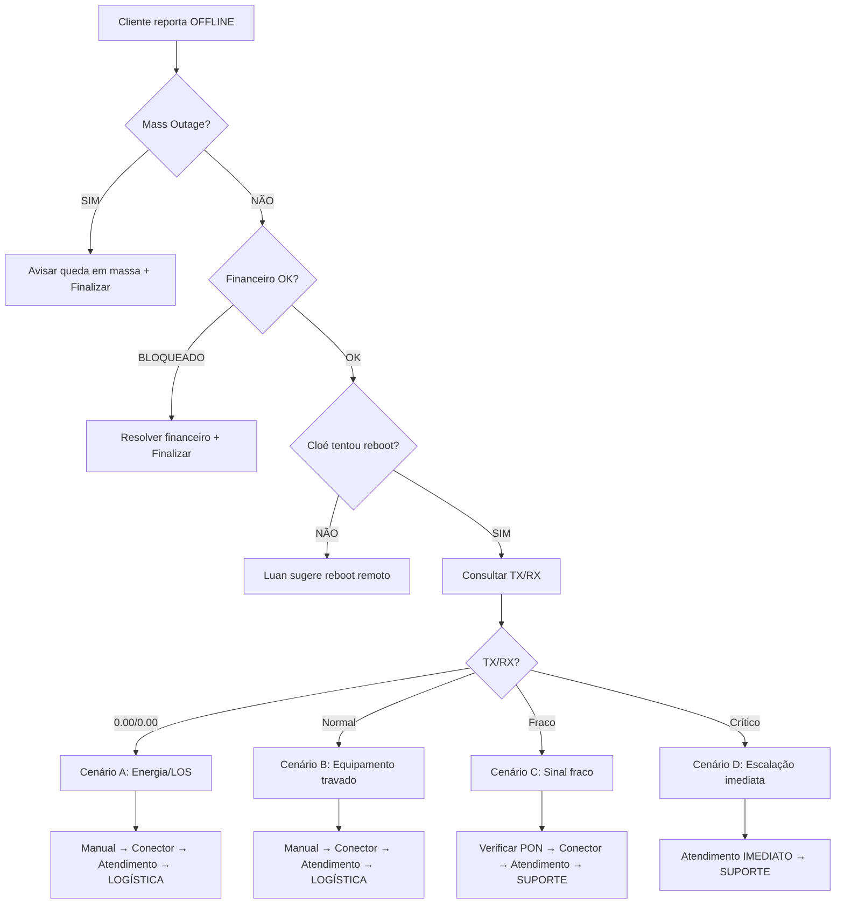

# 🔧 Fluxo de Diagnóstico de Cliente Offline - VERSÃO CONSOLIDADA

**Status:** Em discussão - NÃO IMPLEMENTADO  
**Data:** 2025-10-16  
**Responsáveis:** Cloé (Routing) → Luan (Suporte Técnico)

---

## 📋 Definições Padronizadas

### ⏱️ Tempos Oficiais

| Ação | Tempo | Justificativa |
|------|-------|---------------|
| Desligar roteador | **60 segundos** | Capacitor descarregar + tempo alinhamento OLT |
| Aguardar sincronização | **3-5 minutos** | Cliente executar + equipamento sincronizar |
| Timeout resposta cliente | **30 segundos** | Tempo máximo para cliente confirmar ação |

### 🔄 Hierarquia de Ações

1. **Reboot REMOTO** (Cloé) - SEMPRE PRIMEIRO
2. **Consulta TX/RX** (Luan) - SE reboot falhar
3. **Reboot MANUAL** (Luan) - Conforme cenário
4. **Manipulação Fibra** (Luan) - Medida extrema
5. **Abertura de Atendimento** (Luan) - Escalação

---

## 🎯 Cenários de Diagnóstico

### Cenário A: OFFLINE + TX/RX 0.00/0.00

**Diagnóstico:** Sem energia ou LOS (Loss of Signal)

**Fluxo:**
1. ✅ Verificar se equipamento está LIGADO na energia
2. ✅ Verificar se fonte de alimentação está conectada
3. ✅ Verificar se botão Power está ligado (se houver)
4. ✅ Verificar LED LOS (vermelho/piscando)
   - ❌ **Se LOS vermelho fixo:** Problema de sinal óptico
   - 📹 Enviar instrução de manipulação do conector verde
   - ⏱️ Aguardar 3-5 minutos
   - ❌ **Se persistir:** Abrir atendimento IXC → **Transferir para LOGÍSTICA**

**Frases Luan:**
```
"Detectei que o sinal óptico está zerado (TX/RX: 0.00). 
Isso indica que o equipamento pode estar desligado ou com problema no sinal da fibra.

Por favor, verifique:
1️⃣ O equipamento está ligado na tomada?
2️⃣ A fonte de energia está conectada?
3️⃣ O botão Power está ligado?

Após confirmar, me avise."
```

Se cliente confirmar energia OK:
```
"Agora verifique se há uma LUZ VERMELHA chamada 'LOS' ou 'PON' piscando no equipamento.

Tem essa luz vermelha?"
```

Se SIM:
```
"Essa luz indica problema no sinal da fibra óptica. 
Vou te enviar as instruções para tentar resolver:

[VÍDEO/IMAGEM] - Como remover e reconectar o conector verde

⚠️ ATENÇÃO:
- Segure o conector pela BASE (não pelo cabo)
- Retire com cuidado (não force)
- Não dobre o cabo
- Reconecte firmemente até ouvir 'click'

Aguarde 3-5 minutos após reconectar para o equipamento sincronizar.

Me avise quando terminar."
```

---

### Cenário B: OFFLINE + TX/RX NORMAL (-20 / +0.5)

**Diagnóstico:** Equipamento travado (sinal OK, mas não navega)

**Contexto Importante:** Cloé JÁ tentou reboot remoto antes

**Fluxo:**
1. ✅ **Reboot MANUAL** (60 segundos desligado)
2. ⏱️ Aguardar 3-5 minutos sincronização
3. ❌ **Se continuar offline:** Manipulação do conector verde
4. ⏱️ Aguardar 3-5 minutos
5. ❌ **Se persistir:** Abrir atendimento IXC → **Transferir para LOGÍSTICA**

**Frases Luan:**
```
"Verifiquei o sinal da sua ONU e está dentro dos padrões (RX: -20 dBm / TX: +0.5 dBm).
Isso indica que o equipamento pode estar travado.

Vamos fazer o seguinte:
1️⃣ DESLIGUE o roteador da tomada
2️⃣ AGUARDE 60 segundos (1 minuto completo)
3️⃣ LIGUE novamente

Aguarde de 3 a 5 minutos para o equipamento sincronizar com a rede.

Me avise quando ligar."
```

Após cliente confirmar que ligou:
```
"Perfeito! Agora aguarde mais 3 minutos para o equipamento sincronizar 
e tente navegar.

Voltou a funcionar?"
```

Se NÃO voltou:
```
"Vamos tentar uma última ação antes de abrir o chamado técnico.

Por favor, retire com cuidado o CONECTOR VERDE (cabo de fibra óptica) 
do equipamento e reconecte novamente.

[VÍDEO/IMAGEM]

⚠️ Cuidado: segure pela base, não force, não dobre.

Aguarde 3-5 minutos e me avise."
```

Se AINDA não voltou:
```
"Vou abrir um atendimento técnico para verificação presencial.

Protocolo IXC: [número]

Você será transferido para nossa equipe de logística que vai 
agendar a visita. Contato em até 4 horas úteis."

[Transferir para LOGÍSTICA]
```

---

### Cenário C: OFFLINE + TX/RX FRACO (-27 / -2)

**Diagnóstico:** Sinal fraco/instável

**Fluxo:**
1. ✅ Verificar se LUZ PON está **PISCANDO** (sincronizando)
2. ⏱️ Se piscando: aguardar 2-3 minutos
3. ❌ Se continuar: Manipulação conector verde
4. ⏱️ Aguardar 3-5 minutos
5. ❌ **Se persistir:** Abrir atendimento IXC → **Transferir para SUPORTE**

**Frases Luan:**
```
"Detectei que o sinal da fibra está FRACO (RX: -27 dBm).
Isso pode causar instabilidade na conexão.

Verifique se a luz 'PON' ou 'LOS' está PISCANDO (não fixa).

Está piscando?"
```

Se SIM (piscando):
```
"Ok, isso significa que está tentando sincronizar.
Aguarde mais 2-3 minutos e teste a conexão.

Voltou?"
```

Se NÃO voltou ou luz não pisca:
```
"Vamos tentar reconectar o cabo de fibra.

[VÍDEO/IMAGEM] - Instrução conector verde

Aguarde 3-5 minutos após reconectar."
```

Se persistir:
```
"O sinal continua fraco mesmo após os procedimentos.
Vou abrir atendimento para nossa equipe técnica verificar 
a qualidade do sinal na rede.

Protocolo IXC: [número]

[Transferir para SUPORTE TÉCNICO]"
```

---

### Cenário D: OFFLINE + TX/RX CRÍTICO (-32 / -5)

**Diagnóstico:** Problema grave de rede (não tenta reboot)

**Fluxo:**
1. ❌ **PULAR todos os procedimentos**
2. ✅ Abrir atendimento IXC IMEDIATAMENTE
3. ✅ **Transferir para ATENDENTE HUMANO** (prioridade)

**Frases Luan:**
```
"Detectei um PROBLEMA CRÍTICO no sinal da fibra (RX: -32 dBm).
Isso requer inspeção urgente da nossa equipe técnica.

Vou abrir o atendimento prioritário agora.

Protocolo IXC: [número]

Você será transferido imediatamente para nossa equipe técnica 
que vai agendar a visita com urgência.

[Transferir IMEDIATAMENTE para SUPORTE]"
```

---

### Cenário E: QUALQUER TX/RX + FINANCEIRO BLOQUEADO

**Diagnóstico:** Inadimplência (sempre verificar PRIMEIRO)

**Fluxo:**
1. ✅ Verificar status financeiro no IXC
2. ✅ Se BLOQUEADO por inadimplência:
   - Oferecer desbloqueio de confiança
   - Enviar Boleto/PIX
   - Perguntar se precisa de algo mais
   - Finalizar conversa (NÃO escalona)

**Frases Luan:**
```
"Verifiquei que há pendências financeiras que estão impedindo 
sua conexão.

Posso te ajudar de duas formas:

1️⃣ Desbloqueio de Confiança (24h para regularizar)
2️⃣ Envio de nova fatura atualizada

O que prefere?"
```

Após resolver financeiro:
```
"Pronto! [Ação realizada]

Precisa de mais alguma ajuda?"

[Cliente responde]

"Fico feliz em ajudar! Qualquer dúvida estou à disposição. 
Tenha um ótimo dia! 😊"

[Sistema fecha conversa automaticamente]
```

---

## 🚨 Integração Mass Outage

### Prioridade MÁXIMA

**SEMPRE verificar ANTES de iniciar qualquer diagnóstico:**

```
Se mass_outage.active === true:
  → Luan informa sobre queda em massa
  → NÃO tenta reboot
  → NÃO abre atendimento individual
  → Informa previsão de normalização
  → Finaliza conversa
```

**Frases Luan (Mass Outage Ativo):**
```
"Identifiquei que estamos com uma QUEDA EM MASSA na região 
de [REGIÃO] afetando [NÚMERO] clientes.

Nossa equipe técnica já está trabalhando na resolução.

Previsão de normalização: [TEMPO]

Você será avisado assim que o serviço for restabelecido.

Lamento o transtorno. Tem algo mais que posso ajudar?"
```

---

## 🎯 Fluxo Consolidado (Luan)

### ORDEM DE VERIFICAÇÃO:



---

## ❓ Pontos para Discussão

### 1. Ordem de Verificação
- ✅ **Confirmado:** Mass Outage → Financeiro → TX/RX → Fluxo específico
- ✅ **Confirmado:** Reboot remoto (Cloé) SEMPRE antes de Luan atuar

### 2. Manipulação do Conector Verde
- ❓ **Vídeo demonstrativo:** Já existe ou precisa criar?
- ❓ **Imagem ilustrativa:** Modelo de ONU mais comum?
- ❓ **Texto instrução:** Validar frases finais?

### 3. Transferências para Departamentos
- ✅ **Logística:** Cenários A, B (agendamento instalação/troca)
- ✅ **Suporte:** Cenários C, D (verificação técnica rede)
- ❓ **Critério de urgência:** D é prioridade absoluta?

### 4. Timeout e Sincronização
- ✅ **60s desligar:** Padronizado
- ✅ **3-5 min sincronizar:** Após reboot manual ou conector
- ❓ **2-3 min:** Apenas quando PON piscando?
- ❓ **30s timeout:** Cliente não responde → O que fazer?

### 5. Como Luan Confirma Sucesso?
- ✅ Serviço volta ONLINE (sistema detecta)
- ✅ Cliente responde "feito" ou "voltou"
- ❓ Se cliente não responde em 30s, Luan deve perguntar novamente?
- ❓ Quantas tentativas antes de considerar "sem resposta"?

### 6. Casos Especiais
- ❓ E se cliente recusar fazer procedimento manual?
- ❓ E se cliente já fez reboot antes de falar com Luan?
- ❓ Como tratar "já tentei tudo" do cliente?

---

## 🔄 Próximos Passos

1. ✅ Validar frases de Luan em cada cenário
2. ✅ Definir vídeo/imagem do conector verde
3. ✅ Confirmar critérios de transferência
4. ✅ Validar tempos de timeout
5. ✅ Confirmar comportamento "sem resposta cliente"
6. ✅ Revisar integração Mass Outage
7. 🔄 **APÓS VALIDAÇÃO:** Implementar em:
   - `docs/knowledge-base/data-sources/suporte/troubleshooting-onu.md`
   - `docs/knowledge-base/data-sources/sistema/consulta-sinal-onu.md`
   - `supabase/functions/support-tech-agent/prompts.ts`
   - `supabase/functions/support-tech-agent/config.ts`

---

**🎯 Status:** Aguardando validação final antes de implementar
