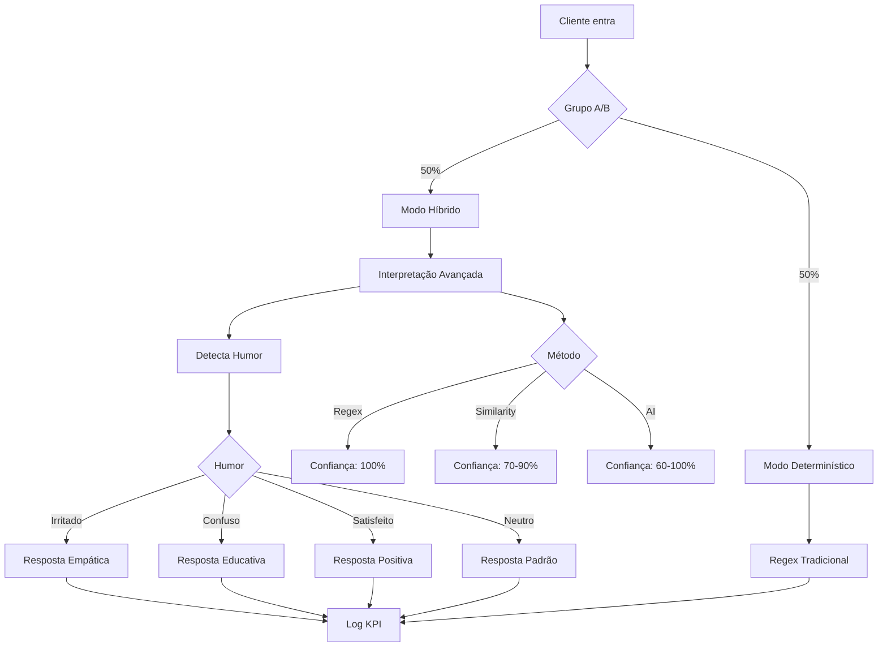

# Implementação do Sistema de Interpretação Híbrida

## 📋 Resumo Executivo

Sistema completo de interpretação inteligente de respostas implementado no `support-tech-agent` com A/B testing para validação gradual.

## ✅ Patches Implementados

### Patch 1: A/B Test (50% Rollout)
**Localização:** Logo após identificação do cliente (linha ~385)

**Funcionalidade:**
- 50% dos atendimentos recebem modo híbrido ativo
- 50% mantém modo determinístico (regex tradicional)
- Estado persistido em `flow_state.hybrid_mode_active`
- Log completo para análise posterior

```typescript
const isHybridEnabled = Math.random() < 0.5;
```

**Métricas registradas:**
- `hybrid_test_assignment` - atribuição inicial
- Rastreável por conversation_id

---

### Patch 2: Interpretação Híbrida com Mood Detection
**Localização:** Cenário B - confirmação de reinício (linha ~1840)

**Funcionalidade:**
- Usa novo `hybridInterpret` expandido
- Suporta múltiplos intents: confirmacao, negacao, duvida
- Detecção de humor: neutro, confuso, irritado, satisfeito
- Hierarquia: regex → similarity → AI
- Mood detection APENAS no grupo híbrido (A/B test)

**Exemplo de uso:**
```typescript
const hybrid = await hybridInterpret(message, {
  intents: ["confirmacao", "negacao", "duvida"],
  regexDetectors: {
    confirmed: /(sim|ok|pronto)/i,
    denied: /(nao|ainda nao)/i
  },
  similarityPhrases: {
    confirmed: ["já fiz", "pronto"],
    denied: ["não", "ainda não"]
  },
  aiContext: {
    expectedAction: "desligar e ligar o roteador",
    previousAgentMessage: "..."
  },
  moodDetection: isHybridEnabled
});
```

**Retorno:**
```typescript
{
  result: 'confirmou' | 'negou' | 'incerto',
  intent: 'confirmacao' | 'negacao' | 'duvida',
  confidence: 0.85,
  method: 'similarity',
  mood: 'irritado',
  reasoning: "Similar a: 'já fiz'"
}
```

---

### Patch 3: Respostas Humanizadas
**Localização:** Junto com Patch 2 (linha ~1860)

**Funcionalidade:**
- Mensagens adaptadas ao humor detectado
- Apenas no grupo híbrido (A/B test)
- Mantém profissionalismo técnico

**Exemplos:**

**Cliente Irritado:**
```
"Poxa, imagino sua frustração 😕
Mas ótimo que já fez! Vou rodar um teste técnico agora 🔧"
```

**Cliente Confuso:**
```
"Ótimo! 😊 Vou verificar o equipamento remotamente agora 🔧
É rapidinho!"
```

**Cliente Satisfeito:**
```
"Excelente! 👏 Deixa eu rodar um teste técnico aqui pra confirmar 🔧"
```

**Cliente Neutro (fallback):**
```
"Perfeito 👏 Vou rodar um teste técnico aqui 🔧"
```

---

### Patch 4: Logs para Métricas
**Localização:** Múltiplos pontos de decisão

**Eventos registrados:**

1. **hybrid_test_assignment** - Atribuição do grupo A/B
```json
{
  "action": "hybrid_test_assignment",
  "conversation_id": "uuid",
  "detalhes": {
    "hybrid_mode": "hybrid",
    "assigned_at": "2025-10-27T..."
  }
}
```

2. **hybrid_interpretation** - Resultado da interpretação
```json
{
  "action": "hybrid_interpretation",
  "conversation_id": "uuid",
  "detalhes": {
    "intent": "confirmacao",
    "mood": "irritado",
    "confidence": 0.85,
    "method": "similarity",
    "hybrid_enabled": true
  }
}
```

3. **kpi_update** - Checkpoint de cenário
```json
{
  "action": "kpi_update",
  "conversation_id": "uuid",
  "detalhes": {
    "scenario": "B",
    "trigger": "auto",
    "hybrid_mode": true,
    "timestamp": "..."
  }
}
```

---

## 📊 Arquitetura Completa



---

## 🎯 Cenários Cobertos

### ✅ Cenário B (Equipamento Travado)
- Detecção automática (sinal bom + problema navegação)
- Confirmação de reinício com interpretação híbrida
- Respostas adaptadas ao humor
- Teste remoto pós-ação

### 🔄 Próximos Cenários
- **Cenário A** (Sem energia): Confirmar manipulação de cabos
- **Cenário C** (Sinal fraco): Confirmar visualização de LEDs
- **Cenário D** (Crítico): Confirmação de agendamento

---

## 📈 Métricas para Análise

### Queries Recomendadas

**1. Taxa de sucesso por grupo:**
```sql
SELECT 
  flow_state->>'hybrid_mode_active' as grupo,
  COUNT(*) as total,
  SUM(CASE WHEN flow_state->>'scenario_completed' IS NOT NULL THEN 1 ELSE 0 END) as resolvidos
FROM conversations
WHERE created_at >= NOW() - INTERVAL '7 days'
GROUP BY grupo;
```

**2. Distribuição de métodos de interpretação:**
```sql
SELECT 
  detalhes->>'method' as metodo,
  COUNT(*) as quantidade,
  AVG((detalhes->>'confidence')::numeric) as confianca_media
FROM registros_de_monitoramento
WHERE acao = 'hybrid_interpretation'
GROUP BY metodo;
```

**3. Impacto do humor nas respostas:**
```sql
SELECT 
  detalhes->>'mood' as humor,
  COUNT(*) as quantidade,
  AVG(EXTRACT(EPOCH FROM (updated_at - created_at))/60) as tempo_resolucao_minutos
FROM registros_de_monitoramento rm
JOIN conversations c ON rm.conversation_id = c.id
WHERE acao = 'hybrid_interpretation'
GROUP BY humor;
```

---

## 🔧 Arquivos Modificados

1. **`_shared/ai-response-interpreter.ts`**
   - Adicionado `detectMood()`
   - Expandido `hybridInterpret()` para suportar mood
   - Adicionado `MoodType`

2. **`_shared/audit-logger.ts`** ✨ NOVO
   - Helper `logAudit()` para centralizar logs

3. **`support-tech-agent/index.ts`**
   - Patch 1: A/B test (linha ~385)
   - Patches 2 & 3: Interpretação + respostas humanizadas (linha ~1840)
   - Patch 4: Logs KPI (múltiplos pontos)

---

## ✅ Status de Implementação

| Patch | Status | Localização | Teste |
|-------|--------|-------------|-------|
| 1 - A/B Test | ✅ | `index.ts:385` | Verificar logs |
| 2 - Interpretação | ✅ | `index.ts:1840` | Testar com "pronto" |
| 3 - Humanização | ✅ | `index.ts:1860` | Testar com raiva |
| 4 - Métricas | ✅ | Multiple | Query BD |

---

## 🚀 Próximos Passos

1. **Monitoramento (1 semana)**
   - Coletar dados de ambos os grupos
   - Comparar taxas de resolução
   - Identificar padrões de humor

2. **Análise Estatística**
   - Teste de significância (p-value < 0.05)
   - Comparar tempo médio de resolução
   - Avaliar satisfação do cliente

3. **Rollout Completo (se validado)**
   - Remover flag de A/B test
   - Ativar híbrido para 100%
   - Expandir para outros cenários

4. **Expansão**
   - Aplicar em Cenário A (energia)
   - Aplicar em Cenário C (sinal fraco)
   - Aplicar em Cenário D (crítico)

---

## 📚 Referências

- [Sistema de Interpretação (Conceito)](./ai-response-interpretation-system.md)
- [Cenário B Completo](./CENARIO-B-COMPLETO.md)
- [Cenário D Completo](./CENARIO-D-COMPLETO.md)
