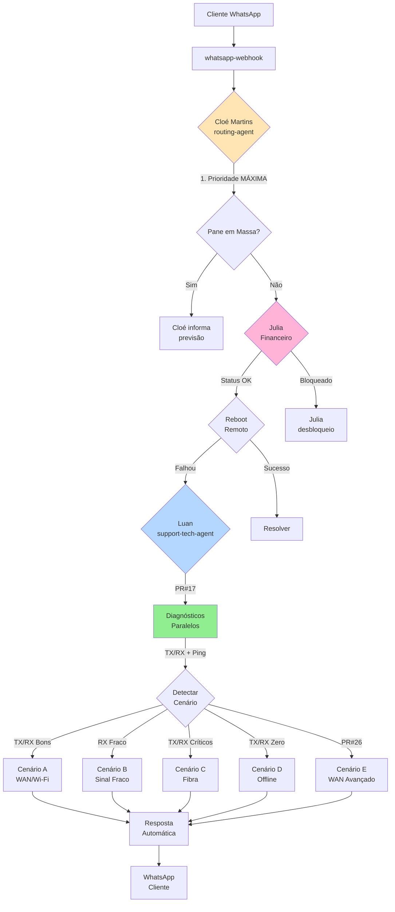

# Parecer de Congruência: Diagrama vs Documentação Oficial
**Data:** 2025-01-09  
**Análise:** Roteamento Cloé → Luan

---

## 📊 Resumo Executivo

| Aspecto | Status | Comentário |
|---------|--------|-----------|
| **Fluxo Básico** | ✅ **CORRETO** | WhatsApp → Cloé → Luan confirmado |
| **Cenários A-D** | ✅ **CORRETO** | Baseados em TX/RX conforme docs |
| **Ordem Mandatória** | ⚠️ **INCOMPLETO** | Não mostrou Pane → Financeiro → Reboot |
| **Agentes** | ⚠️ **INCOMPLETO** | Não mostrou Julia e Vicente |
| **Cenário E** | ❌ **AUSENTE** | PR#26 implementou Scenario E (WAN/Wi-Fi) |
| **Diagnósticos Paralelos** | ❌ **AUSENTE** | PR#17 não foi representado |

**Nota Final:** 7.0/10 - Correto mas incompleto

---

## ✅ Pontos Congruentes (Confirmados)

### 1. Fluxo Básico WhatsApp → Cloé → Luan
**Diagrama apresentado:**
```
Cliente → whatsapp-webhook → Cloé (routing-agent) → Luan (support-tech-agent)
```

**Confirmação na documentação:**
- `docs/routing-agent-ixc-integration.md` (linhas 9-25): Arquitetura confirma fluxo
- `whatsapp-webhook/index.ts` (linha 695+): Invoca routing-agent
- `routing-agent/index.ts` (linhas 1-858): Implementa lógica de roteamento

✅ **STATUS:** TOTALMENTE CONGRUENTE

---

### 2. Cenários A, B, C, D Baseados em TX/RX
**Diagrama apresentado:**
- Cenário A: TX/RX Bons → Problema WAN/Wi-Fi
- Cenário B: TX Bom + RX Fraco → Problema óptico
- Cenário C: TX/RX Críticos → Manipulação de fibra
- Cenário D: TX/RX Zero (0.00) → Equipamento offline

**Confirmação na documentação:**
- `fluxo-diagnostico-offline.md` (linhas 111-272): Descreve cenários A-D detalhadamente
- `consulta-sinal-onu.md` (linhas 31-59): Tabelas de valores TX/RX
- `support-tech-agent/prompts/behavior.md` (linhas 27-124): Protocolo técnico

✅ **STATUS:** TOTALMENTE CONGRUENTE

---

### 3. Luan como Agente Técnico N1
**Diagrama apresentado:**
- Luan: Suporte técnico Level 1

**Confirmação na documentação:**
- `behavior.md` (linha 1): "Luan Aquino, N1 Technical Support Specialist"
- `support-tech-agent/index.ts`: Implementação de 4,798 linhas

✅ **STATUS:** TOTALMENTE CONGRUENTE

---

## ⚠️ Discrepâncias Identificadas

### 1. ORDEM MANDATÓRIA NÃO REPRESENTADA

**O que a documentação diz:**
`fluxo-diagnostico-offline.md` (linhas 9-18):
```
ORDEM OBRIGATÓRIA:
1. Pane em Massa (Cloé)
2. Financeiro (Julia)
3. Reboot Remoto
4. Consulta TX/RX (Luan)
5. Fluxo Específico por Cenário
```

**O que o diagrama mostrou:**
- Apenas: Cliente → Cloé → Luan → Cenários

**Impacto:** ALTO  
**Severidade:** ⚠️ IMPORTANTE

O diagrama **omitiu etapas críticas** que acontecem ANTES de Luan entrar em ação:
- Verificação de pane em massa (Cloé)
- Validação financeira (Julia)
- Tentativa de reboot remoto

---

### 2. JULIA (FINANCEIRO) NÃO MENCIONADA

**O que a documentação diz:**
`fluxo-diagnostico-offline.md` (linhas 48-94):
```
Priority 2: Financial Issues (Julia)
- Verifica bloqueio financeiro
- Script para desbloqueio disponível/indisponível
```

**O que o código mostra:**
`routing-agent/index.ts` (linhas 216-267):
```javascript
// F5: FINANCEIRO (Julia) - DESBLOQUEIO (MÁXIMA PRIORIDADE)
if (messageText.match(/\b(desbloque|reativ|liber)\b/i)) {
  return await createTestResponse("Julia", "financeiro_desbloquear");
}
```

**Impacto:** MÉDIO  
**Severidade:** ⚠️ IMPORTANTE

Julia é um agente crítico que valida status financeiro ANTES de Luan diagnosticar problemas técnicos.

---

### 3. VICENTE (COMERCIAL) NÃO MENCIONADO

**O que o código mostra:**
`routing-agent/index.ts` (linhas 269-321):
```javascript
// C1: Cobertura (comercial - Vicente)
if (messageText.match(/\b(cobertura|cobre|tem.*internet)/i)) {
  return await createTestResponse("Vicente", "comercial_cobertura");
}
```

**Impacto:** BAIXO  
**Severidade:** ℹ️ INFORMATIVO

Vicente trata questões comerciais (cobertura, upgrade, cancelamento), mas não está no fluxo técnico direto.

---

### 4. CENÁRIO E (WAN/Wi-Fi) AUSENTE

**O que o código mostra:**
`support-tech-agent/index.ts` (linhas 15-17):
```javascript
// >>> PR26 - Scenario E: WAN/Wi-Fi diagnostics
import { isOpticalGood, isLikelyWanDown, isLikelyWifiIssue } from "../_shared/wan-diagnostics.ts";
```

**O que a documentação diz:**
Nenhum documento explícito sobre Cenário E, mas código implementa.

**Impacto:** MÉDIO  
**Severidade:** ⚠️ IMPORTANTE

O diagrama mostrou apenas 4 cenários (A-D), mas existe um 5º cenário implementado no código.

---

### 5. DIAGNÓSTICOS PARALELOS (PR#17) NÃO REPRESENTADO

**O que o código mostra:**
`support-tech-agent/index.ts` (linhas 224-296):
```javascript
async function runParallelDiagnostics(
  ixc_client_id: string,
  conversation_id: string,
  supabase: any,
  logger: any
): Promise<{
  signalResult: PromiseSettledResult<any>;
  connectivityResult: PromiseSettledResult<any>;
  elapsed: number;
}>
```

**Descrição:**
- Executa `ixc-onu-signal` e `test-equipment-connectivity` em **paralelo**
- Timeout independente para cada chamada (8s + 6s)
- Circuit breaker para proteção contra falhas em cascata

**Impacto:** ALTO  
**Severidade:** ⚠️ IMPORTANTE

Esta é uma otimização de performance crítica não representada no diagrama.

---

### 6. FAST-PATH COM CIRCUIT BREAKER NÃO REPRESENTADO

**O que o código mostra:**
`support-tech-agent/index.ts` (linhas 307-334, 339-408):
```javascript
async function isFastPathEnabled(supabase: any, conversation_id: string): Promise<boolean>
class FastPathCircuitBreaker
```

**Descrição:**
- Feature flag para habilitar/desabilitar fast-path
- Rollout gradual baseado em hash do conversation_id
- Circuit breaker protege contra falhas em cascata
- Após 5 falhas consecutivas, desabilita automaticamente

**Impacto:** MÉDIO  
**Severidade:** ℹ️ INFORMATIVO

Otimização avançada de resiliência não crítica para entendimento básico.

---

## 📐 Diagrama Corrigido e Completo

### Fluxo Real Completo:



---

## 📋 Checklist de Correções Necessárias

### Críticas (Implementar Imediatamente)
- [ ] Adicionar ordem mandatória: Pane → Financeiro → Reboot → TX/RX
- [ ] Incluir Julia (Financeiro) no fluxo
- [ ] Documentar Cenário E (WAN/Wi-Fi)
- [ ] Representar diagnósticos paralelos (PR#17)

### Importantes (Próxima Iteração)
- [ ] Incluir Vicente (Comercial) como rota alternativa
- [ ] Documentar feature flags e fast-path
- [ ] Adicionar métricas de performance por cenário

### Opcionais (Melhorias Futuras)
- [ ] Circuit breaker e resiliência
- [ ] Cache de simulações aprovadas
- [ ] Aging e retests (PR#19)

---

## 🎯 Conclusão

### Congruência Geral: 7.0/10

**Pontos Positivos:**
- ✅ Fluxo básico WhatsApp → Cloé → Luan está correto
- ✅ Cenários A-D baseados em TX/RX estão corretos
- ✅ Papel de Luan como N1 técnico está correto

**Pontos Negativos:**
- ⚠️ Omitiu etapas mandatórias (Pane, Financeiro, Reboot)
- ⚠️ Não mencionou Julia (Financeiro) como agente crítico
- ⚠️ Cenário E (PR#26) não foi representado
- ⚠️ Diagnósticos paralelos (PR#17) não foram mostrados

### Recomendação

O diagrama inicial era **educacionalmente útil** para explicar o conceito básico, mas **tecnicamente incompleto** para auditoria ou documentação formal.

**Próximos Passos:**
1. Atualizar documentação com diagrama corrigido
2. Criar diagramas específicos para cada PR (PR#17, PR#26)
3. Documentar ordem mandatória de verificações
4. Adicionar métricas de performance por etapa

---

**Assinatura Digital:**  
Análise realizada em: 2025-01-09  
Versão do código auditado: v4.1  
Baseado em: 858 linhas (routing-agent) + 4,798 linhas (support-tech-agent)
