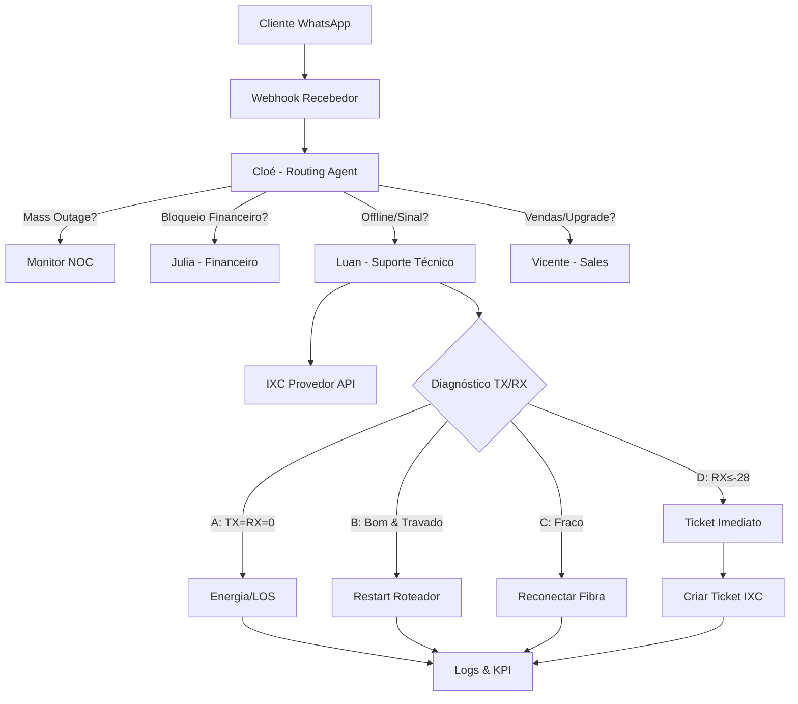

# SUPERNET FIBRA – Sistema Multiagentes v1.0.0

**Plataforma:** Supabase + Lovable (Edge Functions, PostgreSQL, Storage)  
**Agentes:** Cloé (routing), Luan (suporte técnico), Julia (financeiro), Vicente (vendas)

---

## 📊 Arquitetura Geral



---

## 📁 Estrutura de Pastas

```
supabase/
├── functions/
│   ├── routing-agent/              # Cloé: triagem inicial
│   ├── support-tech-agent/         # Luan: 4 cenários TX/RX
│   ├── support-financial-agent/    # Julia: débitos/negociação
│   ├── sales-agent/                # Vicente: vendas
│   ├── ixc-integration/            # Integração IXC (sinal, tickets)
│   ├── luan-auto-upgrade/          # PR#28: regras adaptativas
│   ├── scenario-rollback/          # PR#29: rollback com dual approval
│   ├── test-runner/                # PR#31: testes funcionais
│   ├── stress-runner/              # PR#31: stress test
│   └── _shared/
│       ├── async-utils.ts          # PR#27: defer, withTimeout
│       ├── audit-logger.ts         # PR#27: logs não-bloqueantes
│       ├── kpi.ts                  # PR#27: KPI fire-and-forget
│       └── flow-state.ts           # State machine helpers
├── migrations/
│   ├── PR27_async_safety.sql
│   ├── PR28_agent_global_policies.sql
│   └── PR29_audit_rollback.sql

src/
├── pages/
│   └── admin/
│       ├── KpiDashboard.tsx        # PR#9: métricas 7 dias
│       ├── RegionAlerts.tsx        # PR#10: geolocalização
│       └── ScenarioRollback.tsx    # PR#29: UI rollback
├── components/
│   ├── MediaGuidedMessage.tsx      # PR#6: áudio + imagem
│   └── ThemeToggle.tsx
└── types/
    └── agent.types.ts              # Contratos multiagente

docs/
├── PR-27-ASYNC-SAFETY.md           # defer, withTimeout, background tasks
├── PR-28-AUTO-UPGRADE.md           # Regras adaptativas baseadas em KPI
├── PR-29-AUDITORIA-ROLLBACK.md     # Versionamento + dual approval
├── PR-30-README-FINAL.md           # Este arquivo
├── PR-31-TESTES-E-STRESS.md        # Test runner + stress (5s threshold)
└── PR-32-RELEASE-v1.0.0.md         # Checklist deploy formal
```

---

## 🎯 Cenários do Luan (TX/RX)

| Cenário | TX/RX       | Ação                                  | KPI                        |
|---------|-------------|---------------------------------------|----------------------------|
| **A**   | 0.0 / 0.0   | LOS/energia → mídia guiada → ticket   | `scenario_a_detected`      |
| **B**   | Bom / Bom   | Restart roteador → reteste            | `scenario_b_resolved`      |
| **C**   | Baixo/Médio | Reconectar fibra → reteste → escala   | `scenario_c_escalated`     |
| **D**   | RX ≤ -28    | Ticket imediato (NOC)                 | `scenario_d_ticket_opened` |

---

## 📈 KPIs e Dashboard (PR#9 + PR#10)

### RPC Principal
```sql
SELECT * FROM calc_support_kpis_last_7_days();
-- Retorna: ts, total_count, resolved_remote_count, tickets_count
```

### Métricas Exibidas
- **Taxa de Resolução Remota**: `resolved_remote_count / total_count`
- **Taxa de Tickets**: `tickets_count / total_count`
- **Série Temporal**: gráfico 7 dias
- **Alertas por Região** (PR#10A): cidades/bairros com RX crítico

### Acesso
- **Rota**: `/admin/kpi-dashboard`
- **AuthGuard**: roles `admin` ou `gestor`

---

## 🤖 Auto-Upgrade (PR#28)

### Funcionamento
1. Edge function `luan-auto-upgrade` roda **diariamente** (cron)
2. Lê KPIs via `calc_support_kpis_last_7_days()`
3. Aplica **regras simples**:
   - Se resolução remota < 70% → prioriza mensagens guiadas
   - Se tickets > 25% → reduz tentativas no Cenário C
4. Persiste em `agent_global_policies`
5. Luan lê policy **opcionalmente** (não-bloqueante)

### Exemplo de Policy
```json
{
  "version": "global-rules-v2",
  "rules": {
    "prioritize_guided_messages": true,
    "reduce_repetitions": false,
    "prefer_variations": ["var_curta_empatica", "var_guiada_midia"],
    "scenario_overrides": {
      "C": { "max_retries": 2 },
      "D": { "open_ticket_immediately": false }
    }
  },
  "kpi_snapshot": {
    "remoteRate": 0.68,
    "ticketRate": 0.22,
    "total": 450
  }
}
```

---

## 🔄 Auditoria & Rollback (PR#29)

### Fluxo de 3 Etapas
1. **REQUEST** (Usuário 1): solicita rollback → status `pending`
2. **CONFIRM** (Usuário 2): confirma → status `confirmed`
3. **APPLY** (Qualquer admin): aplica → status `applied`

### Tabelas
- `agent_scenarios_versions`: histórico completo
- `agent_current_configs`: configuração ativa
- `agent_scenarios_rollback_log`: trilha de aprovações

### Casos de Uso
- Reverter prompt que gerou muitos tickets
- Testar variação de mensagem e voltar se piorar NPS
- Ajustar thresholds de RX crítico

---

## 🧪 Testes Automatizados (PR#31)

### Test Runner
```bash
POST /functions/v1/test-runner
# Executa 4 casos (A, B, C, D)
# Alertas:
#   - avg > 3s: warning
#   - avg > 5s: error
```

### Stress Runner
```bash
POST /functions/v1/stress-runner
{ "sessions": 20 }
# Máx seguro: 50 sessões
# Alertas:
#   - avg/sessão > 5s: error
#   - fail_rate > 10%: error
```

### Garantias
- ✅ Flag `testHarness: true` (não cria dados reais)
- ✅ Mock de IXC (sem custo real)
- ✅ Threshold realista (5s máx, ideal 3s)
- ✅ Logs em `registros_de_monitoramento`

---

## 🔒 Segurança & RLS

### Funções Sensíveis
Todas com `SECURITY DEFINER` e validação `has_role(auth.uid(), 'admin')`:
- `calc_support_kpis_last_7_days()`
- `calc_support_kpis_by_region_last_7_days()`

### RLS Habilitado
- `agent_global_policies`
- `agent_scenarios_versions`
- `agent_current_configs`
- `agent_scenarios_rollback_log`
- `registros_de_monitoramento` (select público, insert auth)

### Service Role
Edge functions usam `SUPABASE_SERVICE_ROLE_KEY` para:
- Bypass RLS quando necessário
- Logs assíncronos (`EdgeRuntime.waitUntil`)

---

## 🚀 Deploy (PR#32)

### Checklist Pré-Release
- [ ] Migrations aplicadas (PR28, PR29)
- [ ] Edge functions deployadas
- [ ] Cron configurado (`luan-auto-upgrade` diário)
- [ ] Dashboard KPIs acessível
- [ ] Tests passing (latência < 5s)
- [ ] Stress test OK (fail_rate < 10%)

### Tag Git
```bash
git tag -a v1.0.0 -m "Sistema Multiagentes v1.0.0"
git push origin v1.0.0
```

### Monitoramento Pós-Deploy
- Observar `auto_upgrade_applied` nos logs
- Acompanhar taxa de resolução remota
- Alertas de latência (`latency_alert`, `stress_alert`)
- Auditar rollbacks aplicados

---

## 📝 Boas Práticas

### Mensagens ao Cliente
- Curtas e humanizadas
- Foco em "caixinha da internet" (não "ONU")
- Variações empáticas quando detectar irritação
- Mídia guiada (áudio + imagem) no Cenário A

### Código
- Logs não-bloqueantes (`defer`, `EdgeRuntime.waitUntil`)
- Timeouts em integrações externas (`withTimeout`)
- State machine nunca é alterado por auto-upgrade
- Rollbacks sempre com dupla confirmação

### Observabilidade
- KPIs agregados a cada 7 dias
- Alertas progressivos (warning → error)
- Logs estruturados em `registros_de_monitoramento`
- Geolocalização para mapear mass outages

---

## 🆘 Troubleshooting

### Latência Alta (> 5s)
1. Verificar `registros_de_monitoramento` com `acao = 'latency_alert'`
2. Identificar gargalo (IXC API, DB query, LLM)
3. Aplicar `withTimeout` mais agressivo
4. Considerar cache de sinal ONU

### Taxa de Resolução Remota Baixa (< 60%)
1. Forçar execução de `luan-auto-upgrade`
2. Verificar se policy foi aplicada (`agent_global_policies`)
3. Auditar cenários C/D: retries excessivos?
4. Revisar variações de mensagens

### Rollback Não Aplicado
1. Verificar status: `SELECT * FROM agent_scenarios_rollback_log WHERE id = '...'`
2. Se `pending` → falta confirmação
3. Se `confirmed` → chamar action `apply`
4. Se `applied` → verificar `agent_current_configs`

---

## 🎓 Próximos Passos (v1.1.0)

- [ ] Dashboard tempo real (WebSocket)
- [ ] A/B testing automático de variações
- [ ] Integração com WhatsApp Business API nativo
- [ ] Fine-tuning do LLM com dados reais (anotados)
- [ ] Predição de mass outage via ML

---

**Versão:** 1.0.0  
**Data:** Janeiro 2025  
**Mantenedores:** Equipe SUPERNET FIBRA
