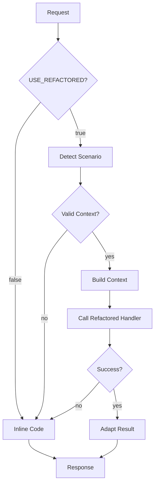

# 🔀 Routing Layer - Cenários Refatorados

**Status:** ✅ Implementado e pronto para testes  
**Feature Flag:** `USE_REFACTORED_SCENARIOS = false` (linha 1678 do index.ts)  
**Última atualização:** 2025-11-10

---

## 📋 Índice

1. [Visão Geral](#visão-geral)
2. [Arquitetura](#arquitetura)
3. [Como Ativar](#como-ativar)
4. [Como Testar](#como-testar)
5. [Monitoramento](#monitoramento)
6. [Troubleshooting](#troubleshooting)
7. [Roadmap](#roadmap)

---

## Visão Geral

A camada de roteamento permite **migração gradual** do código inline (monolítico) para os cenários refatorados (modulares), mantendo 100% de compatibilidade durante a transição.

### Benefícios

✅ **Zero downtime** - Fallback automático para código inline em caso de erro  
✅ **A/B Testing** - Comparar performance inline vs refatorado  
✅ **Rollback instantâneo** - Mudar `USE_REFACTORED_SCENARIOS = false`  
✅ **Validação incremental** - Testar 1 cenário de cada vez  
✅ **Logging detalhado** - Métricas de performance e debugging

---

## Arquitetura



### Componentes

| Componente | Arquivo | Função |
|-----------|---------|---------|
| **Routing Layer** | `index.ts` (linha 1673-1786) | Detecta cenário e roteia |
| **Context Adapter** | `adapters/context-adapter.ts` | Converte inline ↔ refatorado |
| **Scenario Handlers** | `scenarios/scenario-{a,b,c,d,e}.ts` | Lógica modular |
| **Types** | `types/scenario-context.ts` | Interfaces TypeScript |

---

## Como Ativar

### Opção 1: Ativar Todos os Cenários (Prod)

```typescript
// supabase/functions/support-tech-agent/index.ts (linha 1678)
const USE_REFACTORED_SCENARIOS = true; // ✅ Ativa todos
```

### Opção 2: Ativar Apenas 1 Cenário (Teste)

```typescript
// Exemplo: Testar apenas Cenário C
const USE_REFACTORED_SCENARIOS = scenario === 'C'; // ✅ Só C usa refatorado
```

### Opção 3: Rollout Gradual (10% dos usuários)

```typescript
const USE_REFACTORED_SCENARIOS = Math.random() < 0.1; // 10% A/B test
```

---

## Como Testar

### Passo 1: Preparar Ambiente

```bash
# Deploy da edge function (automático no Lovable)
# Ou manualmente:
supabase functions deploy support-tech-agent
```

### Passo 2: Ativar Feature Flag

Editar `index.ts` linha 1678:
```typescript
const USE_REFACTORED_SCENARIOS = true;
```

### Passo 3: Testar Cada Cenário

#### Cenário A - Energia (PON/LOS Vermelha)
```bash
# Criar conversa com sinal OFF
# Enviar: "PON vermelha"
# Esperar: Fluxo de energia do cenário A
```

#### Cenário B - Equipamento Travado (Sinal OK)
```bash
# Criar conversa com TX > 0, RX > -24
# Enviar: "internet não funciona"
# Esperar: Reboot do equipamento
```

#### Cenário C - Sinal Fraco (RX -27 a -32)
```bash
# Criar conversa com RX = -28
# Enviar: "internet caindo"
# Esperar: Diagnóstico de instabilidade
```

#### Cenário D - Sem Sinal Óptico (TX = 0)
```bash
# Criar conversa com TX = 0, RX = 0
# Enviar: "sem internet"
# Esperar: Fluxo de cabo solto
```

#### Cenário E - Sinal Bom, Problema WAN/Wi-Fi
```bash
# Criar conversa com TX > 0, RX > -24
# Internet OK mas lenta
# Esperar: Diagnóstico WAN/Wi-Fi
```

### Passo 4: Verificar Logs

```typescript
// Logs de sucesso:
"🔀 Roteamento para cenário refatorado" // Entrada no routing
"✅ Cenário refatorado executado com sucesso" // Sucesso

// Logs de fallback:
"⚠️ Contexto inválido para cenário refatorado - usando inline"
"❌ Erro no cenário refatorado - fallback para inline"
```

---

## Monitoramento

### Métricas Chave

| Métrica | Onde Ver | O que Medir |
|---------|----------|-------------|
| **Execution Time** | Log `executionTime` | Refatorado vs Inline |
| **Error Rate** | Log `❌ Erro no cenário refatorado` | Taxa de fallback |
| **Context Validation** | Log `⚠️ Contexto inválido` | Qualidade dos dados |
| **Message Length** | Log `messageLength` | Consistência de respostas |

### Query de Logs (Supabase)

```sql
-- Contar tentativas de routing
SELECT 
  count(*) as total_attempts,
  count(*) FILTER (WHERE event_message LIKE '%✅ Cenário refatorado%') as successful,
  count(*) FILTER (WHERE event_message LIKE '%❌ Erro no cenário%') as errors
FROM edge_logs
WHERE timestamp > now() - interval '1 hour'
  AND function_id = 'support-tech-agent';
```

### Comparação A/B

```typescript
// Adicionar ao log de sucesso:
logger.info("✅ Cenário refatorado executado com sucesso", {
  scenario: activeScenario,
  executionTime, // 👈 Comparar com tempo inline
  messageLength: adaptedResult.message?.length || 0,
  refactored: true // 👈 Tag para query
});
```

---

## Troubleshooting

### Problema: Routing não ativa

**Causa:** Feature flag desligada  
**Solução:** Verificar linha 1678 do `index.ts`

```typescript
const USE_REFACTORED_SCENARIOS = false; // ❌ Está false
const USE_REFACTORED_SCENARIOS = true;  // ✅ Mudar para true
```

### Problema: Contexto inválido

**Causa:** Dados faltando no `InlineContextData`  
**Solução:** Verificar log de `missing` fields

```typescript
// Log mostra:
"⚠️ Contexto inválido para cenário refatorado - usando inline"
{ scenario: 'C', missing: ['signalData.rx'] }

// Adicionar validação:
signalData: {
  tx: onuTx ?? 0, // 👈 Garantir valor default
  rx: onuRx ?? -99,
  status: onuStatus || "unknown"
}
```

### Problema: Erro no cenário refatorado

**Causa:** Exception no handler modular  
**Solução:** Verificar logs detalhados

```typescript
// Log mostra:
"❌ Erro no cenário refatorado - fallback para inline"
{ scenario: 'A', error: 'Cannot read property X of undefined' }

// Debugar:
// 1. Verificar se buildScenarioContext retorna contexto válido
// 2. Verificar se handler refatorado trata edge cases
// 3. Adicionar try/catch no handler
```

### Problema: Respostas diferentes inline vs refatorado

**Causa:** Lógica divergente entre versões  
**Solução:** Comparar código inline com refatorado

```bash
# Comparar Cenário A:
diff <(grep -A 100 "isCenarioA" index.ts) \
     <(cat scenarios/scenario-a.ts)
```

---

## Roadmap

### ✅ Fase 1: Infraestrutura (Concluída)
- [x] Context Adapter
- [x] Routing Layer
- [x] Testes unitários do adapter
- [x] Documentação

### 🔄 Fase 2: Validação (Em andamento)
- [ ] Testes E2E de cada cenário
- [ ] Comparação de métricas inline vs refatorado
- [ ] Ajustes de paridade funcional

### 📅 Fase 3: Rollout Gradual
- [ ] Ativar Cenário A (10% dos usuários)
- [ ] Monitorar por 24h
- [ ] Ativar Cenário B (10% dos usuários)
- [ ] Continuar até 100%

### 🚀 Fase 4: Cleanup
- [ ] Remover código inline dos cenários migrados
- [ ] Refatorar helpers compartilhados
- [ ] Remover adapter (dados já virão no formato correto)

---

## Próximos Passos

1. **Testes Manuais:**
   - Ativar `USE_REFACTORED_SCENARIOS = true`
   - Testar 1 cenário de cada vez
   - Verificar logs de sucesso/erro

2. **Testes Automatizados:**
   - Rodar `deno test adapters/context-adapter.test.ts`
   - Adicionar testes E2E (futuro)

3. **Monitoramento:**
   - Criar dashboard de métricas (Supabase Analytics)
   - Alertas de erro rate > 5%

4. **Rollout:**
   - Começar com Cenário C (menor risco)
   - Expandir para A, B, D, E
   - 100% após validação

---

## Contato

**Dúvidas?** Consultar:
- `docs/INDEX-REFACTORING-PLAN.md` - Plano completo de refatoração
- `adapters/README.md` - Documentação do adapter
- `docs/CENARIO-{A,B,C,D,E}-COMPLETO.md` - Specs de cada cenário
