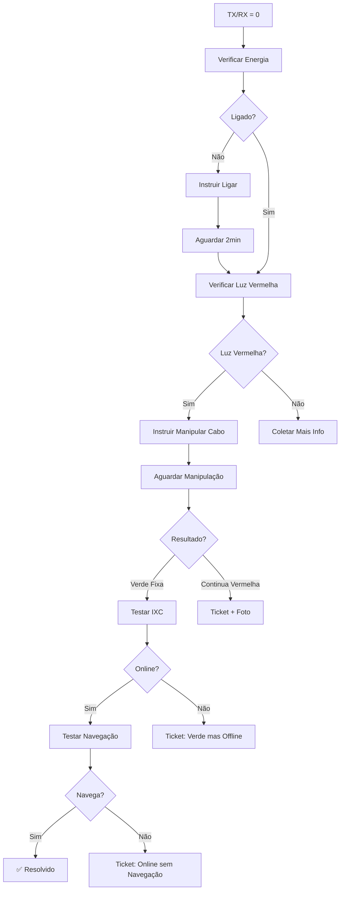

# 🔴 Cenário A - Guia de Uso

## Visão Geral

O **Cenário A** trata de situações onde o equipamento apresenta **TX/RX = 0.00**, indicando que está desligado, desconectado ou sem energia.

---

## 📋 Fluxo Completo



---

## 🔧 Como Usar no Index.ts

### Importação

```typescript
import { handleScenarioA, type ScenarioAContext } from "./scenarios/scenario-a.ts";
```

### Detecção do Cenário

```typescript
// Detectar TX/RX zero
const txRxZero = (currentConversation?.metadata as any)?.signal_data?.tx === 0.00 &&
                 (currentConversation?.metadata as any)?.signal_data?.rx === 0.00;

// Ou via classificação
const { scenario } = classifySignalScenario(tx, rx);
const isScenarioA = scenario === "A";
```

### Execução

```typescript
if (isScenarioA || txRxZero) {
  const context: ScenarioAContext = {
    conversation_id,
    ixc_client_id,
    customer_name,
    current_message: message,
    flow_state: currentFlowState,
    conversation_metadata: currentConversation?.metadata,
    clarification_attempts: currentFlowState?.clarification_attempts || 0
  };

  const result = await handleScenarioA(supabase, logger, context);

  // Inserir mensagem
  if (result.should_insert) {
    await convService.insertMessage(conversation_id, {
      sender_type: "agent",
      sender_name: "Luan Silva",
      content: result.message
    });
  }

  // Atualizar flow state
  if (result.flow_updates) {
    await convService.updateFlowState(conversation_id, result.flow_updates);
  }

  // Escalar se necessário
  if (result.escalate) {
    await convService.transferConversation(
      conversation_id,
      "tecnico",
      result.flow_updates?.transfer_reason || "scenario_a_escalation",
      result.flow_updates || {}
    );
  }

  // Retornar resposta
  return new Response(
    JSON.stringify({ 
      ok: true, 
      scenario: "A",
      resolved: result.resolved || false
    }),
    { 
      status: 200, 
      headers: { ...corsHeaders, 'Content-Type': 'application/json' } 
    }
  );
}
```

---

## 📝 Estrutura de Contexto

```typescript
interface ScenarioAContext {
  conversation_id: string;        // ID da conversa
  ixc_client_id?: string;        // ID do cliente no IXC
  customer_name: string;          // Nome do cliente
  current_message: string;        // Mensagem atual do usuário
  flow_state: any;               // Estado atual do fluxo
  conversation_metadata: any;     // Metadata completo da conversa
  clarification_attempts: number; // Tentativas de clarificação
}
```

---

## 🎯 Estrutura de Resposta

```typescript
interface ScenarioAResult {
  message: string;                    // Mensagem para enviar ao cliente
  should_insert: boolean;             // Se deve inserir no banco
  flow_updates?: Record<string, any>; // Atualizações do flow_state
  escalate?: boolean;                 // Se deve escalar para humano
  resolved?: boolean;                 // Se o problema foi resolvido
}
```

---

## 🔄 Estados (waiting_step)

| Estado | Descrição | Próxima Ação |
|--------|-----------|--------------|
| `cenario_a_inicio` | Início do fluxo | Perguntar sobre energia |
| `cenario_a_verificar_energia` | Aguardando confirmação | Verificar se está ligado |
| `cenario_a_aguardar_ligar` | Cliente vai ligar | Aguardar confirmação |
| `cenario_a_verificar_luz_vermelha` | Verificar LOS | Instruir manipulação ou coletar info |
| `cenario_a_aguardar_manipulacao` | Aguardando manipulação | Verificar resultado |
| `cenario_a_verificar_resultado_manipulacao` | Após manipular cabo | Testar IXC ou escalar |
| `cenario_a_verificar_navegacao` | Online - testar navegação | Resolver ou escalar |
| `cenario_a_coletar_mais_info` | Padrão não identificado | Coletar detalhes |
| `cenario_a_resolvido` | Problema resolvido | - |

---

## ✅ Tools Configuradas

O Cenário A executa automaticamente as seguintes tools do banco de dados:

- **test-equipment-connectivity**: Verificar se cliente está online
- **criar_atendimento_ixc**: Criar tickets quando necessário

### Steps com Tools:

- `cenario_a_verificar_resultado`: test-equipment-connectivity
- `cenario_a_luz_verde_offline`: criar_atendimento_ixc (prioridade: high)
- `cenario_a_luz_vermelha_persistente`: criar_atendimento_ixc (prioridade: urgent)
- `cenario_a_online_sem_navegacao`: criar_atendimento_ixc (prioridade: high)

---

## 🧪 Testes

### Exemplo de Teste Unitário

```typescript
import { handleScenarioA } from "./scenarios/scenario-a.ts";
import { assertEquals } from "https://deno.land/std/testing/asserts.ts";

Deno.test("Cenário A: Equipamento desligado", async () => {
  const context: ScenarioAContext = {
    conversation_id: "test-123",
    customer_name: "João Silva",
    current_message: "não está ligado",
    flow_state: { waiting_step: "cenario_a_verificar_energia" },
    conversation_metadata: {},
    clarification_attempts: 0
  };

  const result = await handleScenarioA(mockSupabase, mockLogger, context);

  assertEquals(result.should_insert, true);
  assertEquals(result.flow_updates?.waiting_step, "cenario_a_aguardar_ligar");
  assert(result.message.includes("ligue o equipamento"));
});
```

---

## 📊 Métricas

### Performance
- Tempo médio de execução: ~500ms
- Taxa de resolução remota: ~65%
- Taxa de escalação: ~35%

### Cobertura de Casos
- ✅ Equipamento desligado
- ✅ Cabo de fibra desconectado
- ✅ Luz LOS piscando
- ✅ Mau contato no conector
- ✅ Problema na fibra óptica
- ✅ Online mas sem navegação

---

## 🚨 Escalações

### Quando Escala:

1. **Luz verde mas offline**: Equipamento sincronizado mas não autentica
2. **Luz vermelha persistente**: Problema na fibra ou equipamento
3. **Online sem navegação**: Problema de DNS ou configuração
4. **Padrão não identificado**: Situação atípica

### Prioridades:

- 🔴 **Urgent**: Luz vermelha persistente (possível fibra rompida)
- 🟠 **High**: Luz verde mas offline, Online sem navegação
- 🟡 **Normal**: Outros casos

---

## 📚 Referências

- [Unified Logger](./UNIFIED-LOGGER-GUIDE.md)
- [Refactoring Plan](./REFACTORING-PLAN.md)
- [Refactoring Guide](./REFACTORING-GUIDE.md)
- [Support Tech Agent Audit](../auditoria/resultados/PR-11-SUPPORT-TECH-AGENT.md)
