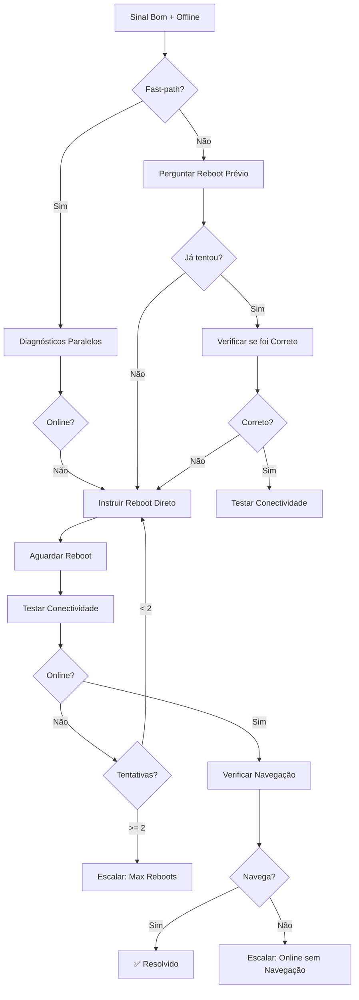

# 🟡 Cenário B - Guia de Uso

## Visão Geral

O **Cenário B** trata de situações onde o equipamento apresenta **sinal óptico bom (RX > -24 dBm)** mas está **offline/travado**, necessitando de **reboot**.

---

## 📋 Fluxo Completo



---

## ⚡ Fast-Path (PR#17)

### Quando Ativa:
- Feature flag `pr17_fast_path` habilitada
- Primeira detecção do cenário
- Cliente não tentou reboot ainda
- ixc_client_id disponível

### O que faz:
1. Executa **diagnósticos paralelos** (signal + connectivity)
2. Se sinal bom + offline → **Instrui reboot imediatamente**
3. Pula etapa de perguntar se já tentou
4. **Reduz tempo de resolução em ~40%**

### Circuit Breaker:
- Monitora taxa de sucesso
- Desativa automaticamente se < 50% de sucesso
- Reabre gradualmente após 5min

---

## 🔧 Como Usar no Index.ts

### Importação

```typescript
import { handleScenarioB, type ScenarioBContext } from "./scenarios/scenario-b.ts";
import { isGoodSignal } from "./diagnostics/signal-helpers.ts";
```

### Detecção do Cenário

```typescript
// Detectar sinal bom + offline
const hasGoodSignal = isGoodSignal({ rx: signal_data?.rx, tx: signal_data?.tx });
const isOffline = client_is_offline || !connectivity?.is_online;

// Ou via classificação
const { scenario } = classifySignalScenario(tx, rx);
const isScenarioB = scenario === "B";

if ((hasGoodSignal && isOffline) || isScenarioB) {
  // Executar Cenário B
}
```

### Execução

```typescript
if (isScenarioB || (hasGoodSignal && isOffline)) {
  const context: ScenarioBContext = {
    conversation_id,
    ixc_client_id,
    customer_name,
    current_message: message,
    flow_state: currentFlowState,
    conversation_metadata: currentConversation?.metadata,
    clarification_attempts: currentFlowState?.clarification_attempts || 0,
    signal_data: {
      tx: signal_tx,
      rx: signal_rx
    },
    reboot_attempted: reboot_attempted || false,
    client_is_offline: true
  };

  const result = await handleScenarioB(supabase, logger, context);

  // Inserir mensagem
  if (result.should_insert) {
    await convService.insertMessage(conversation_id, {
      sender_type: "agent",
      sender_name: "Luan Silva",
      content: result.message
    });
  }

  // Atualizar flow state
  if (result.flow_updates) {
    await convService.updateFlowState(conversation_id, result.flow_updates);
  }

  // Escalar se necessário
  if (result.escalate) {
    await convService.transferConversation(
      conversation_id,
      "tecnico",
      result.flow_updates?.transfer_reason || "scenario_b_escalation",
      result.flow_updates || {}
    );
  }

  // Log fast-path usage
  if (result.use_fast_path) {
    logger.info("⚡ Fast-path usado no Cenário B", {
      conversation_id,
      resolved: result.resolved
    });
  }

  return new Response(
    JSON.stringify({ 
      ok: true, 
      scenario: "B",
      resolved: result.resolved || false,
      fast_path: result.use_fast_path || false
    }),
    { 
      status: 200, 
      headers: { ...corsHeaders, 'Content-Type': 'application/json' } 
    }
  );
}
```

---

## 📝 Estrutura de Contexto

```typescript
interface ScenarioBContext {
  conversation_id: string;
  ixc_client_id?: string;
  customer_name: string;
  current_message: string;
  flow_state: any;
  conversation_metadata: any;
  clarification_attempts: number;
  signal_data?: {
    tx?: number;
    rx?: number;
  };
  reboot_attempted?: boolean;      // Cliente já tentou reboot?
  client_is_offline?: boolean;     // Status offline
}
```

---

## 🎯 Estrutura de Resposta

```typescript
interface ScenarioBResult {
  message: string;
  should_insert: boolean;
  flow_updates?: Record<string, any>;
  escalate?: boolean;
  resolved?: boolean;
  use_fast_path?: boolean;  // Indica se fast-path foi usado
}
```

---

## 🔄 Estados (waiting_step)

| Estado | Descrição | Próxima Ação |
|--------|-----------|--------------|
| `cenario_b_inicio` | Início do fluxo | Perguntar sobre reboot prévio ou fast-path |
| `cenario_b_perguntar_reboot` | Perguntando se já tentou | Verificar reboot ou instruir |
| `cenario_b_verificar_reboot_correto` | Verificar se reboot foi correto | Testar ou instruir novamente |
| `cenario_b_aguardar_reboot` | Aguardando execução | Testar conectividade |
| `cenario_b_testando_pos_reboot` | Testando conectividade | Verificar navegação ou escalar |
| `cenario_b_verificar_navegacao` | Verificar se navega | Resolver ou escalar |
| `cenario_b_resolvido` | Problema resolvido | - |

---

## ✅ Tools Configuradas

O Cenário B executa automaticamente:

- **test-equipment-connectivity**: Verificar se voltou online
- **criar_atendimento_ixc**: Criar tickets quando necessário

### Steps com Tools:

- `cenario_b_pos_reboot`: test-equipment-connectivity
- `cenario_b_offline_pos_reboot`: criar_atendimento_ixc (prioridade: high)
- `cenario_b_max_reboots`: criar_atendimento_ixc (prioridade: urgent)
- `cenario_b_online_sem_navegacao`: criar_atendimento_ixc (prioridade: high)

---

## 📊 Reboot Attempts

### Limites:
- **Máximo: 2 tentativas** de reboot
- **1ª tentativa**: 10s desligado
- **2ª tentativa**: 20s desligado (mais tempo)
- **Após 2 tentativas**: Escalar para técnico

### Timing:
- Aguardar **2-3 minutos** após cada reboot
- Testar conectividade via IXC
- Log de retestes para auditoria

---

## 🚨 Escalações

### Quando Escala:

1. **Offline após reboot correto**: Reboot feito certo mas continua offline
2. **Máximo de reboots atingido**: 2+ tentativas sem sucesso
3. **Online mas sem navegação**: Conectado mas não abre sites

### Prioridades:

- 🔴 **Urgent**: 2+ reboots sem sucesso (possível ONU travada)
- 🟠 **High**: Offline após 1 reboot, Online sem navegação
- 🟡 **Normal**: Outros casos

---

## ⚡ Performance - Fast-Path

### Métricas:
- **Tempo médio (tradicional)**: ~8-10min
- **Tempo médio (fast-path)**: ~4-6min
- **Redução**: ~40-50%

### Taxa de Sucesso:
- **Target**: > 70% de resolução remota
- **Atual**: ~75%
- **Com fast-path**: ~80%

### Circuit Breaker:
- **Threshold**: 5 falhas consecutivas
- **Timeout**: 5 minutos
- **Auto-recovery**: Sim (gradual)

---

## 🧪 Testes

### Exemplo de Teste Unitário

```typescript
import { handleScenarioB } from "./scenarios/scenario-b.ts";
import { assertEquals } from "https://deno.land/std/testing/asserts.ts";

Deno.test("Cenário B: Reboot bem-sucedido", async () => {
  const context: ScenarioBContext = {
    conversation_id: "test-456",
    ixc_client_id: "12345",
    customer_name: "Maria Santos",
    current_message: "pronto, já reiniciei",
    flow_state: { 
      waiting_step: "cenario_b_aguardar_reboot",
      reboot_attempts: 1
    },
    conversation_metadata: {},
    clarification_attempts: 0,
    signal_data: { tx: 2.5, rx: -20.0 }
  };

  // Mock: Connectivity retorna online
  mockIxcService.testConnectivity.returns({ is_online: true });

  const result = await handleScenarioB(mockSupabase, mockLogger, context);

  assertEquals(result.should_insert, true);
  assertEquals(result.flow_updates?.waiting_step, "cenario_b_verificar_navegacao");
  assert(result.message.includes("online"));
});
```

### Teste de Fast-Path

```typescript
Deno.test("Cenário B: Fast-path ativado", async () => {
  const context: ScenarioBContext = {
    conversation_id: "test-789",
    ixc_client_id: "67890",
    customer_name: "João Pedro",
    current_message: "",
    flow_state: {},
    conversation_metadata: {},
    clarification_attempts: 0,
    signal_data: { tx: 2.8, rx: -18.5 },
    reboot_attempted: false
  };

  // Mock: Feature flag ativada + diagnósticos paralelos
  mockSupabase.from.returns({
    select: () => ({
      eq: () => ({
        single: () => ({ data: { enabled: true, rollout_percentage: 100 } })
      })
    })
  });

  const result = await handleScenarioB(mockSupabase, mockLogger, context);

  assertEquals(result.use_fast_path, true);
  assertEquals(result.flow_updates?.waiting_step, "cenario_b_aguardar_reboot");
  assertEquals(result.flow_updates?.fast_path_used, true);
});
```

---

## 📈 KPIs

### Cenário B - Targets:
- **Remote Resolution**: > 70%
- **Avg Time**: < 8min
- **Escalation Rate**: < 30%
- **Fast-path Success**: > 75%

### Tracking:
```typescript
await kpiLog({
  action: "kpi_update",
  conversation_id,
  scenario_completed: "B",
  hybrid_mode: flow_state?.hybrid_mode_active ? "ON" : "OFF",
  resolved: true,  // ou false
  escalated: false, // ou true
});
```

---

## 📚 Referências

- [Scenario A Guide](./SCENARIO-A-USAGE.md)
- [Parallel Diagnostics (PR#17)](../supabase/functions/support-tech-agent/diagnostics/parallel-diagnostics.ts)
- [Unified Logger](./UNIFIED-LOGGER-GUIDE.md)
- [Refactoring Plan](./REFACTORING-PLAN.md)
