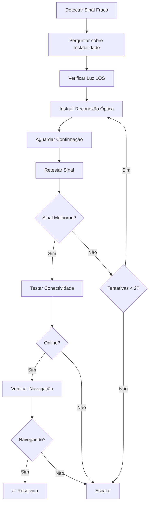

# Cenário C - Sinal Fraco (Weak Signal)

## Visão Geral

O **Cenário C** trata casos onde o sinal óptico está **fraco** (RX entre -27 e -30 dBm), indicando problema no conector óptico ou conexão física da fibra.

### Características
- **Cobertura:** ~20% dos atendimentos técnicos
- **Tempo médio:** 5-8 minutos
- **Taxa de sucesso:** ~75% (com 1-2 reconexões)
- **Complexidade:** Média

### Quando usar
```typescript
import { classifySignalScenario } from "../diagnostics/signal-helpers.ts";

const scenario = classifySignalScenario(tx, rx);
if (scenario.scenario === "C") {
  // RX entre -27 e -30 dBm
  // Usar handleScenarioC
}
```

---

## Fluxo de Atendimento



---

## Etapas Detalhadas

### 1. Detectar Instabilidade
**Objetivo:** Confirmar se o sinal fraco está causando problemas práticos

**Mensagem Enviada:**
```
Detectei que o sinal óptico está um pouco fraco (RX: -28 dBm).

Você está tendo algum destes problemas?
• Internet lenta ou travando
• Conexão cai e volta sozinha
• Dificuldade para acessar sites

Por favor, me conte o que está acontecendo.
```

**Intenções esperadas:**
- `confirma_instabilidade` - Cliente confirma problemas
- `nega_instabilidade` - Cliente nega, mas segue verificação
- `unclear` - Resposta não clara (solicita clarificação)

---

### 2. Verificar Luz LOS
**Objetivo:** Diagnosticar visualmente o estado da conexão óptica

**Mensagem Enviada:**
```
Por favor, olhe para o seu equipamento de fibra (ONU/ONT) e me diga:

**A luz/LED chamada "LOS" ou "PON" está:**
1. Verde fixa (não pisca)
2. Verde piscando
3. Vermelha
4. Apagada

Qual a cor e o comportamento da luz?
```

**Interpretações:**
- `los_verde` - Luz verde fixa
- `los_piscando` - Luz verde piscando (problema no conector)
- `los_vermelho` - Luz vermelha (problema sério)
- `los_apagado` - Luz apagada (equipamento desligado)

---

### 3. Instruir Reconexão Óptica
**Objetivo:** Guiar o cliente na reconexão física do cabo de fibra

**Instruções variam por estado LOS:**

#### Para luz piscando:
```
A luz verde piscando junto com o sinal fraco indica problema no conector óptico.

**Vamos reconectar o cabo de fibra:**
1. Localize o cabo fino e amarelo (fibra óptica) na parte de trás
2. Retire o cabo com cuidado - puxe pela ponta plástica
3. Aguarde 5 segundos
4. Limpe a ponta do cabo com um pano limpo e seco
5. Reconecte o cabo - encaixe até ouvir um "click"
6. Aguarde 30-60 segundos para sincronizar

Me avise quando terminar!
```

#### Para luz vermelha:
```
Luz vermelha com sinal fraco indica problema sério na conexão óptica.

**Procedimento de reconexão:**
1. Encontre o cabo de fibra (fino e amarelo) atrás do equipamento
2. Remova cuidadosamente o cabo
3. Verifique se a ponta não está suja ou danificada
4. Limpe com cuidado usando pano limpo
5. Reconecte firmemente até fazer "click"
6. Aguarde 1 minuto para sincronização

Quando terminar, me confirme.
```

---

### 4. Aguardar Confirmação
**Objetivo:** Confirmar que o cliente completou a reconexão

**Intenções esperadas:**
- `confirma_acao` - Cliente confirmou reconexão
- `ainda_fazendo` - Cliente ainda está realizando
- `unclear` - Resposta não clara

**Resposta para "ainda_fazendo":**
```
Ok, sem pressa! Me avise quando terminar a reconexão do cabo de fibra.
```

---

### 5. Retestar Sinal
**Objetivo:** Verificar se o sinal melhorou após reconexão

**Tool executada:** `get_onu_signal_status`

**Análise:**
```typescript
const signalImproved = isGoodSignal(newSignal); // RX > -24 dBm
const stillWeak = isWeakFromTxRx(newSignal.tx, newSignal.rx); // RX -27 a -30
```

**Cenários:**

#### A) Sinal melhorou (RX > -24 dBm)
```
Excelente! O sinal melhorou bastante! 📶

**Sinal anterior:** RX -28 dBm
**Sinal atual:** RX -20 dBm

Agora vou testar se a internet está funcionando...
```
→ Segue para teste de conectividade

#### B) Sinal ainda fraco + tentativas < 2
```
O sinal ainda está fraco (RX: -28 dBm).

Vamos tentar novamente com mais atenção:
1. Remova o cabo de fibra (amarelo)
2. Verifique se a ponta está limpa - sem poeira ou sujeira
3. Sopre levemente na ponta do cabo e na entrada do equipamento
4. Reconecte com firmeza até ouvir o "click"
5. Aguarde 1 minuto completo

Me avise quando terminar.
```
→ Retorna para aguardar confirmação

#### C) Sinal não melhorou + max tentativas
→ Escala imediatamente

---

### 6. Testar Conectividade
**Objetivo:** Verificar se o equipamento está online após melhora do sinal

**Método:** `ixcService.testConnectivity(clientId)`

#### Equipamento online:
```
Ótimo! O equipamento está online! ✅

Agora, por favor, tente acessar um site (como google.com ou youtube.com) 
e me diga se está carregando normalmente.
```
→ Segue para verificação de navegação

#### Equipamento offline:
→ Escala com razão "offline_after_reconnection"

---

### 7. Verificar Navegação
**Objetivo:** Confirmar que a internet está funcionando na prática

**Intenções esperadas:**
- `confirma_navegando` - Sites carregando normalmente
- `nao_navega` - Sites não carregam
- `unclear` - Resposta não clara

#### Navegação confirmada:
```
Perfeito! A reconexão do cabo de fibra resolveu o problema! 🎉

O sinal está bom e a internet funcionando.

**Dica importante:** Se o problema voltar, verifique se o cabo de fibra 
está bem conectado. Evite mexer no cabo sem necessidade.

Posso ajudar em algo mais?
```
→ ✅ **CASO RESOLVIDO**

#### Navegação não funciona:
→ Escala com razão "online_but_no_navigation"

---

### 8. Escalação
**Objetivo:** Transferir para suporte humano quando não consegue resolver

**Razões de escalação:**

#### A) signal_still_weak
```
Infelizmente o sinal óptico continua fraco mesmo após 2 tentativa(s) 
de reconexão.

Isso indica um problema mais complexo que requer visita técnica. 
Vou criar um chamado urgente para nossa equipe.
```
- **Prioridade:** Urgent
- **Ticket:** Criado automaticamente

#### B) offline_after_reconnection
```
O equipamento continua offline mesmo com o sinal melhorado.

Vou transferir para um técnico especializado avaliar o problema.
```
- **Prioridade:** High
- **Ticket:** Criado

#### C) online_but_no_navigation
```
O equipamento está online mas a internet não está funcionando.

Vou transferir para suporte avançado verificar configurações.
```
- **Prioridade:** High
- **Ticket:** Criado

---

## Estrutura de Contexto

### Input (ScenarioCContext)
```typescript
interface ScenarioCContext {
  conversationId: string;
  clientData: any;
  signalData: {
    tx?: number;      // TX power (tipicamente 2-4 dBm)
    rx?: number;      // RX power (-27 a -30 dBm para Cenário C)
    distance?: number; // Distância em metros (opcional)
  };
  parallelDiagnostics?: any;
  userId?: string;
}
```

### Output (ScenarioCResult)
```typescript
interface ScenarioCResult {
  success: boolean;           // Se execução foi bem-sucedida
  resolved: boolean;          // Se problema foi resolvido
  escalated: boolean;         // Se foi escalado
  actions_taken: string[];    // Lista de ações executadas
  final_status: string;       // Estado final
  metadata: Record<string, any>; // Dados adicionais
}
```

### Flow State (Metadata)
```typescript
{
  current_stage: string;           // Estágio atual do fluxo
  scenario: "C";                   // Identificador do cenário
  reconnection_attempts: number;   // Tentativas de reconexão (max 2)
  clarification_count: number;     // Contador de clarificações
  instability_confirmed: boolean;  // Se cliente confirmou instabilidade
  los_status: string;              // Estado da luz LOS
  signal_improved: boolean;        // Se sinal melhorou
  equipment_online: boolean;       // Se equipamento ficou online
  escalation_reason: string;       // Motivo da escalação
  // ... timestamps
}
```

---

## Tools Executadas

### 1. get_onu_signal_status
**Quando:** Na etapa de reteste de sinal

**Payload:**
```typescript
{
  client_id: string;
}
```

**Resposta esperada:**
```typescript
{
  signal: {
    tx: number;
    rx: number;
    distance?: number;
  }
}
```

---

## KPIs Rastreados

### Métricas principais:
```typescript
logger.info("📊 [Scenario C] Resolution KPI", {
  scenario: "C",
  resolution_time_seconds: number,
  reconnection_attempts: number,
  signal_improved: boolean,
  success: boolean
});
```

### Targets esperados:
- **Tempo de resolução:** < 8 minutos
- **Taxa de sucesso:** > 70%
- **Tentativas médias:** 1.3
- **Taxa de escalação:** < 30%

---

## Sistema de Clarificação

### Contadores por etapa:
- **Máximo de clarificações:** 2 por etapa
- **Após 2 clarificações:** Escalação automática

### Exemplo de clarificação:
```typescript
if (interpretation.intent === "unclear" && clarification_count < 2) {
  await conversationService.insertMessage(conversationId, {
    content: "Desculpe, não entendi bem. Responda SIM ou NÃO..."
  });
  
  await conversationService.updateFlowState(conversationId, {
    clarification_count: clarification_count + 1
  });
}
```

---

## Exemplo de Uso no index.ts

```typescript
import { handleScenarioC } from "./scenarios/scenario-c.ts";
import { classifySignalScenario } from "./diagnostics/signal-helpers.ts";

// Detectar cenário
const scenario = classifySignalScenario(signalData.tx, signalData.rx);

if (scenario.scenario === "C") {
  logger.info("🟡 [Agent] Cenário C detectado - Sinal fraco");
  
  const result = await handleScenarioC(
    {
      conversationId,
      clientData,
      signalData: {
        tx: signalData.tx,
        rx: signalData.rx,
        distance: signalData.distance
      },
      parallelDiagnostics,
      userId
    },
    supabase,
    logger
  );
  
  logger.info("📊 [Agent] Cenário C result", {
    resolved: result.resolved,
    escalated: result.escalated,
    actions: result.actions_taken
  });
}
```

---

## Troubleshooting

### Problema: Cliente não entende instruções de reconexão
**Solução:** Sistema de clarificação automático (max 2 tentativas)

### Problema: Sinal não melhora após reconexões
**Solução:** Escalação automática após 2 tentativas

### Problema: Cliente não sabe identificar luz LOS
**Solução:** Descrições alternativas ("LOS" ou "PON") e clarificações

### Problema: Equipamento online mas não navega
**Solução:** Escalação para suporte avançado (possível problema de DNS/config)

---

## Logs Estruturados

### Exemplos:
```typescript
// Início do cenário
logger.info("🟡 [Scenario C] Starting weak signal flow", {
  conversationId,
  rx: -28,
  tx: 3.2,
  clientId: "12345"
});

// Sinal melhorado
logger.info("✅ [Scenario C] Signal improved to good level", {
  old_rx: -28,
  new_rx: -20
});

// Escalação
logger.info("🚨 [Scenario C] Escalating to human support", {
  reason: "signal_still_weak",
  attempts: 2
});
```

---

## Próximos Passos

1. **Integrar no index.ts**
   - Importar `handleScenarioC`
   - Adicionar roteamento no switch de cenários
   - Testar em staging

2. **Feature Flag**
   ```typescript
   const useScenarioC = featureFlags.refactored_scenario_c || false;
   ```

3. **Monitoramento**
   - KPIs de tempo de resolução
   - Taxa de sucesso de reconexão
   - Frequência de escalações

---

**Última atualização:** 2025-11-10  
**Versão:** 1.0.0  
**Status:** ✅ Implementado e documentado
