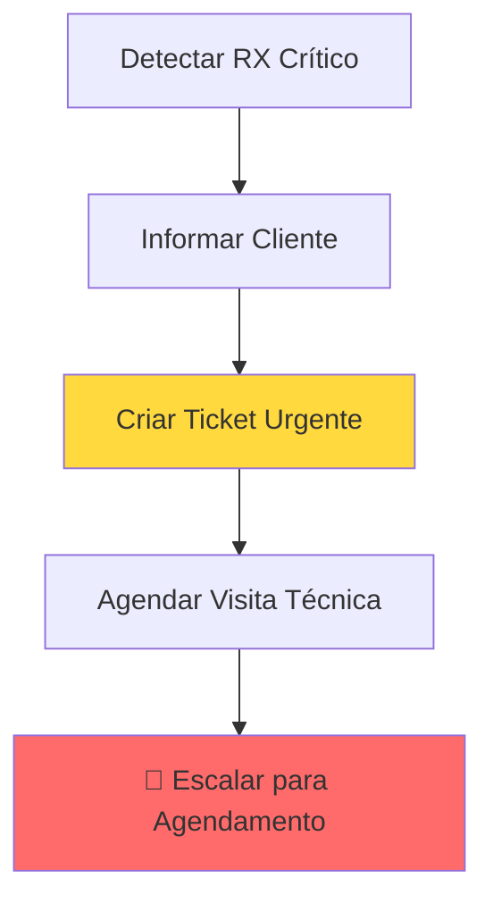

# Cenário D - RX Crítico (Critical RX)

## Visão Geral

O **Cenário D** trata casos onde o sinal óptico RX está **criticamente baixo** (< -30 dBm), indicando problema grave que **não pode ser resolvido remotamente** e requer visita técnica urgente.

### Características
- **Cobertura:** ~5% dos atendimentos técnicos
- **Tempo médio:** 2-3 minutos (escalação imediata)
- **Taxa de resolução remota:** 0% (sempre requer visita)
- **Complexidade:** Baixa (fluxo linear)
- **Prioridade:** Crítica/Urgente

### Quando usar
```typescript
import { classifySignalScenario } from "../diagnostics/signal-helpers.ts";

const scenario = classifySignalScenario(tx, rx);
if (scenario.scenario === "D") {
  // RX < -30 dBm
  // Usar handleScenarioD
}
```

---

## Fluxo de Atendimento



**Características do Fluxo:**
- ✅ **Totalmente automatizado** - Sem interação necessária
- ⚡ **Execução rápida** - 2-3 minutos
- 🎫 **Ticket automático** - Criado com prioridade crítica
- 📞 **Escalação imediata** - Sem tentativas de resolução remota

---

## Etapas Detalhadas

### 1. Detectar RX Crítico
**Objetivo:** Identificar sinal criticamente baixo

**Critério:**
```typescript
if (rx < -30) {
  // Cenário D - Crítico
  // Impossível resolver remotamente
}
```

**Ação:** Proceder imediatamente para informar cliente

---

### 2. Informar Cliente
**Objetivo:** Explicar gravidade e necessidade de visita técnica

**Mensagem enviada:**
```
⚠️ **PROBLEMA GRAVE DETECTADO**

O sinal óptico está [severidade] dBm:
• **RX atual:** -32 dBm (Normal: acima de -24 dBm)
• **Situação:** Problema sério na fibra óptica

**O que isso significa:**
Este problema NÃO pode ser resolvido remotamente. É necessária 
uma visita técnica urgente para verificar:
- Cabo de fibra danificado ou rompido
- Problemas na rede externa
- Equipamento com defeito

**Próximos passos:**
Vou criar um chamado URGENTE e nossa equipe entrará em contato 
para agendar a visita técnica o mais rápido possível.

Aguarde alguns segundos...
```

**Níveis de severidade:**
- RX < -35 dBm: "extremamente crítico (praticamente sem sinal)"
- RX < -32 dBm: "muito crítico (sinal muito fraco)"
- RX < -30 dBm: "crítico (sinal insuficiente)"

---

### 3. Criar Ticket Urgente
**Objetivo:** Registrar problema com máxima prioridade

**Parâmetros do ticket:**
```typescript
{
  title: "[URGENTE] Sinal óptico crítico - RX -32 dBm",
  priority: "critical",
  category: "technical_support_urgent",
  description: `
    ⚠️ PROBLEMA CRÍTICO - PRIORIDADE MÁXIMA
    
    Sinal óptico crítico detectado:
    RX: -32 dBm (crítico: < -30 dBm)
    TX: 3.2 dBm
    
    Diagnóstico:
    - Possível rompimento ou dano severo na fibra
    - Requer visita técnica IMEDIATA
    
    Ações necessárias:
    1. Agendar visita em até 24 horas
    2. Verificar integridade do cabo
    3. Testar equipamento
    4. Verificar rede externa
  `
}
```

**Mensagem ao cliente (sucesso):**
```
✅ Chamado urgente criado com sucesso!

**Número do chamado:** [ticket_id]

Nossa equipe técnica já foi notificada e entrará em contato 
com você em breve para agendar a visita.

**Previsão de atendimento:** Até 24 horas
**Prioridade:** Crítica

Você receberá um contato por telefone ou WhatsApp para 
combinar o melhor horário para a visita técnica.

Enquanto isso, evite mexer no equipamento ou nos cabos.
```

**Mensagem (falha):**
```
Houve um problema ao criar o chamado automaticamente, 
mas não se preocupe!

Vou transferir você diretamente para nossa equipe técnica 
que criará o chamado urgente manualmente e agendará sua 
visita imediatamente.
```

---

### 4. Agendar Visita Técnica
**Objetivo:** Preparar cliente e fornecer informações sobre a visita

**Mensagem enviada:**
```
📋 **Informações importantes para a visita técnica:**

**O que o técnico irá verificar:**
• Estado do cabo de fibra óptica
• Conexões na rede externa
• Equipamento ONU
• Possíveis danos físicos

**Como se preparar:**
• Garanta acesso ao local onde está o equipamento
• Tenha em mãos o número do chamado: [ticket_id]
• Não mexa no equipamento antes da visita

**Próximos passos:**
Vou transferir você para nossa equipe de agendamento que 
entrará em contato imediatamente para combinar o melhor horário.
```

---

### 5. Escalação Imediata
**Objetivo:** Transferir para equipe de agendamento/técnica

**Mensagem final:**
```
Transferindo você agora para nossa equipe de agendamento. 
Eles entrarão em contato em breve.

Obrigado pela compreensão! 🙏
```

**Metadados da transferência:**
```typescript
{
  scenario: "D",
  rx_value: -32,
  ticket_id: "12345",
  priority: "critical",
  requires_visit: true,
  escalation_reason: "critical_fiber_issue"
}
```

---

## Estrutura de Contexto

### Input (ScenarioDContext)
```typescript
interface ScenarioDContext {
  conversationId: string;
  clientData: any;
  signalData: {
    tx?: number;
    rx?: number;      // < -30 dBm para Cenário D
    distance?: number;
  };
  parallelDiagnostics?: any;
  userId?: string;
}
```

### Output (ScenarioDResult)
```typescript
interface ScenarioDResult {
  success: boolean;           // Se execução foi bem-sucedida
  resolved: boolean;          // SEMPRE false (requer visita)
  escalated: boolean;         // SEMPRE true
  actions_taken: string[];    // Lista de ações executadas
  final_status: string;       // "escalated_for_visit"
  metadata: {
    ticket_id?: string;
    rx_value: number;
    escalation_time: number;
    requires_visit: true;
  };
}
```

### Flow State (Metadata)
```typescript
{
  current_stage: string;
  scenario: "D";
  rx_value: number;
  detection_time: string;
  client_informed_at: string;
  ticket_id?: string;
  ticket_created: boolean;
  ticket_created_at: string;
  visit_info_sent_at: string;
  escalated: true;
  escalated_at: string;
  escalation_time_seconds: number;
}
```

---

## KPIs Rastreados

### Métricas principais:
```typescript
logger.info("📊 [Scenario D] Escalation KPI", {
  scenario: "D",
  resolution_time_seconds: number,
  rx_value: number,
  ticket_created: boolean,
  ticket_id: string,
  success: boolean
});
```

### Targets esperados:
- **Tempo de escalação:** < 3 minutos
- **Taxa de criação de ticket:** > 95%
- **Taxa de escalação:** 100% (sempre escala)
- **Prioridade do ticket:** Critical

---

## Exemplo de Uso no index.ts

```typescript
import { handleScenarioD } from "./scenarios/scenario-d.ts";
import { classifySignalScenario } from "./diagnostics/signal-helpers.ts";

// Detectar cenário
const scenario = classifySignalScenario(signalData.tx, signalData.rx);

if (scenario.scenario === "D") {
  logger.info("🔴 [Agent] Cenário D detectado - RX crítico");
  
  const result = await handleScenarioD(
    {
      conversationId,
      clientData,
      signalData: {
        tx: signalData.tx,
        rx: signalData.rx,
        distance: signalData.distance
      },
      parallelDiagnostics,
      userId
    },
    supabase,
    logger
  );
  
  logger.info("📊 [Agent] Cenário D result", {
    escalated: result.escalated,
    ticket_id: result.metadata.ticket_id,
    actions: result.actions_taken
  });
  
  // Cenário D sempre escala, nunca resolve remotamente
  return result;
}
```

---

## Troubleshooting

### Problema: Falha na criação do ticket
**Solução:** Sistema continua o fluxo e transfere manualmente para equipe técnica

### Problema: Cliente quer tentar resolver remotamente
**Resposta padrão:** "Com este nível de sinal crítico, qualquer tentativa remota seria ineficaz e atrasaria a solução. A visita técnica é necessária."

### Problema: Cliente pergunta quanto tempo demora
**Resposta padrão:** "Prazo máximo de 24 horas para contato e agendamento. A visita será agendada conforme sua disponibilidade."

---

## Diferenças dos Outros Cenários

| Aspecto | Cenário A/B/C | Cenário D |
|---------|---------------|-----------|
| **Tentativas remotas** | Sim (múltiplas) | Não |
| **Interação com cliente** | Alta | Mínima |
| **Tempo médio** | 4-8 minutos | 2-3 minutos |
| **Taxa de resolução** | 60-75% | 0% |
| **Escalação** | Condicional | Sempre |
| **Ticket** | Opcional | Obrigatório |
| **Prioridade** | Normal/High | Critical |

---

## Logs Estruturados

### Exemplos:
```typescript
// Detecção
logger.info("🔴 [Scenario D] Starting critical RX flow", {
  conversationId,
  rx: -32,
  tx: 3.2,
  clientId: "12345"
});

// Ticket criado
logger.info("✅ [Scenario D] Ticket created successfully", {
  ticket_id: "98765"
});

// Escalação
logger.info("🚨 [Scenario D] Escalating to scheduling team", {
  ticket_id: "98765",
  rx: -32
});
```

---

## Próximos Passos

1. **Integrar no index.ts**
   - Importar `handleScenarioD`
   - Adicionar no switch de cenários
   - Testar em staging

2. **Feature Flag**
   ```typescript
   const useScenarioD = featureFlags.refactored_scenario_d || false;
   ```

3. **Monitoramento**
   - KPIs de tempo de escalação
   - Taxa de criação de ticket
   - Tempo médio até agendamento

---

**Última atualização:** 2025-11-10  
**Versão:** 1.0.0  
**Status:** ✅ Implementado e documentado
