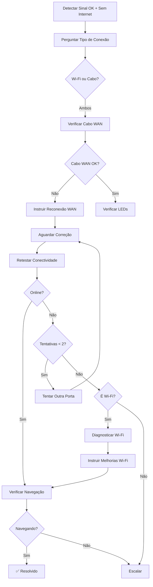

# Cenário E - WAN/Wi-Fi Issues

## Visão Geral

O **Cenário E** trata casos onde o **sinal óptico está OK** mas há problemas de rede (WAN ou Wi-Fi), exigindo diagnóstico diferenciado entre problemas de cabo de rede, roteador, ou conexão sem fio.

### Características
- **Cobertura:** ~5% dos atendimentos técnicos
- **Tempo médio:** 8-12 minutos
- **Taxa de sucesso:** ~60% (depende do tipo de problema)
- **Complexidade:** Alta (múltiplos cenários possíveis)

### Quando usar
```typescript
import { classifySignalScenario } from "../diagnostics/signal-helpers.ts";
import { isGoodSignal } from "../diagnostics/signal-helpers.ts";

const scenario = classifySignalScenario(tx, rx);
const signalOk = isGoodSignal({ tx, rx });

if (scenario.scenario === "E" || (signalOk && !connectivity.ping)) {
  // Sinal óptico OK mas sem conectividade
  // Usar handleScenarioE
}
```

---

## Fluxo de Atendimento



---

## Etapas Detalhadas

### 1. Perguntar Tipo de Conexão
**Objetivo:** Identificar se o problema é Wi-Fi ou cabo

**Mensagem:**
```
Vi que o sinal óptico está bom (RX: -20 dBm), mas você está sem internet.

Para diagnosticar melhor, preciso saber:

**Como você está tentando se conectar?**
1. Por Wi-Fi (sem fio)
2. Por cabo (conectado direto no equipamento)

Por favor, me diga qual das opções.
```

**Intenções esperadas:**
- `conexao_wifi` - Cliente usa Wi-Fi
- `conexao_cabo` - Cliente usa cabo ethernet
- `unclear` - Resposta não clara

---

### 2. Verificar Cabo WAN
**Objetivo:** Checar se o cabo entre ONU e roteador está conectado

**Mensagem:**
```
[Tipo de conexão identificado]. Vamos verificar a conexão principal.

**O equipamento possui 2 tipos de cabo:**
1. **Cabo de FIBRA ÓPTICA** (fino, amarelo) - conecta na porta "PON" ou "LOS"
2. **Cabo de REDE** (mais grosso, colorido) - conecta na porta "WAN" ou "Internet"

Por favor, verifique:
• O cabo de REDE (grosso) está conectado na porta "WAN" do equipamento?
• Este cabo vai até seu roteador/computador?

Me diga: SIM se está conectado, ou NÃO se está solto/desconectado.
```

**Intenções esperadas:**
- `cabo_conectado` - Cabo WAN está bem conectado
- `cabo_solto` - Cabo WAN está solto ou desconectado
- `unclear` - Cliente não sabe verificar

---

### 3. Verificar LEDs do Equipamento
**Objetivo:** Diagnosticar visualmente o estado da ONU

**Mensagem:**
```
Ótimo, o cabo WAN está conectado. Agora vamos verificar os LEDs do equipamento.

**Olhe para as luzes do equipamento principal (ONU):**

Qual luz/LED está acesa ou piscando?
1. LOS/PON - Verde
2. POWER - Verde
3. INTERNET/WAN - Verde ou piscando
4. Alguma luz vermelha
5. Todas apagadas

Me diga quais luzes você vê acesas.
```

**Análise das respostas:**
- **LOS/PON verde + POWER verde** = Normal
- **INTERNET/WAN apagada ou vermelha** = Problema WAN
- **Todas apagadas** = Equipamento desligado (redirecionar para Cenário A)

---

### 4. Instruir Reconexão WAN
**Objetivo:** Guiar reconexão física do cabo de rede

**Mensagem:**
```
Vamos reconectar o cabo WAN para garantir uma conexão firme:

**Passo a passo:**
1. **Localize o cabo de REDE** (mais grosso, geralmente azul, amarelo ou cinza)
2. **Desconecte o cabo** da porta "WAN" ou "Internet" do equipamento principal
3. **Aguarde 10 segundos**
4. **Verifique se a ponta está limpa** - sem poeira ou oxidação
5. **Reconecte firmemente** na mesma porta WAN
6. **Aguarde 30 segundos** para sincronização

Se houver um ROTEADOR adicional conectado:
7. **Desconecte e reconecte** o cabo na porta "WAN" do roteador também

Me avise quando terminar!
```

---

### 5. Aguardar Correção WAN
**Objetivo:** Confirmar que cliente completou a reconexão

**Intenções esperadas:**
- `confirma_acao` - Cliente confirmou
- `ainda_fazendo` - Cliente ainda está fazendo
- `unclear` - Resposta não clara

---

### 6. Retestar Conectividade
**Objetivo:** Verificar se equipamento voltou online

**Method:** `ixcService.testConnectivity(clientId)`

#### Equipamento online:
```
Excelente! O equipamento está online! ✅

Agora, por favor, tente acessar um site (google.com ou youtube.com) 
e me diga se está funcionando.
```
→ Segue para verificação de navegação

#### Equipamento offline + tentativas < 2:
```
O equipamento ainda está offline. Vamos tentar trocar a porta WAN:

1. Desconecte o cabo WAN da porta atual
2. Conecte em OUTRA porta disponível no equipamento
3. Aguarde 30 segundos

Alguns equipamentos têm múltiplas portas LAN/WAN. Teste outra porta.

Me avise quando terminar.
```
→ Retorna para aguardar correção

#### Equipamento offline + max tentativas:
- Se **Wi-Fi**: Segue para diagnóstico Wi-Fi
- Se **Cabo**: Escala imediatamente

---

### 7. Diagnosticar Wi-Fi
**Objetivo:** Identificar problemas de sinal sem fio

**Mensagem:**
```
Você está conectado por Wi-Fi. Vamos verificar a qualidade do sinal:

**Por favor, me diga:**
1. Quantas barrinhas de sinal Wi-Fi aparecem no seu dispositivo? 
   (1, 2, 3 ou 4 barras)
2. A que distância você está do equipamento? 
   (perto, médio, longe)
3. Quantas paredes existem entre você e o equipamento?
```

**Análise:**
- **1-2 barras** = Sinal fraco (distância ou obstáculos)
- **3-4 barras** = Sinal bom (problema pode ser interferência ou config)
- **Longe + muitas paredes** = Problema de cobertura

---

### 8. Instruir Melhorias Wi-Fi
**Objetivo:** Orientar soluções para problemas Wi-Fi

**Mensagem:**
```
Vamos melhorar sua conexão Wi-Fi:

**Opções de solução:**

**1. Aproxime-se do equipamento**
   • Teste a internet perto do roteador
   • Se funcionar, o problema é distância/sinal fraco

**2. Reinicie o Wi-Fi do seu dispositivo**
   • Desligue e ligue o Wi-Fi do celular/computador
   • Ou "esqueça" a rede e reconecte

**3. Teste por cabo (melhor opção)**
   • Se tiver um cabo de rede disponível
   • Conecte direto no equipamento
   • Isso elimina problemas de Wi-Fi

**4. Verifique interferências**
   • Afaste de micro-ondas, telefones sem fio
   • Mude o equipamento de posição se possível

Qual opção você quer tentar primeiro?
```

---

### 9. Verificar Navegação
**Objetivo:** Confirmar que internet está funcionando na prática

**Intenções esperadas:**
- `confirma_navegando` - Sites carregando
- `nao_navega` - Sites não carregam
- `unclear` - Resposta não clara

#### Navegação confirmada:
```
Perfeito! O problema foi resolvido! 🎉

[Dica específica para Wi-Fi ou Cabo]

Posso ajudar em algo mais?
```
→ ✅ **CASO RESOLVIDO**

#### Navegação falhou:
→ Escala para suporte avançado

---

### 10. Escalação
**Objetivo:** Transferir para suporte humano

**Razões de escalação:**

#### A) wan_issues_unresolved
```
Não consegui resolver o problema de conexão WAN remotamente 
após [N] tentativa(s).

Vou criar um chamado para análise técnica especializada.
```
- **Prioridade:** High
- **Possível causa:** Cabo defeituoso, porta WAN danificada, roteador com problema

#### B) navigation_failed
```
O equipamento parece estar funcionando mas a navegação não está normal.

Vou transferir para suporte avançado verificar configurações de rede.
```
- **Prioridade:** High  
- **Possível causa:** Problema de DNS, config de roteador, firewall

---

## Estrutura de Contexto

### Input (ScenarioEContext)
```typescript
interface ScenarioEContext {
  conversationId: string;
  clientData: any;
  signalData: {
    tx?: number;      // TX power OK
    rx?: number;      // RX power OK (> -24 dBm)
    distance?: number;
  };
  parallelDiagnostics?: any;
  userId?: string;
}
```

### Output (ScenarioEResult)
```typescript
interface ScenarioEResult {
  success: boolean;
  resolved: boolean;
  escalated: boolean;
  actions_taken: string[];
  final_status: string;
  metadata: {
    connection_type?: 'wifi' | 'cable';
    wan_attempts?: number;
    resolution_time?: number;
  };
}
```

### Flow State (Metadata)
```typescript
{
  current_stage: string;
  scenario: "E";
  connection_type: 'wifi' | 'cable';
  wan_reconnection_attempts: number;
  clarification_count: number;
  wan_cable_issue?: string;
  wan_cable_connected?: boolean;
  equipment_online?: boolean;
  escalation_reason?: string;
  // ... timestamps
}
```

---

## Tools Executadas

### 1. test_equipment_connectivity
**Quando:** Após tentativas de correção WAN

**Method:** `ixcService.testConnectivity(clientId)`

**Resposta esperada:**
```typescript
{
  online: boolean;
  ping: boolean;
  last_online?: string;
}
```

---

## KPIs Rastreados

### Métricas principais:
```typescript
logger.info("📊 [Scenario E] Resolution KPI", {
  scenario: "E",
  resolution_time_seconds: number,
  connection_type: 'wifi' | 'cable',
  wan_reconnection_attempts: number,
  success: boolean
});
```

### Targets esperados:
- **Tempo de resolução:** < 12 minutos
- **Taxa de sucesso:** > 55%
- **Tentativas médias WAN:** 1.5
- **Taxa de escalação:** < 45%

---

## Sistema de Clarificação

Mesmo sistema dos outros cenários:
- **Máximo de clarificações:** 2 por etapa
- **Após 2 clarificações:** Escalação ou próximo passo

---

## Exemplo de Uso no index.ts

```typescript
import { handleScenarioE } from "./scenarios/scenario-e.ts";
import { classifySignalScenario, isGoodSignal } from "./diagnostics/signal-helpers.ts";

// Detectar cenário
const scenario = classifySignalScenario(signalData.tx, signalData.rx);
const signalOk = isGoodSignal(signalData);

if (scenario.scenario === "E" || (signalOk && !connectivityResult.online)) {
  logger.info("🔵 [Agent] Cenário E detectado - Problemas de rede");
  
  const result = await handleScenarioE(
    {
      conversationId,
      clientData,
      signalData: {
        tx: signalData.tx,
        rx: signalData.rx,
        distance: signalData.distance
      },
      parallelDiagnostics,
      userId
    },
    supabase,
    logger
  );
  
  logger.info("📊 [Agent] Cenário E result", {
    resolved: result.resolved,
    escalated: result.escalated,
    connection_type: result.metadata.connection_type,
    actions: result.actions_taken
  });
}
```

---

## Troubleshooting

### Problema: Cliente não diferencia cabo de fibra de cabo de rede
**Solução:** Descrição visual detalhada (fino/amarelo vs grosso/colorido)

### Problema: Múltiplos roteadores em cascata
**Solução:** Instruir verificação de TODOS os cabos WAN da cadeia

### Problema: Cliente não sabe barrinhas de Wi-Fi
**Solução:** Pedir aproximação física do equipamento para teste

### Problema: Wi-Fi conectado mas sem internet
**Solução:** Verificar se pegou IP correto, testar "esquecer rede"

---

## Diferenças dos Outros Cenários

| Aspecto | Cenários A-D | Cenário E |
|---------|--------------|-----------|
| **Sinal óptico** | Problema | OK |
| **Foco** | Hardware óptico | Rede/Conectividade |
| **Diagnóstico** | Linear | Bifurcado (Wi-Fi vs Cabo) |
| **Complexidade** | Baixa-Média | Alta |
| **Tentativas** | 1-2 | 2+ (depende do tipo) |
| **Taxa de sucesso** | 70-75% | 55-60% |

---

## Logs Estruturados

### Exemplos:
```typescript
// Início
logger.info("🔵 [Scenario E] Starting WAN/Wi-Fi diagnosis flow", {
  conversationId,
  rx: -20,
  tx: 3.5
});

// Tipo identificado
logger.info("📶 [Scenario E] Connection type identified", {
  type: "wifi"
});

// Escalação
logger.info("🚨 [Scenario E] Escalating to human support", {
  reason: "wan_issues_unresolved",
  attempts: 2
});
```

---

## Próximos Passos

1. **Integrar no index.ts**
   - Importar `handleScenarioE`
   - Adicionar lógica de roteamento
   - Testar em staging

2. **Feature Flag**
   ```typescript
   const useScenarioE = featureFlags.refactored_scenario_e || false;
   ```

3. **Monitoramento**
   - KPIs por tipo de conexão (Wi-Fi vs Cabo)
   - Taxa de sucesso WAN reconnection
   - Frequência de problemas Wi-Fi vs WAN

---

**Última atualização:** 2025-11-10  
**Versão:** 1.0.0  
**Status:** ✅ Implementado e documentado
