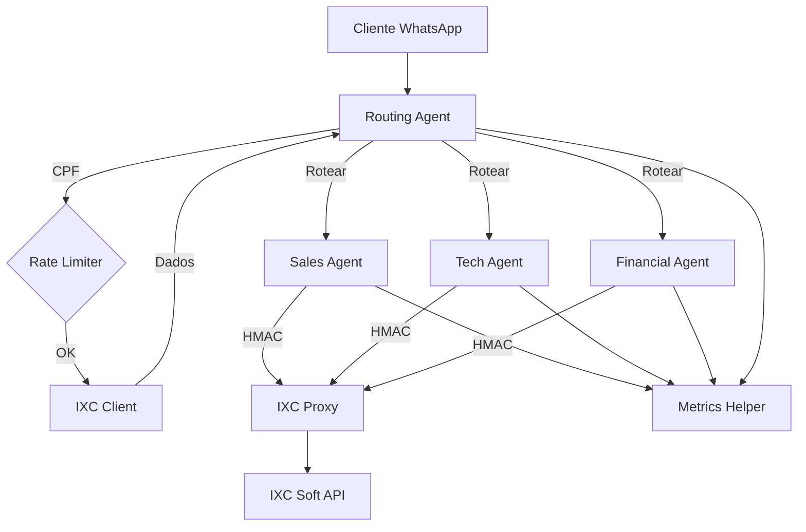

# 🔗 Matriz de Agentes x Ferramentas

Este documento mapeia quais ferramentas cada agente tem permissão para usar e para quais finalidades.

## 📊 Tabela de Permissões

| Ferramenta | Routing | Sales | Tech | Financial | Automação | Telemedicina | Corporate AI |
|------------|---------|-------|------|-----------|-----------|--------------|--------------|
| **IXC Client** | ✅ | ✅ | ✅ | ✅ | ❌ | ❌ | ❌ |
| **HMAC Auth** | ✅ | ✅ | ✅ | ✅ | ✅ | ✅ | ❌ |
| **Rate Limiter** | ✅ | ❌ | ❌ | ❌ | ✅ | ✅ | ✅ |
| **Metrics Helper** | ✅ | ✅ | ✅ | ✅ | ✅ | ✅ | ✅ |

---

## 🤖 Detalhamento por Agente

### 1. Routing Agent (Cloé Martins)

**Arquivo:** `supabase/functions/routing-agent/`

**Responsabilidades:**
- Recepção inicial de clientes
- Identificação via CPF
- Análise de intenção
- Roteamento para agente especializado

**Ferramentas Utilizadas:**

#### ✅ IXC Client
- **Uso:** Buscar dados do cliente por CPF
- **Métodos:**
  - `getClient(cpf)` - Identificar cliente
  - `getClientStatus(clientId)` - Verificar conexão online/offline
  - `getContracts(clientId)` - Verificar status de contratos
- **Criticidade:** ⚠️ Alta - essencial para roteamento correto

#### ✅ HMAC Auth
- **Uso:** Autenticar chamadas para outros agentes
- **Criticidade:** ⚠️ Alta - segurança das transferências

#### ✅ Rate Limiter
- **Uso:** Limitar consultas de CPF (max 10/min por CPF)
- **Configuração:** 
  ```typescript
  maxRequests: 10,
  windowMinutes: 1,
  blockDurationMinutes: 15
  ```
- **Criticidade:** ⚠️ Alta - prevenir abuso

#### ✅ Metrics Helper
- **Uso:** Rastrear performance de roteamento
- **Métricas:**
  - Tempo de identificação
  - Taxa de sucesso
  - Distribuição por agente

---

### 2. Sales Agent (Marina Costa)

**Arquivo:** `supabase/functions/sales-agent/`

**Responsabilidades:**
- Vendas de planos de internet
- Consulta de cobertura
- Agendamento de instalação
- Contratação de serviços adicionais

**Ferramentas Utilizadas:**

#### ✅ IXC Client
- **Uso:** Verificar se cliente já existe, criar contratos
- **Métodos:**
  - `getClient(cpf)` - Verificar cadastro existente
  - `createContract(data)` - Criar novo contrato
  - `getCoverage(cep)` - Verificar cobertura
- **Criticidade:** ⚠️ Alta - essencial para vendas

#### ✅ HMAC Auth
- **Uso:** Comunicação segura com IXC Proxy
- **Criticidade:** ⚠️ Média

#### ✅ Metrics Helper
- **Uso:** Rastrear conversões e performance
- **Métricas:**
  - Taxa de conversão
  - Tempo médio de venda
  - Planos mais vendidos

---

### 3. Support Tech Agent (Luan Silva)

**Arquivo:** `supabase/functions/support-tech-agent/`

**Responsabilidades:**
- Suporte técnico N1
- Troubleshooting automático e manual
- Reboot remoto de equipamentos (híbrido com Cloé)
- Abertura de ordens de serviço
- Orientação sobre equipamentos

**Ferramentas Utilizadas:**

#### ✅ IXC Client
- **Uso:** Diagnóstico técnico e criar tickets
- **Métodos:**
  - `getClientStatus(clientId)` - Status de conexão
  - `createTicket(data)` - Abrir OS
  - `getEquipmentInfo(clientId)` - Dados de equipamento
- **Criticidade:** ⚠️ Alta - core do suporte

#### ✅ Reboot Client Equipment (Edge Function)
- **Uso:** Reiniciar equipamento remotamente via IXC
- **Invocação:** `reboot-client-equipment`
- **Modo de operação:** 
  - **Automático**: Quando Cloé detecta OFFLINE e sugere reboot
  - **Manual**: Quando Luan decide reiniciar durante troubleshooting
- **Fluxo assíncrono**: Não bloqueia atendimento (60s wait em background)
- **Criticidade:** ⚠️ Alta - resolve 70-80% casos OFFLINE

#### ✅ HMAC Auth
- **Uso:** Comunicação segura com IXC
- **Criticidade:** ⚠️ Alta

#### ✅ Metrics Helper
- **Uso:** Métricas de atendimento
- **Métricas:**
  - Tempo de resolução
  - Taxa de escalonamento
  - Tipos de problemas mais comuns

**Tool Calling (OpenAI):**
```typescript
{
  name: "criar_atendimento_ixc",
  description: "Cria OS quando problema requer visita técnica",
  parameters: {
    tipo_problema: enum,
    descricao: string,
    urgencia: enum
  }
}
```

---

### 4. Support Financial Agent (Julia Martins)

**Arquivo:** `supabase/functions/support-financial-agent/`

**Responsabilidades:**
- Negociação de débitos
- Desbloqueio de acesso
- Informações sobre boletos
- Acordos de pagamento

**Ferramentas Utilizadas:**

#### ✅ IXC Client
- **Uso:** Consultar e gerenciar pendências financeiras
- **Métodos:**
  - `getFinancialStatus(clientId)` - Pendências
  - `unblockClient(clientId)` - Desbloquear (1x por mês)
  - `generatePaymentSlip(contractId)` - Gerar boleto/PIX
  - `createPaymentAgreement(data)` - Acordo de pagamento
- **Criticidade:** ⚠️ Alta - operações financeiras

#### ✅ HMAC Auth
- **Uso:** Segurança em operações financeiras
- **Criticidade:** ⚠️ Crítica

#### ✅ Metrics Helper
- **Uso:** KPIs financeiros
- **Métricas:**
  - Taxa de recuperação
  - Valor médio negociado
  - Tempo de resolução

**Tool Calling (OpenAI):**
```typescript
{
  name: "criar_atendimento_escalacao",
  description: "Escalar para administrativo/gerência",
  parameters: {
    motivo: string,
    observacoes: string
  }
}
```

---

### 5. Automação Agent

**Arquivo:** `supabase/functions/automacao-agent/`

**Responsabilidades:**
- Informações sobre automação residencial
- Planos de smart home
- Dispositivos compatíveis
- Dúvidas sobre integração

**Ferramentas Utilizadas:**

#### ❌ IXC Client
- **Não utiliza** - não precisa acessar dados do IXC

#### ✅ HMAC Auth
- **Uso:** Comunicação interna (se necessário)
- **Criticidade:** ⚠️ Baixa

#### ✅ Rate Limiter
- **Uso:** Proteção de endpoint público
- **Configuração:** 
  ```typescript
  maxRequests: 20,
  windowMinutes: 1
  ```
- **Criticidade:** ⚠️ Média

#### ✅ Metrics Helper
- **Uso:** Métricas de interesse
- **Métricas:**
  - Perguntas mais frequentes
  - Taxa de conversão para vendas

---

### 6. Telemedicina Agent

**Arquivo:** `supabase/functions/telemedicina-agent/`

**Responsabilidades:**
- Informações sobre telemedicina
- Planos de saúde digital
- Especialidades disponíveis
- Orientação sobre consultas

**Ferramentas Utilizadas:**

#### ❌ IXC Client
- **Não utiliza** - serviço independente

#### ✅ HMAC Auth
- **Uso:** Autenticação de login telemedicina
- **Criticidade:** ⚠️ Média

#### ✅ Rate Limiter
- **Uso:** Proteção de endpoint público
- **Criticidade:** ⚠️ Alta

#### ✅ Metrics Helper
- **Uso:** Métricas de interesse
- **Métricas:**
  - Interesse por plano
  - Especialidades mais consultadas

---

### 7. Corporate AI Chat

**Arquivo:** `supabase/functions/corporate-ai-chat/`

**Responsabilidades:**
- Assistente interno para funcionários
- Informações sobre políticas da empresa
- Treinamentos e procedimentos
- Suporte geral para colaboradores

**Ferramentas Utilizadas:**

#### ❌ IXC Client
- **Não utiliza** - não precisa de dados de clientes

#### ❌ HMAC Auth
- **Não utiliza** - não faz chamadas internas

#### ✅ Rate Limiter
- **Uso:** Prevenir abuso por colaboradores
- **Configuração:**
  ```typescript
  maxRequests: 30,
  windowMinutes: 1
  ```
- **Criticidade:** ⚠️ Baixa

#### ✅ Metrics Helper
- **Uso:** Uso interno da IA
- **Métricas:**
  - Dúvidas mais comuns
  - Tópicos mais acessados

---

## 🔐 Níveis de Acesso ao IXC

| Agente | Leitura | Escrita | Operações Críticas |
|--------|---------|---------|-------------------|
| **Routing** | ✅ Sim | ❌ Não | ❌ Não |
| **Sales** | ✅ Sim | ✅ Sim | ⚠️ Criar contratos |
| **Tech** | ✅ Sim | ✅ Sim | ⚠️ Criar OS, reboot |
| **Financial** | ✅ Sim | ✅ Sim | ⚠️ Desbloquear, boletos |
| **Automação** | ❌ Não | ❌ Não | ❌ Não |
| **Telemedicina** | ❌ Não | ❌ Não | ❌ Não |
| **Corporate** | ❌ Não | ❌ Não | ❌ Não |

---

## 🚨 Regras de Segurança

### 1. Validação Obrigatória

Todos os agentes que usam IXC Client devem:
- ✅ Validar formato de CPF antes de consultar
- ✅ Aplicar rate limiting
- ✅ Logar todas operações críticas
- ✅ Validar permissões do usuário

### 2. Operações Críticas

Operações que modificam dados no IXC requerem:
- ✅ HMAC authentication
- ✅ Logging detalhado em `action_log`
- ✅ Confirmação do cliente (quando aplicável)
- ✅ Registro de auditoria

### 3. Tratamento de Erros

- ✅ Sempre capturar erros de ferramentas
- ✅ Registrar em métricas
- ✅ Tentar retry com backoff exponencial (quando apropriado)
- ✅ Falhar gracefully com mensagem amigável

---

## 📈 Métricas Recomendadas

### Por Ferramenta

**IXC Client:**
- Latência média por operação
- Taxa de erro por endpoint
- Cache hit rate (se implementado)

**HMAC Auth:**
- Tentativas de autenticação falhas
- Requests bloqueadas por assinatura inválida

**Rate Limiter:**
- Requests bloqueadas
- Usuários mais ativos
- Padrões de abuso

---

## 🔄 Fluxo de Comunicação



---

## 📚 Próximos Passos

Para adicionar uma nova ferramenta ao sistema:

1. Criar arquivo em `/supabase/functions/_shared/`
2. Documentar em `tools-reference.md`
3. Atualizar esta matriz
4. Implementar em agentes relevantes
5. Adicionar testes
6. Documentar exemplos de uso

---

**Última atualização:** Outubro 2025
