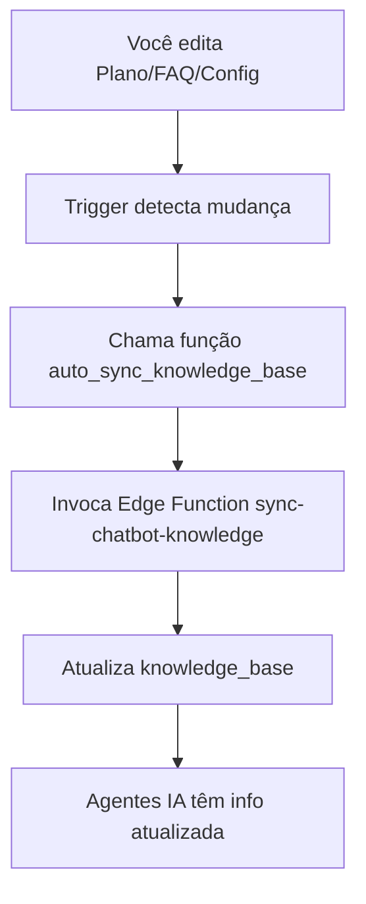

# 🔄 Sincronização Automática da Base de Conhecimento

## Visão Geral

O sistema agora sincroniza **automaticamente** a base de conhecimento dos agentes IA sempre que você faz alterações em:
- ✅ Planos (adicionar, editar, remover)
- ✅ FAQs (adicionar, editar, remover)
- ✅ Configurações da empresa

**Você não precisa mais clicar em botões de sincronização!** 🎉

---

## Como Funciona

### Triggers do Banco de Dados

Foram criados 3 triggers que detectam mudanças e sincronizam automaticamente:

```sql
-- Trigger em planos
CREATE TRIGGER trigger_sync_on_plans_change
  AFTER INSERT OR UPDATE OR DELETE ON plans
  FOR EACH STATEMENT
  EXECUTE FUNCTION auto_sync_knowledge_base();

-- Trigger em FAQs
CREATE TRIGGER trigger_sync_on_faqs_change
  AFTER INSERT OR UPDATE OR DELETE ON faqs
  FOR EACH STATEMENT
  EXECUTE FUNCTION auto_sync_knowledge_base();

-- Trigger em configurações da empresa
CREATE TRIGGER trigger_sync_on_company_change
  AFTER UPDATE ON company_settings
  FOR EACH STATEMENT
  EXECUTE FUNCTION auto_sync_knowledge_base();
```

### Fluxo de Sincronização



---

## O Que é Sincronizado

### 📋 Planos
- Nome, velocidade e preço
- Características e descrição
- Flag de "mais popular"
- CTA (Call to Action)
- **Disponível para:** Vicente (Vendas)

### ❓ FAQs
- Perguntas e respostas
- Ordenação por display_order
- Apenas FAQs ativas
- **Disponível para:** Todos os agentes

### 🏢 Informações da Empresa
- Nome, CNPJ, endereço
- Telefone, WhatsApp, email
- Descrição do site
- **Disponível para:** Todos os agentes

### 🔧 Documentação Técnica IXC
- Como criar tickets/atendimentos
- Endpoints e formatos de requisição
- Mapeamento de assuntos e setores
- **Disponível para:** Luan (Suporte Técnico)

### 🏠 Automação Residencial
- Pacotes e preços
- Características e benefícios
- Requisitos técnicos
- **Disponível para:** Todos os agentes

### 💊 Telemedicina
- Planos disponíveis
- Especialidades médicas
- Como funciona o atendimento
- **Disponível para:** Todos os agentes

---

## Vantagens

✅ **Automático**: Sem necessidade de lembrar de sincronizar
✅ **Instantâneo**: Atualiza assim que você salva
✅ **Confiável**: Sempre sincronizado, sem erros humanos
✅ **Limpo**: Interface sem botões desnecessários

---

## Monitoramento

### Verificar se Triggers Estão Ativos

```sql
-- Listar todos os triggers de sincronização
SELECT 
  trigger_name,
  event_object_table,
  action_statement
FROM information_schema.triggers
WHERE trigger_name LIKE 'trigger_sync_%';
```

### Ver Último Sync

```sql
-- Ver quando foi a última atualização na knowledge_base
SELECT 
  category,
  content_type,
  COUNT(*) as items,
  MAX(updated_at) as last_update
FROM knowledge_base
WHERE is_active = true
GROUP BY category, content_type
ORDER BY last_update DESC;
```

---

## Troubleshooting

### ❌ Agentes não recebem informações atualizadas

**Possíveis causas:**
1. Triggers desabilitados
2. Edge function com erro
3. Permissões insuficientes

**Solução:**
```sql
-- Verificar se triggers existem
SELECT * FROM pg_trigger WHERE tgname LIKE 'trigger_sync_%';

-- Forçar sincronização manual (se necessário)
SELECT net.http_post(
  url := 'https://mxdupkbpxjcfxdgrwknp.supabase.co/functions/v1/sync-chatbot-knowledge',
  headers := '{"Content-Type": "application/json", "Authorization": "Bearer YOUR_ANON_KEY"}'::jsonb,
  body := '{}'::jsonb
);
```

### ❌ Erro nos logs da Edge Function

Verificar logs em: [Supabase Dashboard → Edge Functions → sync-chatbot-knowledge → Logs](https://supabase.com/dashboard/project/mxdupkbpxjcfxdgrwknp/functions/sync-chatbot-knowledge/logs)

---

## Manutenção

### Desabilitar Sync Automático (se necessário)

```sql
-- Desabilitar triggers temporariamente
ALTER TABLE plans DISABLE TRIGGER trigger_sync_on_plans_change;
ALTER TABLE faqs DISABLE TRIGGER trigger_sync_on_faqs_change;
ALTER TABLE company_settings DISABLE TRIGGER trigger_sync_on_company_change;
```

### Re-habilitar Sync Automático

```sql
-- Re-habilitar triggers
ALTER TABLE plans ENABLE TRIGGER trigger_sync_on_plans_change;
ALTER TABLE faqs ENABLE TRIGGER trigger_sync_on_faqs_change;
ALTER TABLE company_settings ENABLE TRIGGER trigger_sync_on_company_change;
```

---

## Histórico de Mudanças

**Data:** 14/10/2025  
**Versão:** 1.0  
**Mudanças:**
- ✅ Implementado triggers automáticos
- ✅ Removidos botões manuais da UI
- ✅ Interface mais limpa e focada
- ✅ Sincronização instantânea e confiável
