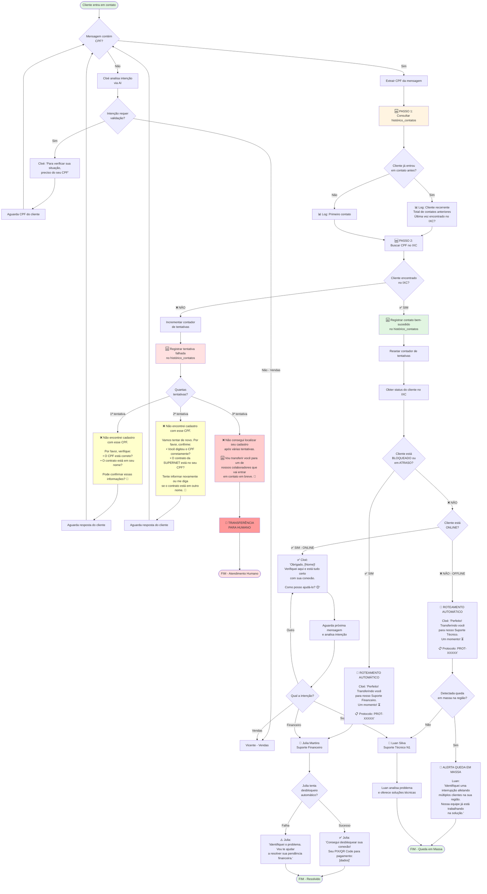

# Fluxograma Cloé - Validação de CPF com Histórico de Contatos

## Legendas

### 🆕 Novidades nesta versão:
- **Histórico de Contatos**: Consulta banco de dados ANTES do IXC para personalizar atendimento
- **Contador de Tentativas**: Registra todas as tentativas de validação de CPF
- **Transferência Humana**: Após 3 tentativas sem sucesso, transfere para atendente humano
- **Mensagens Progressivas**: Mensagens de erro mais detalhadas a cada tentativa
- **Personalização**: Saudações personalizadas para clientes recorrentes

### 🔴 Roteamento Automático:
- **Bloqueado/Atraso**: Julia Martins (Financeiro) com tentativa de desbloqueio automático
- **Offline**: Luan Silva (Técnico) com verificação de queda em massa
- **Online**: Continua com Cloé até identificar intenção específica

### 📊 Banco de Dados:
- Tabela: `customer_contact_history`
- Registra TODOS os contatos, sucesso ou falha
- Campos: CPF, nome, telefone, email, IXC ID, motivo, timestamp, metadata
- Permite análise de padrões de atendimento e clientes recorrentes

### ⚠️ Validação de CPF:
1. **1ª Tentativa**: Pergunta simples (CPF correto? Contrato no seu nome?)
2. **2ª Tentativa**: Pede confirmação e oferece alternativa (outro nome)
3. **3ª Tentativa**: Transfere para atendimento humano (sem mais perguntas)
