# Fluxograma Cloé Martins - Validação de CPF com Histórico de Contatos

## 👤 Sobre a Cloé
Cloé Martins é a primeira atendente humana da SUPERNET FIBRA. Ela é responsável pelo roteamento inicial, validação de CPF e análise de situação do cliente. Com uma comunicação empática e profissional, Cloé identifica rapidamente a necessidade do cliente e o direciona para o setor adequado.

```mermaid
graph TD
    Start([Cliente entra em contato]) --> CheckMessage{Mensagem contém<br/>CPF?}
    
    CheckMessage -->|Não| AnalyzeIntent[Cloé Martins analisa intenção<br/>via AI]
    AnalyzeIntent --> NeedsCPF{Intenção requer<br/>validação?}
    NeedsCPF -->|Não - Vendas| Sales[Vicente - Vendas]
    NeedsCPF -->|Sim| AskCPF[Cloé: 'Para verificar sua situação,<br/>preciso do seu CPF']
    AskCPF --> WaitCPF[Aguarda CPF do cliente]
    WaitCPF --> CheckMessage
    
    CheckMessage -->|Sim| ExtractCPF[Extrair CPF da mensagem]
    
    ExtractCPF --> CheckHistory[🔍 PASSO 1: CONSULTAR BANCO<br/>customer_contact_history<br/>Buscar CPF no histórico de contatos]
    
    CheckHistory --> HasHistory{📊 Cliente já entrou<br/>em contato antes<br/>com a SUPERNET?}
    HasHistory -->|✅ Sim - Cliente Recorrente| LogHistory[📝 Registrar Log:<br/>• Cliente conhecido<br/>• Total de contatos anteriores<br/>• Última vez encontrado no IXC?<br/>• Personalizar atendimento]
    HasHistory -->|❌ Não - Primeiro Contato| LogNewContact[📝 Registrar Log:<br/>• Cliente novo<br/>• Primeira interação<br/>• Preparar cadastro]
    
    LogHistory --> CheckIXC[🔍 PASSO 2: VALIDAR NO IXC<br/>Buscar CPF na base IXC]
    LogNewContact --> CheckIXC
    
    CheckIXC --> FoundIXC{Cliente encontrado<br/>no IXC?}
    
    FoundIXC -->|❌ NÃO| CountAttempts[Incrementar contador<br/>de tentativas]
    CountAttempts --> SaveAttempt[🆕 Registrar tentativa falhada<br/>no histórico_contatos]
    SaveAttempt --> CheckAttemptCount{Quantas<br/>tentativas?}
    
    CheckAttemptCount -->|1ª tentativa| FirstAttempt["❌ Não encontrei cadastro com esse CPF.<br/><br/>Por favor, verifique:<br/>• O CPF está correto?<br/>• O contrato está em seu nome?<br/><br/>Pode confirmar essas informações? 🙂"]
    
    CheckAttemptCount -->|2ª tentativa| SecondAttempt["❌ Não encontrei cadastro com esse CPF.<br/><br/>Vamos tentar de novo. Por favor, confirme:<br/>• Você digitou o CPF corretamente?<br/>• O contrato da SUPERNET está no seu CPF?<br/><br/>Tente informar novamente ou me diga<br/>se o contrato está em outro nome. 🙏"]
    
    CheckAttemptCount -->|3ª tentativa| ThirdAttempt["❌ Não consegui localizar seu cadastro<br/>após várias tentativas.<br/><br/>🆕 Vou transferir você para um de<br/>nossos colaboradores que vai entrar<br/>em contato em breve. 🙏"]
    
    FirstAttempt --> WaitResponse1[Aguarda resposta do cliente]
    SecondAttempt --> WaitResponse2[Aguarda resposta do cliente]
    ThirdAttempt --> TransferHuman[🚨 TRANSFERÊNCIA<br/>PARA HUMANO]
    
    WaitResponse1 --> CheckMessage
    WaitResponse2 --> CheckMessage
    TransferHuman --> End1([FIM - Atendimento Humano])
    
    FoundIXC -->|✅ SIM| SaveSuccess[🆕 Registrar contato bem-sucedido<br/>no histórico_contatos]
    SaveSuccess --> ResetAttempts[Resetar contador de tentativas]
    ResetAttempts --> GetStatus[Obter status do cliente no IXC]
    
    GetStatus --> CheckBlocked{Cliente está<br/>BLOQUEADO ou<br/>em ATRASO?}
    
    CheckBlocked -->|✅ SIM| RouteFinancial["🔴 ROTEAMENTO AUTOMÁTICO<br/><br/>Cloé Martins: 'Perfeito! Transferindo você<br/>para nosso Suporte Financeiro.<br/>Um momento! ⏳<br/><br/>📋 Protocolo: PROT-XXXXX'"]
    
    RouteFinancial --> TransferFinancial[🔄 Julia Martins<br/>Suporte Financeiro]
    TransferFinancial --> FinancialDesbloqueio{Julia tenta<br/>desbloqueio<br/>automático<br/>IMEDIATAMENTE?}
    FinancialDesbloqueio -->|Sucesso| FinancialSuccess["✅ Julia informa STATUS e resultado:<br/>'Olá! Identifiquei sua situação:<br/>🌐 Status: OFFLINE/ONLINE<br/>🔒 Acesso: BLOQUEADO (motivo)<br/><br/>Consegui desbloquear sua conexão!<br/>Teste já sua navegação.<br/><br/>Para regularizar:<br/>💳 PIX: [código]<br/>🔢 Código de barras: [...]'"]
    FinancialDesbloqueio -->|Falha| FinancialManual["⚠️ Julia informa STATUS e motivo:<br/>'Olá! Sua situação atual:<br/>🌐 Status: OFFLINE/ONLINE<br/>🔒 Acesso: BLOQUEADO (motivo)<br/><br/>Não foi possível o desbloqueio<br/>automático porque: [motivo do IXC].<br/><br/>Vou te ajudar a resolver!'"]
    FinancialSuccess --> End2([FIM - Resolvido])
    FinancialManual --> End2
    
    CheckBlocked -->|❌ NÃO| CheckOnline{Cliente está<br/>ONLINE?}
    
    CheckOnline -->|❌ NÃO - OFFLINE| CheckMassOutage{🔍 Cloé Martins verifica:<br/>Login PPPoE está em<br/>affected_logins da<br/>mass_outage_events?}
    
    CheckMassOutage -->|✅ SIM - Cliente Afetado| MassOutageAlert["🚨 CLOÉ MARTINS INFORMA DIRETAMENTE<br/><br/>Olá [Nome]! 👋<br/><br/>🚨 INTERRUPÇÃO EM MASSA DETECTADA<br/><br/>Identifiquei que você está afetado<br/>por uma interrupção na sua região.<br/><br/>📊 Situação atual:<br/>• X clientes afetados<br/>• Detectado em: [timestamp]<br/>• Causa: [se identificada]<br/><br/>✅ Nossa equipe técnica já está<br/>trabalhando na solução.<br/><br/>NÃO É PROBLEMA NO SEU EQUIPAMENTO.<br/>Pedimos desculpas pelo transtorno! 🙏"]
    
    CheckMassOutage -->|❌ NÃO - Cliente OK| RouteSupport["🔴 ROTEAMENTO AUTOMÁTICO<br/><br/>Cloé Martins: 'Perfeito! Transferindo você<br/>para nosso Suporte Técnico.<br/>Um momento! ⏳<br/><br/>📋 Protocolo: PROT-XXXXX'"]
    
    MassOutageAlert --> End3([FIM - Aguarda Normalização])
    RouteSupport --> TransferSupport[🔄 Luan Silva<br/>Suporte Técnico N1]
    TransferSupport --> SupportAnalysis["Luan analisa problema<br/>e oferece soluções técnicas"]
    SupportAnalysis --> End3
    
    CheckOnline -->|✅ SIM - ONLINE| ConfirmOnline["✅ Cloé Martins:<br/>'Obrigado, [Nome]!<br/>Verifiquei aqui e está tudo certo<br/>com sua conexão.<br/><br/>Como posso ajudá-lo? 😊'"]
    ConfirmOnline --> AnalyzeNextIntent[Aguarda próxima mensagem<br/>e analisa intenção]
    AnalyzeNextIntent --> RouteByIntent{Qual a intenção?}
    RouteByIntent -->|Suporte Técnico| TransferSupport
    RouteByIntent -->|Financeiro| TransferFinancial
    RouteByIntent -->|Vendas| Sales
    RouteByIntent -->|Outro| ConfirmOnline
    
    style Start fill:#e1f5e1
    style End1 fill:#ffe1e1
    style End2 fill:#e1f5e1
    style End3 fill:#e1f5e1
    style CheckHistory fill:#fff4e1
    style SaveSuccess fill:#e1f5e1
    style SaveAttempt fill:#ffe1e1
    style TransferHuman fill:#ff9999
    style ThirdAttempt fill:#ffcccc
    style FirstAttempt fill:#ffffcc
    style SecondAttempt fill:#ffffcc
```

## Legendas

### 👤 Equipe de Atendimento:
- **Cloé Martins**: Primeira atendente, responsável pelo roteamento e validação inicial
- **Julia Martins**: Suporte Financeiro N1, especialista em cobranças e desbloqueios
- **Luan Silva**: Suporte Técnico N1, especialista em conexões e troubleshooting
- **Vicente**: Vendas, especialista em novos contratos e upgrades

**IMPORTANTE**: Todos os atendentes são HUMANOS e trabalham com apoio de IA.

### 🆕 Novidades nesta versão:
- **Tom Humanizado**: Cloé Martins é humana, não mais "assistente virtual"
- **Informação de Status**: Julia **SEMPRE** informa o status do cliente (ONLINE/OFFLINE, BLOQUEADO/LIBERADO) antes de qualquer ação
- **Desbloqueio Imediato**: Julia tenta desbloqueio automático IMEDIATAMENTE ao receber o cliente
- **Histórico de Contatos**: Consulta banco de dados ANTES do IXC para personalizar atendimento
- **Contador de Tentativas**: Registra todas as tentativas de validação de CPF
- **Transferência Entre Setores**: Após 3 tentativas sem sucesso, transfere para outro setor
- **Mensagens Progressivas**: Mensagens de erro mais detalhadas a cada tentativa
- **Personalização**: Saudações personalizadas para clientes recorrentes
- **🚨 Verificação de Quedas em Massa**: Cloé Martins verifica `affected_logins` e informa cliente diretamente
  - Verifica se `pppoeLogin` está em `mass_outage_events.affected_logins`
  - Se afetado: informa sobre a queda e **NÃO transfere** para técnico
  - Se não afetado: transfere para Luan para troubleshooting

### 🔴 Roteamento Automático:
- **Bloqueado/Atraso**: Julia Martins (Financeiro) 
  - Recebe dados completos do status do cliente da Cloé
  - Informa IMEDIATAMENTE o status (ONLINE/OFFLINE, BLOQUEADO/motivo)
  - Tenta desbloqueio automático
  - Informa resultado (sucesso ou motivo da falha)
  - Fornece dados de pagamento se aplicável
- **Offline**: 
  - **1º**: Cloé Martins verifica queda em massa (consulta `mass_outage_events.affected_logins`)
  - **Se afetado**: Cloé informa diretamente e **NÃO** transfere
  - **Se não afetado**: Transfere para Luan Silva (Técnico N1)
- **Online**: Continua com Cloé Martins até identificar intenção específica

### 📊 Banco de Dados:
- Tabela: `customer_contact_history`
- Registra TODOS os contatos, sucesso ou falha
- Campos: CPF, nome, telefone, email, IXC ID, motivo, timestamp, metadata
- Permite análise de padrões de atendimento e clientes recorrentes

### ⚠️ Validação de CPF:
1. **1ª Tentativa**: Pergunta simples (CPF correto? Contrato no seu nome?)
2. **2ª Tentativa**: Pede confirmação e oferece alternativa (outro nome)
3. **3ª Tentativa**: Transfere para atendimento humano (sem mais perguntas)
