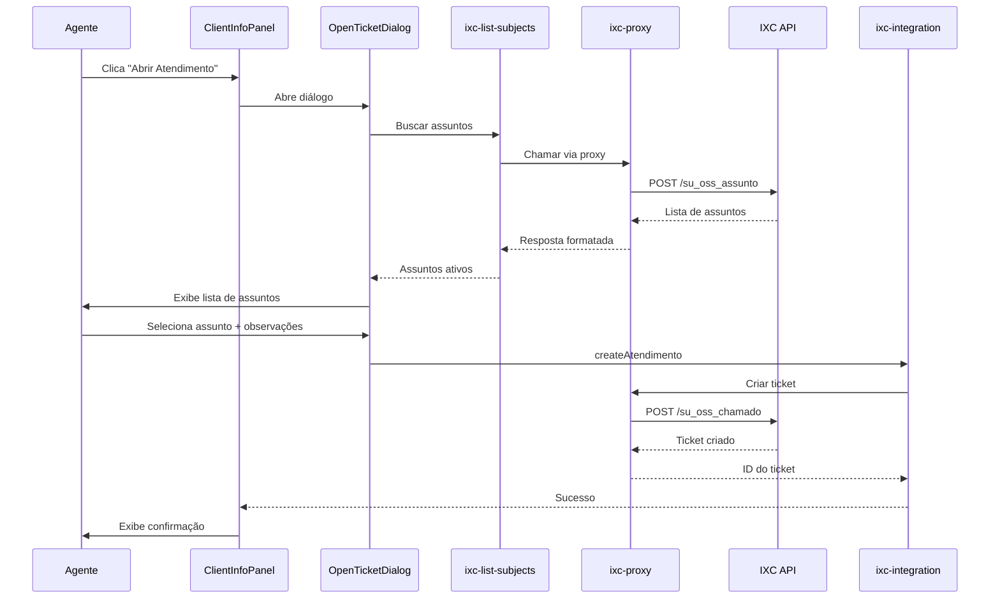

# Buscar Assuntos de Atendimento - IXC

## Visão Geral

O sistema busca e exibe os assuntos/categorias de atendimento cadastrados no IXC através da edge function `ixc-list-subjects`. Esta função utiliza o **proxy IXC** para garantir autenticação consistente e retry automático.

## Endpoint IXC Utilizado

```
POST /webservice/v1/su_oss_assunto
```

## Implementação Técnica

### Edge Function: `ixc-list-subjects`

**Localização**: `supabase/functions/ixc-list-subjects/index.ts`

**Método**: Utiliza `callIxcWithRetry` do `_shared/ixc-client.ts` para chamar o proxy IXC

**Parâmetros de Busca**:
```json
{
  "qtype": "su_oss_assunto.id",
  "query": "1",
  "oper": ">=",
  "page": "1",
  "rp": "1000",
  "sortname": "su_oss_assunto.id",
  "sortorder": "desc"
}
```

### Estrutura de Resposta

**Campos Principais**:
- `id`: ID único do assunto
- `assunto`: Nome/descrição do assunto
- `ativo`: Status (valores aceitos: `"Sim"` ou `"S"`)
- `finalidade`: Finalidade do assunto
- `tipo`: Tipo de atendimento
- `cor_marcador`: Cor para identificação visual

**Exemplo de Resposta**:
```json
{
  "ok": true,
  "data": {
    "registros": [
      {
        "id": "1",
        "assunto": "Suporte Técnico",
        "ativo": "Sim",
        "finalidade": "Atendimento técnico",
        "tipo": "Suporte"
      },
      {
        "id": "2", 
        "assunto": "Financeiro",
        "ativo": "S",
        "finalidade": "Questões financeiras",
        "tipo": "Cobrança"
      }
    ]
  }
}
```

### Filtros Aplicados

A função retorna apenas assuntos **ativos**:
```typescript
.filter((subject: IXCSubject) => 
  subject.ativo === 'Sim' || subject.ativo === 'S'
)
```

## Uso no Frontend

### Componente: `OpenTicketDialog`

**Localização**: `src/components/atendimento/OpenTicketDialog.tsx`

**Fluxo**:
1. Diálogo é aberto pelo usuário
2. `useEffect` busca assuntos via `ixc-list-subjects`
3. Lista de assuntos é exibida em um Select
4. Usuário seleciona assunto e adiciona observações
5. Ticket é criado via `ixc-integration` com action `createAtendimento`

**Código Exemplo**:
```typescript
const fetchSubjects = async () => {
  const { data, error } = await supabase.functions.invoke('ixc-list-subjects');
  
  if (error) {
    console.error('Erro ao buscar assuntos:', error);
    return;
  }
  
  setSubjects(data || []);
};
```

## Integração com Proxy IXC

### Vantagens do Uso do Proxy

1. **Autenticação Centralizada**: Credenciais gerenciadas em um único ponto
2. **Retry Automático**: `callIxcWithRetry` implementa retry com backoff exponencial
3. **Tratamento de Erros Consistente**: Padronização de respostas de erro
4. **Circuit Breaker**: Proteção contra sobrecarga do IXC
5. **Logging Unificado**: Rastreamento centralizado de chamadas

### Configuração Necessária

**Variáveis de Ambiente** (via `ixc-proxy`):
- `IXC_API_BASE_URL`: URL base da API IXC
- `IXC_API_USERNAME`: Usuário da API
- `IXC_API_PASSWORD`: Senha da API
- `SUPABASE_URL`: URL do Supabase para chamar o proxy

## Criação de Assuntos no IXC

### Campos Obrigatórios

Para criar novos assuntos via API IXC:

```json
{
  "assunto": "Nome do Assunto",
  "ativo": "S",
  "layout_impressao": "1",
  "numero_de_vias": "1",
  "exige_comodato_finalizar_os": "N",
  "exige_produto_finalizar_os": "N",
  "tipo_comissao": "F",
  "considerar_sla": "AB",
  "metas_horas_abertura_ticket": "72"
}
```

**Campos Condicionais**:
- `quantidade_equipamentos`: Obrigatório se `exige_comodato_finalizar_os` for `"S"`
- `quantidade_produtos`: Obrigatório se `exige_produto_finalizar_os` for `"S"`

## Fluxo Completo de Abertura de Ticket



## Componentes Relacionados

- **OpenTicketDialog**: Diálogo de seleção de assunto e criação de ticket
- **ClientInfoPanel**: Contém botão "Abrir Atendimento" que aciona o diálogo
- **ixc-list-subjects**: Edge function que busca assuntos via proxy
- **ixc-proxy**: Proxy centralizado para chamadas IXC
- **ixc-integration**: Edge function que cria o atendimento com assunto selecionado
- **callIxcWithRetry**: Função compartilhada para chamadas com retry

## Tratamento de Erros

### Cenários de Erro

1. **Proxy IXC indisponível**:
   - Mensagem: "Erro ao comunicar com o sistema IXC"
   - Ação: Desabilitar seleção de assuntos

2. **Nenhum assunto ativo encontrado**:
   - Mensagem: "Nenhum assunto disponível no momento"
   - Ação: Desabilitar botão de criar atendimento

3. **Cliente não encontrado no IXC**:
   - Mensagem: "Cliente não encontrado no IXC. Verifique o CPF."
   - Ação: Buscar cliente por CPF antes de criar ticket

4. **Erro ao criar atendimento**:
   - Mensagem: Erro específico retornado pelo IXC
   - Ação: Exibir toast com detalhes do erro

### Logs de Depuração

A função registra logs detalhados:
```
📋 Listando assuntos do IXC via proxy...
📤 Chamando proxy com body: {...}
📥 Resposta do proxy: {...}
📄 Total de assuntos: X
✓ Y assuntos ativos retornados
```

## Melhores Práticas

1. **Cache de Assuntos**: Considerar implementar cache local de assuntos ativos
2. **Validação de Cliente**: Sempre verificar se cliente existe no IXC antes de criar ticket
3. **Observações Padrão**: Incluir contexto relevante (departamento, protocolo, canal)
4. **Tratamento de Respostas**: Sempre validar estrutura da resposta antes de processar
5. **Feedback ao Usuário**: Fornecer feedback claro sobre sucesso/erro da operação

## Configuração no IXC

Para que os assuntos funcionem corretamente:

1. Acessar **Suporte > Configurações > Assuntos de Atendimento**
2. Cadastrar assuntos com nomes claros e descritivos
3. Marcar como **Ativo** (`ativo = "S"` ou `ativo = "Sim"`)
4. Definir **Finalidade** e **Tipo** apropriados
5. Configurar SLA se necessário

## Referências

- [Documentação IXC - Assuntos de Atendimento](https://ajuda.ixcsoft.com.br/)
- Edge Function: `supabase/functions/ixc-list-subjects/index.ts`
- Proxy IXC: `supabase/functions/ixc-proxy/index.ts`
- IXC Client: `supabase/functions/_shared/ixc-client.ts`
- Componente: `src/components/atendimento/OpenTicketDialog.tsx`
- Componente: `src/components/atendimento/ClientInfoPanel.tsx`
