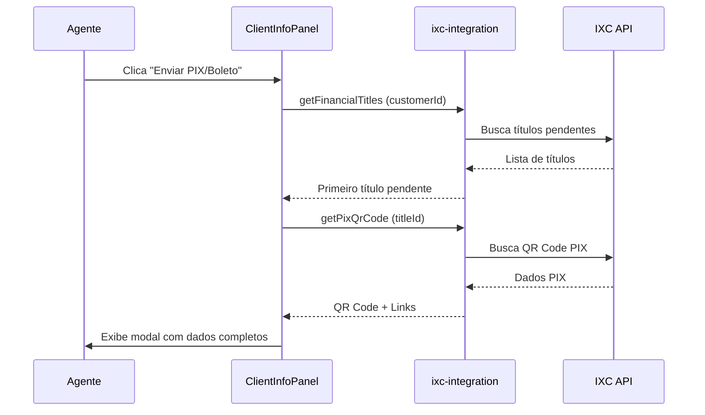

# Enviar PIX/Boleto ao Cliente

## Visão Geral

Funcionalidade que permite aos agentes buscar e enviar informações de pagamento (PIX e Boleto) diretamente ao cliente durante o atendimento.

## Localização

**Componente**: `ClientInfoPanel` → Ações Rápidas → Botão "Enviar PIX/Boleto"

**Localização no código**: `src/components/atendimento/ClientInfoPanel.tsx`

## Funcionalidade

### Fluxo Completo



### Passo a Passo

1. **Agente clica no botão "Enviar PIX/Boleto"**
   - Botão localizado no painel de informações do cliente
   - Requer que o cliente tenha CPF cadastrado

2. **Sistema busca títulos financeiros**
   - Action: `getFinancialTitles`
   - Endpoint: `/webservice/v1/fn_areceber`
   - Parâmetros: `customerId` do cliente

3. **Sistema obtém dados PIX do primeiro título**
   - Action: `getPixQrCode`
   - Endpoint: `/fn_areceber_qrcode?id={titleId}`
   - Retorna QR Code, link de pagamento e URL do boleto

4. **Modal é exibido com informações completas**
   - Valor e vencimento
   - PIX Copia e Cola
   - Código de barras
   - Links de acesso
   - Mensagem pronta para WhatsApp

## Dados Exibidos no Modal

### Informações Principais

- **Valor**: Valor total do título em R$
- **Vencimento**: Data de vencimento formatada

### PIX Copia e Cola

- String completa do PIX para pagamento
- Botão "Copiar" para área de transferência
- Campo com scroll para textos longos

### Código de Barras

- Código numérico do boleto bancário
- Botão "Copiar" para área de transferência
- Formatação em fonte monoespaçada

### Links de Acesso

1. **📎 Abrir Boleto**
   - Abre URL do boleto em nova aba
   - Campo: `url_boleto`

2. **🔗 Link de Pagamento**
   - Abre página de pagamento PIX
   - Campo: `qrcode_link` ou `qrcode_original_link_pagamento`

### Mensagem Pronta

Mensagem formatada e pronta para copiar e enviar ao cliente via WhatsApp:

```
Olá! Segue os dados para pagamento:

💵 Valor: R$ XX,XX
📅 Vencimento: DD/MM/AAAA

🏦 PIX COPIA E COLA:
[string completa do PIX]

🔢 Código de Barras:
[código de barras do boleto]

📎 Link do Boleto:
[URL do boleto]

🔗 Link de Pagamento:
[URL da página de pagamento PIX]
```

**Botão**: "Copiar Mensagem" - copia toda a mensagem formatada

## Endpoints IXC Utilizados

### 1. Buscar Títulos Financeiros

**Endpoint**: `/webservice/v1/fn_areceber`

**Método**: POST via `ixc-integration` → action: `getFinancialTitles`

**Parâmetros**:
```json
{
  "action": "getFinancialTitles",
  "params": {
    "customerId": "123"
  }
}
```

**Resposta**:
```json
{
  "success": true,
  "data": {
    "titles": [
      {
        "id": "456",
        "valor": "99.90",
        "data_vencimento": "01/02/2025",
        "codbar": "12345678901234567890123456789012345678901234",
        "url_boleto": "https://...",
        "status": "A"
      }
    ]
  }
}
```

### 2. Buscar QR Code PIX

**Endpoint**: `/fn_areceber_qrcode?id={titleId}`

**Método**: GET via `ixc-integration` → action: `getPixQrCode`

**Parâmetros**:
```json
{
  "action": "getPixQrCode",
  "params": {
    "titleId": "456"
  }
}
```

**Resposta**:
```json
{
  "success": true,
  "data": {
    "qrcode": "00020126580014br.gov.bcb.pix...",
    "qrcode_url": "data:image/png;base64,...",
    "qrcode_link": "https://..."
  }
}
```

## Tratamento de Erros

### Cenários de Erro

| Cenário | Mensagem | Ação |
|---------|----------|------|
| Cliente sem CPF | "Não foi possível identificar o cliente no IXC. Verifique o CPF." | Botão desabilitado |
| Cliente não encontrado no IXC | "Cliente não encontrado" | Busca por CPF falhada |
| Nenhum título pendente | "Cliente não possui faturas em aberto." | Toast informativo |
| Erro ao buscar PIX | - | Exibe dados sem PIX (só boleto) |
| Erro geral | "Ocorreu um erro inesperado" | Toast de erro com detalhes |

### Estados de Carregamento

- **`loadingPayment`**: Indicador visual durante busca
- Botão desabilitado durante carregamento
- Spinner ou texto "Carregando..."

## Integração com `ixc-integration`

### Actions Utilizadas

#### 1. `getFinancialTitles`

```typescript
const { data, error } = await supabase.functions.invoke('ixc-integration', {
  body: {
    action: 'getFinancialTitles',
    params: { customerId }
  }
});
```

**Resposta esperada**:
- `data.data.titles[]`: Array de títulos financeiros
- Retorna todos os títulos pendentes do cliente

#### 2. `getPixQrCode`

```typescript
const { data, error } = await supabase.functions.invoke('ixc-integration', {
  body: {
    action: 'getPixQrCode',
    params: { titleId: firstTitle.id }
  }
});
```

**Resposta esperada**:
- `data.data.qrcode`: String PIX Copia e Cola
- `data.data.qrcode_link`: URL da página de pagamento
- `data.data.qrcode_url`: QR Code em base64 (não usado atualmente)

## Código de Exemplo

### Implementação no ClientInfoPanel

```typescript
const handleSendPaymentLink = async () => {
  if (!conversation) return;

  let customerId = conversation.ixc_client_id;
  setLoadingPayment(true);

  try {
    // Buscar cliente no IXC se necessário
    if (!customerId && conversation.customer_cpf) {
      const { data: searchData } = await supabase.functions.invoke('ixc-integration', {
        body: {
          action: 'getClientByCpf',
          params: { cpf: conversation.customer_cpf }
        }
      });
      
      if (searchData?.success && searchData.data?.id) {
        customerId = searchData.data.id;
      }
    }

    if (!customerId) {
      toast({
        title: "Cliente não encontrado",
        variant: "destructive",
      });
      return;
    }

    // Buscar títulos financeiros pendentes
    const { data: titlesData } = await supabase.functions.invoke('ixc-integration', {
      body: {
        action: 'getFinancialTitles',
        params: { customerId }
      }
    });

    const titles = titlesData?.data?.titles || [];
    
    if (titles.length === 0) {
      toast({
        title: "Nenhum título pendente",
        description: "Cliente não possui faturas em aberto.",
      });
      return;
    }

    const firstTitle = titles[0];

    // Buscar QR Code PIX
    const { data: pixData } = await supabase.functions.invoke('ixc-integration', {
      body: {
        action: 'getPixQrCode',
        params: { titleId: firstTitle.id }
      }
    });

    setPaymentInfo({
      valor: firstTitle.valor,
      vencimento: firstTitle.data_vencimento,
      codbar: firstTitle.codbar,
      url_boleto: firstTitle.url_boleto,
      qrcode: pixData?.data?.qrcode,
      qrcode_link: pixData?.data?.qrcode_link,
    });

    setPaymentDialogOpen(true);

  } catch (error) {
    toast({
      title: "Erro ao buscar informações",
      description: error.message,
      variant: "destructive",
    });
  } finally {
    setLoadingPayment(false);
  }
};
```

### Função de Copiar para Área de Transferência

```typescript
const copyToClipboard = (text: string, label: string) => {
  navigator.clipboard.writeText(text);
  toast({
    title: "Copiado!",
    description: `${label} copiado para a área de transferência`,
  });
};
```

## Casos de Uso

### 1. Cliente Solicita 2ª Via de Boleto

**Cenário**: Cliente perdeu boleto e quer pagar

**Ações do Agente**:
1. Abrir conversa do cliente
2. Clicar em "Enviar PIX/Boleto"
3. Copiar mensagem pronta
4. Enviar via WhatsApp

**Tempo estimado**: ~15 segundos

### 2. Cliente Quer Pagar por PIX

**Cenário**: Cliente prefere pagar por PIX

**Ações do Agente**:
1. Abrir conversa do cliente
2. Clicar em "Enviar PIX/Boleto"
3. Copiar apenas PIX Copia e Cola
4. Enviar via WhatsApp

**Tempo estimado**: ~10 segundos

### 3. Cliente Não Encontra Email com Boleto

**Cenário**: Email não chegou ou foi para spam

**Ações do Agente**:
1. Abrir conversa do cliente
2. Clicar em "Enviar PIX/Boleto"
3. Clicar em "📎 Abrir Boleto"
4. Copiar URL do boleto
5. Enviar URL via WhatsApp

**Tempo estimado**: ~20 segundos

## Melhores Práticas

### Para Agentes

1. **Sempre verificar vencimento**: Informar se já está vencido
2. **Confirmar valor**: Perguntar se valor está correto
3. **Oferecer múltiplas opções**: PIX, boleto, ou link de pagamento
4. **Registrar no histórico**: Anotar que enviou dados de pagamento
5. **Acompanhar**: Perguntar se conseguiu pagar

### Para Desenvolvedores

1. **Cache de Títulos**: Considerar cache temporário de títulos
2. **Timeout**: Implementar timeout nas chamadas IXC
3. **Retry Logic**: Usar retry automático via `callIxcWithRetry`
4. **Logging**: Registrar todas as operações
5. **Validação**: Sempre validar resposta do IXC antes de processar

## Próximas Melhorias

- [ ] Enviar link diretamente via WhatsApp (automação)
- [ ] Exibir QR Code visual (imagem) além do Copia e Cola
- [ ] Histórico de envios de boleto/PIX
- [ ] Opção de enviar por email automaticamente
- [ ] Suporte a múltiplos títulos (não só o primeiro)
- [ ] Geração de link de pagamento curto

## Relacionado

- [Buscar Assuntos de Atendimento](./buscar-assuntos-atendimento.md)
- [Integração IXC - Títulos Financeiros](./titulos-financeiros.md)
- [Support Financial Agent](../../agent-personality-guide.md#support-financial)
- Edge Function: `supabase/functions/ixc-integration/index.ts`
- Componente: `src/components/atendimento/ClientInfoPanel.tsx`

## Referências

- [Documentação IXC - Títulos a Receber](https://ajuda.ixcsoft.com.br/)
- [Documentação IXC - PIX QR Code](https://ajuda.ixcsoft.com.br/)
- Endpoint: `/webservice/v1/fn_areceber`
- Endpoint: `/fn_areceber_qrcode`
