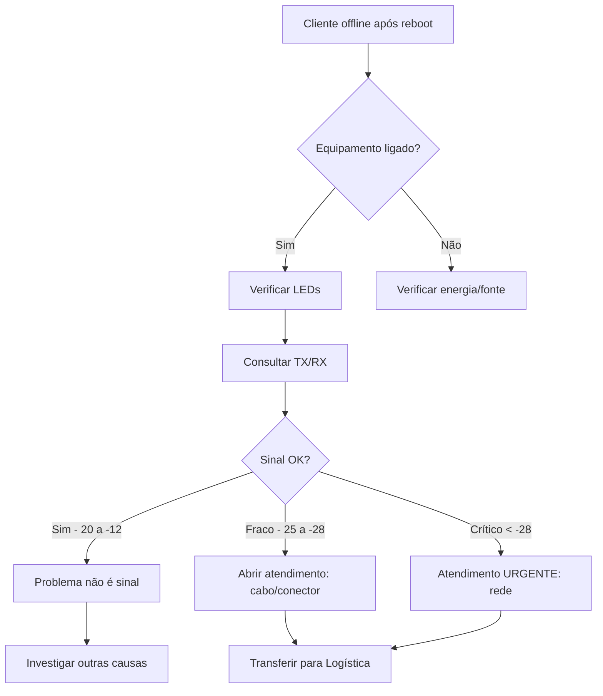

# Consulta de Sinal ONU (TX/RX)

## 📡 Visão Geral

Sistema de consulta de potência óptica (TX/RX) para diagnóstico de problemas de conectividade em clientes de fibra óptica.

**Edge Function:** `ixc-onu-signal`  
**Endpoint IXC:** `botao_rel_22991` (Relatório de Potência/Resumo ONU)  
**Agente:** Luan (Suporte Técnico)

---

## 🎯 Quando Usar

Luan deve consultar TX/RX quando:

1. **Após reboot sem sucesso:**
   - Cliente continua offline após tentativa de reboot
   - Equipamento ligado mas sem conexão

2. **Quedas recorrentes:**
   - Cliente relata quedas frequentes
   - Instabilidade na conexão

3. **Diagnóstico preventivo:**
   - Antes de escalar para logística
   - Para adicionar dados técnicos ao atendimento IXC

---

## 📊 Valores de Referência

### Potência RX (Recepção)

| Faixa (dBm) | Status | Interpretação |
|-------------|--------|---------------|
| -20 a -12 | 🟢 Excelente | Sinal ideal |
| -25 a -20 | 🟡 Aceitável | Funcionando, mas atenção |
| -28 a -25 | 🟠 Fraco | Risco de instabilidade |
| < -28 | 🔴 Crítico | Problema grave de sinal |
| > -8 | 🔴 Saturado | Risco de dano ao equipamento |

### Potência TX (Transmissão)

| Faixa (dBm) | Status | Interpretação |
|-------------|--------|---------------|
| 0 a +1 | 🟢 Ideal | Transmissão perfeita |
| -2 a 0 | 🟡 Aceitável | Funcionando normalmente |
| < -2 | 🟠 Baixo | Verificar equipamento |
| > +2 | 🔴 Alto demais | Risco de saturação |

---

## 🔧 Como Luan Usa

### 1️⃣ Invocar Consulta

```typescript
const signal = await supabase.functions.invoke('ixc-onu-signal', {
  body: { clientId: 'IXC_CLIENT_ID' }
});
```

### 2️⃣ Interpretar Resultado

```json
{
  "ok": true,
  "data": {
    "clientId": "123",
    "timestamp": "2025-10-15T22:00:00Z",
    "rawData": {
      "tx": "0.5",
      "rx": "-18.2",
      "status": "online",
      "temperatura": "45°C"
    }
  }
}
```

### 3️⃣ Diagnóstico Automático

**Exemplo 1: Sinal Normal**
```
RX: -18 dBm (excelente)
TX: +0.5 dBm (ideal)
→ Diagnóstico: Sinal ótimo, problema não é sinal
→ Ação: Investigar outras causas
```

**Exemplo 2: Sinal Fraco**
```
RX: -26 dBm (fraco)
TX: +0.2 dBm (ok)
→ Diagnóstico: Problema de recepção (provável cabo/conector)
→ Ação: Abrir atendimento para inspeção física
```

**Exemplo 3: Sinal Crítico**
```
RX: -32 dBm (crítico)
TX: -3 dBm (baixo)
→ Diagnóstico: Problema grave na rede óptica
→ Ação: Atendimento urgente, possível rompimento
```

---

## 🗣️ Frases para Luan

### Ao Consultar

> "Vou verificar o sinal da sua ONU para diagnóstico técnico... 🔍"

### Sinal Normal

> "Verifiquei o sinal e está dentro dos padrões ideais (RX: -18dBm). O problema não é no sinal óptico."

### Sinal Fraco

> "Detectei que o sinal está fraco (RX: -26dBm). Pode ser cabo ou conector com problema. Vou abrir um atendimento para nossa equipe verificar."

### Sinal Crítico

> "⚠️ Sinal crítico detectado (RX: -32dBm). Há problema grave na rede. Vou abrir atendimento URGENTE para nossa equipe."

### Erro na Consulta

> "Não consegui verificar o sinal técnico no momento, mas vou abrir o atendimento baseado nos sintomas relatados."

---

## 🎯 Fluxo Integrado



---

## 📝 Dados para Atendimento IXC

Quando Luan abre atendimento, deve incluir:

```
Cliente: [Nome]
CPF: [CPF]
Status: Offline

DIAGNÓSTICO TÉCNICO:
- Reboot tentado: Sim (sem sucesso)
- Equipamento: Ligado
- LEDs: [Status dos LEDs]
- TX: [valor] dBm
- RX: [valor] dBm
- Diagnóstico: [interpretação]

Solicitação: Inspeção técnica da rede/equipamento
```

---

## ⚠️ Limitações

1. **Requer cliente cadastrado no IXC**
   - Endpoint precisa do ID do cliente
   - Não funciona para prospects

2. **Depende de dados no IXC**
   - Se IXC não tiver dados da ONU, retorna vazio
   - Nem todos equipamentos reportam TX/RX

3. **Não substitui inspeção física**
   - Valores são indicativos
   - Equipe técnica deve confirmar no local

---

## 🔗 Referências

- **Edge Function**: `supabase/functions/ixc-onu-signal/index.ts`
- **Helper**: `supabase/functions/_shared/ixc-client.ts` → `getOnuSignalStatus()`
- **Config Luan**: `supabase/functions/support-tech-agent/config.ts`
- **Endpoint IXC**: `POST /webservice/v1/botao_rel_22991`

---

## 📚 Documentação Relacionada

- [Troubleshooting ONU](./troubleshooting-onu.md)
- [Reboot Híbrido](../../../reboot-hibrido-implementacao.md)
- [IXC Integration](../integracao-ixc/README.md)
