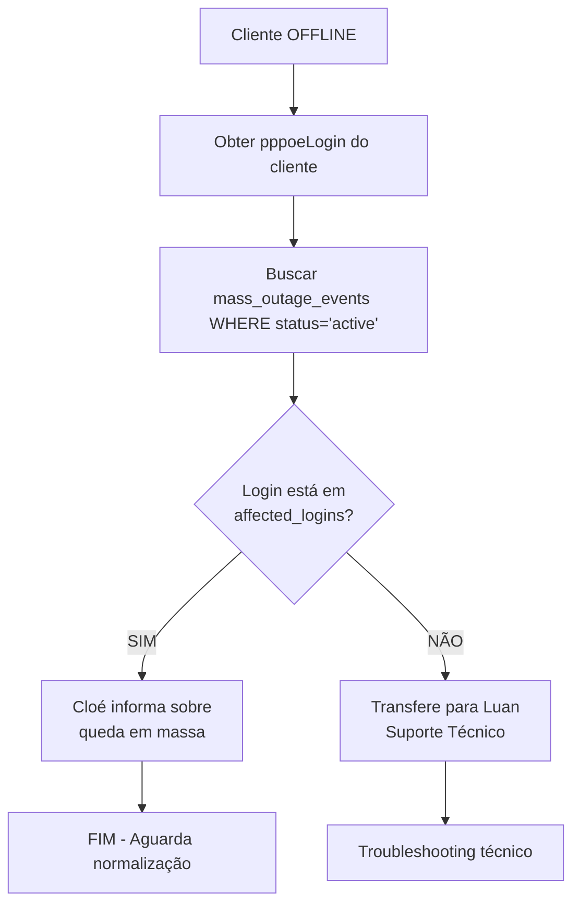
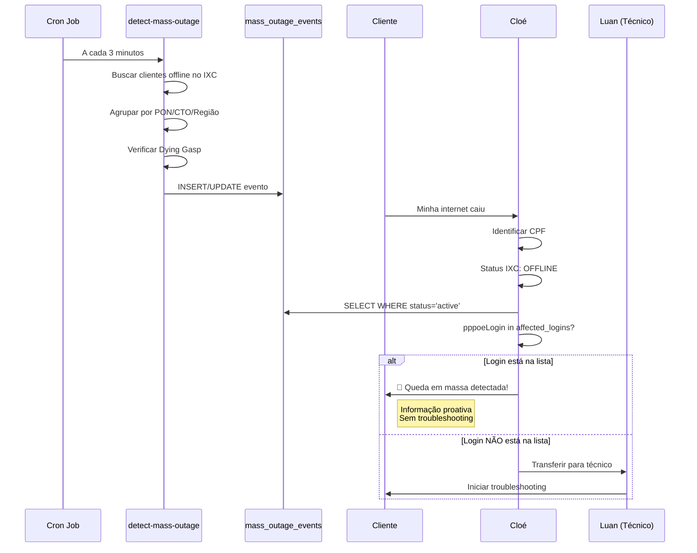

# Fluxo de Detecção e Tratamento de Quedas em Massa

## Visão Geral

O sistema detecta automaticamente quedas em massa na rede e informa os clientes afetados de forma proativa, evitando sobrecarga do suporte técnico com múltiplos atendimentos do mesmo problema.

## Componentes do Sistema

### 1. Detecção Automática
**Edge Function:** `detect-mass-outage`

**Funcionamento:**
- Executa automaticamente a cada 3 minutos (via cron job)
- Consulta API IXC para obter lista de usuários offline
- Agrupa clientes por:
  - Porta PON (threshold: 3+ clientes)
  - CTO compartilhada (threshold: 4+ clientes)
  - Padrão regional do login (threshold: 5+ clientes)
- Verifica eventos "Dying Gasp" para identificar falta de energia
- Cria/atualiza registro na tabela `mass_outage_events`

**Campos importantes da tabela:**
```typescript
{
  event_key: string,           // Identificador único por dia
  region_pattern: string,       // Ex: "PON:GPON-OLT01-1/1/1"
  affected_count: number,       // Quantidade de clientes afetados
  affected_logins: string[],    // ⚠️ ARRAY com logins PPPoE afetados
  status: 'active' | 'resolved',
  metadata: {
    group_type: string,         // 'Porta PON', 'CTO', 'Região'
    power_outage: boolean,      // true se Dying Gasp detectado
    dying_gasp_count: number,   // Quantidade de ONUs com Dying Gasp
    outage_cause: string        // 'power_outage_dying_gasp' ou 'unknown'
  }
}
```

### 2. Verificação no Atendimento
**Edge Function:** `routing-agent` (Cloé)

**Quando executar:**
- Cliente identificado via CPF
- Status no IXC: **OFFLINE**
- ANTES de transferir para suporte técnico

**Fluxo de verificação:**


**Código de verificação:**
```typescript
const customerLogin = clientStatus?.pppoeLogin || '';

const { data: massOutage } = await supabase
  .from('mass_outage_events')
  .select('*')
  .eq('status', 'active')
  .order('detected_at', { ascending: false })
  .limit(1)
  .maybeSingle();

// ⚠️ CRÍTICO: Verificar se o login está na lista
const isClientAffected = massOutage?.affected_logins?.includes(customerLogin);

if (isClientAffected) {
  // Cloé informa diretamente - NÃO transfere para Luan
  return massOutageMessage;
}
```

### 3. Mensagem ao Cliente
**Quem responde:** Cloé (Atendente Virtual)

**Template da mensagem:**
```
Olá [Nome]! 👋

🚨 INTERRUPÇÃO EM MASSA DETECTADA

Identifiquei que você está afetado por uma interrupção na sua região ([região]).

📊 Situação atual:
• [X] clientes afetados
• Detectado em: [timestamp]
• Causa: [se identificada - ex: falta de energia]

✅ Nossa equipe técnica já está trabalhando na solução.

O problema não é no seu equipamento individual. Assim que normalizar, 
sua conexão voltará automaticamente.

Pedimos desculpas pelo transtorno! 🙏
```

### 4. Monitoramento e Dashboard
**Componentes UI:**
- `MassOutageMonitor.tsx` - Painel completo de monitoramento
- `MassOutageAlertCard.tsx` - Card de alerta para página admin

**Funcionalidades:**
- Visualização de eventos ativos e histórico
- Detecção manual sob demanda
- Pool automático a cada 3 minutos
- Realtime updates via Supabase subscriptions
- Indicação de causa (falta de energia, desconhecida)

## Fluxo Completo



## Benefícios

1. **Redução de Carga no Suporte:**
   - Evita múltiplos atendimentos técnicos do mesmo problema
   - Técnicos focam em casos individuais

2. **Experiência do Cliente:**
   - Informação proativa sobre o problema
   - Transparência sobre a situação
   - Expectativa correta de resolução

3. **Eficiência Operacional:**
   - Detecção automática em tempo real
   - Identificação de causa (falta de energia)
   - Métricas e histórico de eventos

## Configuração

### Habilitar Cron Job (pg_cron)
```sql
-- Executar no SQL Editor do Supabase
select cron.schedule(
  'detect-mass-outage-every-3min',
  '*/3 * * * *',  -- A cada 3 minutos
  $$
  select net.http_post(
    url:='https://mxdupkbpxjcfxdgrwknp.supabase.co/functions/v1/detect-mass-outage',
    headers:='{"Content-Type": "application/json", "Authorization": "Bearer [ANON_KEY]"}'::jsonb,
    body:='{}'::jsonb
  ) as request_id;
  $$
);
```

### Thresholds Configurados
- **Porta PON:** 3+ clientes offline
- **CTO:** 4+ clientes offline
- **Região:** 5+ clientes offline

## Troubleshooting

### Cliente afetado mas não recebe aviso
**Causa:** Login PPPoE não está no array `affected_logins`

**Solução:**
```sql
-- Verificar se o login está na lista
SELECT 
  id,
  region_pattern,
  affected_count,
  affected_logins,
  'seu_login@pppoe' = ANY(affected_logins) as is_affected
FROM mass_outage_events
WHERE status = 'active';
```

### Evento não está sendo detectado
**Causa:** Threshold não foi atingido

**Verificação:**
1. Quantos clientes estão offline no grupo?
2. Qual o threshold do tipo de grupo?
3. Verificar logs do edge function `detect-mass-outage`

### Evento não resolve automaticamente
**Causa:** Clientes voltaram online mas evento não foi atualizado

**Solução:**
- O sistema resolve automaticamente quando `affected_count < threshold`
- Executar manualmente: `POST /functions/v1/detect-mass-outage`
- Verificar logs da execução

## Métricas Importantes

**Monitorar:**
- Taxa de detecção: eventos criados vs. eventos reais
- Falsos positivos: eventos resolvidos < 5 minutos
- Tempo médio de resolução
- % de clientes que entram em contato durante queda em massa
- Efetividade do aviso proativo (redução de tickets)
