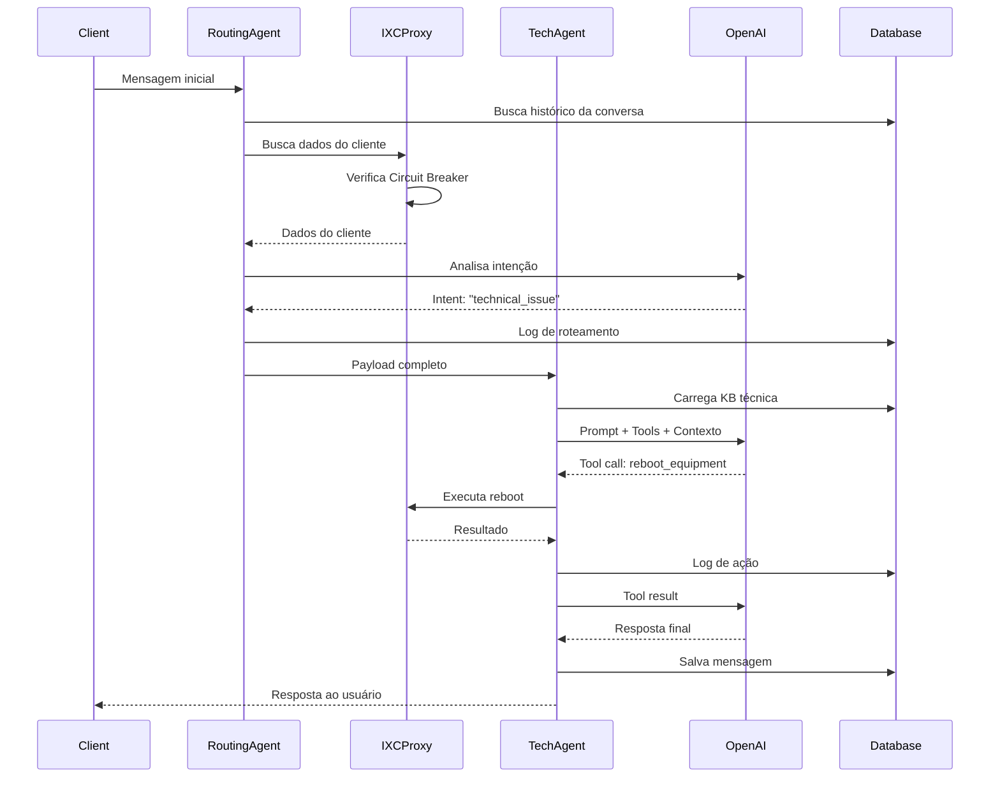

# Arquitetura Multiagente - Documentação Técnica Completa

## 1. Arquitetura e Orquestração

### 1.1 Executor/Orquestrador Central

O sistema utiliza a **Edge Function `routing-agent`** como orquestrador principal:

**Localização**: `supabase/functions/routing-agent/index.ts`

**Fluxo de Orquestração**:
```typescript
// Ponto de entrada único
serve(async (req) => {
  // 1. Validação HMAC para segurança
  const validationResult = await validateHMACWithTimestamp(req);
  
  // 2. Extração do payload padronizado
  const payload: RoutingPayload = await req.json();
  
  // 3. Análise de intenção via LLM (GPT-4o-mini)
  const intentAnalysis = await analyzeIntent(payload);
  
  // 4. Roteamento baseado em intent
  const targetAgent = determineAgent(intentAnalysis);
  
  // 5. Invocação do agente específico
  return await invokeAgent(targetAgent, payload);
});
```

**Decisão de Roteamento**:
- **Análise Semântica**: Usa GPT-4o-mini para classificar a intenção
- **Regras de Negócio**: Verifica status financeiro, dados técnicos, contexto
- **Especialização**: Direciona para agente especializado (vendas, suporte técnico, suporte financeiro, automação, telemedicina)

### 1.2 Payload Padronizado (RoutingPayload)

**Definição**: `supabase/functions/_shared/types.ts`

```typescript
interface RoutingPayload {
  conversation_id: string;
  client: {
    cpf: string;
    name: string;
    email?: string;
    phone?: string;
    contract_id?: number;
    pppoe_login?: string;
    address?: { cep?: string; city?: string; region?: string; };
  };
  ixc?: {
    cliente_full?: any;
    radusuario?: {
      status: 'online' | 'offline';
      last_online_minutes?: number;
      signal_db?: number | null;
      ont_serial?: string;
      config_mismatch?: boolean;
    };
    contracts?: any[];
  };
  supabase?: {
    mass_outage_checked: boolean;
    mass_outage_match: boolean;
    mass_outage_event_id?: string | null;
  };
  context: {
    initial_message: string;
    attempts_for_cpf?: number;
    timestamp: string;
  };
  next_action?: 'support-tech-agent' | 'support-financial-agent' | 'sales-agent';
  routeReason?: string;
}
```

## 2. Protocolo de Comunicação

### 2.1 Message Passing via HTTP/Edge Functions

**Padrão de Comunicação**:
- **Síncrono**: Chamadas HTTP entre Edge Functions
- **Client Supabase**: Utiliza `supabase.functions.invoke()`
- **HMAC Authentication**: Segurança entre funções

```typescript
// Exemplo de invocação entre agentes
const { data, error } = await supabase.functions.invoke('target-agent', {
  body: routingPayload,
  headers: {
    'x-hmac-signature': signature,
    'x-hmac-timestamp': timestamp
  }
});
```

### 2.2 IXC Proxy Centralizado

**Localização**: `supabase/functions/ixc-proxy/index.ts`

**Funcionalidades**:
- **Centralização de Credenciais**: Único ponto de acesso ao IXC
- **Caching Inteligente**: Reduz chamadas repetidas
- **Circuit Breaker**: Proteção contra falhas em cascata
- **Métricas**: Coleta de performance

```typescript
// Padrão de requisição ao IXC
const ixcRequest: IXCProxyRequest = {
  method: 'GET',
  path: '/webservice/v1/cliente',
  query: '?cpf_cnpj=' + cpf
};

const response = await supabase.functions.invoke('ixc-proxy', {
  body: ixcRequest
});
```

### 2.3 Persistência de Estado

**Banco de Dados**: PostgreSQL (Supabase)

**Tabelas Principais**:
- `conversations`: Estado de conversas
- `ai_messages`: Histórico de mensagens
- `conversation_routing_logs`: Logs de roteamento
- `action_logs`: Registro de ações executadas

## 3. Agentes e Ferramentas (Tools)

### 3.1 Agentes Implementados

#### A. Routing Agent (Orquestrador)
- **Função**: Análise de intenção e roteamento
- **LLM**: GPT-4o-mini
- **Tools**: Nenhuma (apenas classificação)

#### B. Sales Agent
- **Função**: Vendas e novos contratos
- **LLM**: GPT-4o
- **Tools**:
  - `check_coverage`: Verifica cobertura por CEP
  - `list_plans`: Lista planos disponíveis
  - `create_contract`: Gera contrato

#### C. Support Tech Agent
- **Função**: Suporte técnico (conexão, sinal, equipamentos)
- **LLM**: GPT-4o
- **Tools**:
  - `get_connection_status`: Status PPPoE/ONT
  - `check_mass_outage`: Verifica quedas em massa
  - `reboot_client_equipment`: Reinicia equipamento (manual ou automático)
  - `test_equipment_connectivity`: Testa conectividade
  - `ixc_client_lookup`: Busca cliente no IXC
  - `create_ticket`: Abre chamado no IXC
- **Fluxo Híbrido de Reboot**: 
  - Cloé detecta cliente OFFLINE → passa flag `suggested_action: "auto_reboot"`
  - Luan responde instantaneamente + executa reboot em background (60s)
  - Resultado enviado automaticamente ao cliente após verificação

#### D. Support Financial Agent
- **Função**: Questões financeiras e faturas
- **LLM**: GPT-4o
- **Tools**:
  - `get_invoices`: Lista faturas
  - `get_payment_methods`: Métodos de pagamento
  - `send_invoice_copy`: Envia 2ª via

#### E. Automação Agent
- **Função**: Automação residencial e IoT
- **LLM**: GPT-4o-mini
- **Tools**: Consulta base de conhecimento específica

#### F. Telemedicina Agent
- **Função**: Suporte telemedicina
- **LLM**: GPT-4o-mini
- **Tools**: Consulta base de conhecimento médica

### 3.2 Injeção de Ferramentas (Tool Injection)

**Mecanismo**: OpenAI Function Calling

```typescript
// Definição de tools no agente
const tools = [
  {
    type: "function",
    function: {
      name: "check_coverage",
      description: "Verifica se há cobertura de fibra óptica em um CEP",
      parameters: {
        type: "object",
        properties: {
          cep: { type: "string", description: "CEP a verificar" }
        },
        required: ["cep"]
      }
    }
  },
  // ... outras tools
];

// Chamada ao LLM com tools
const response = await openai.chat.completions.create({
  model: "gpt-4o",
  messages: conversationHistory,
  tools: tools,
  tool_choice: "auto" // LLM decide quando usar
});

// Execução da tool
if (response.choices[0].message.tool_calls) {
  for (const toolCall of response.choices[0].message.tool_calls) {
    const result = await executeToolFunction(
      toolCall.function.name,
      JSON.parse(toolCall.function.arguments)
    );
    // Injeta resultado de volta no contexto
    conversationHistory.push({
      role: "tool",
      content: JSON.stringify(result),
      tool_call_id: toolCall.id
    });
  }
}
```

### 3.3 Gerenciamento de Estado e Memória

#### A. Memória de Curto Prazo (Working Memory)
```typescript
// Carrega histórico recente da conversa
const { data: messages } = await supabase
  .from('ai_messages')
  .select('role, content')
  .eq('conversation_id', conversationId)
  .order('created_at', { ascending: true })
  .limit(10); // Últimas 10 mensagens

const conversationHistory = messages.map(msg => ({
  role: msg.role,
  content: msg.content
}));
```

#### B. Memória de Longo Prazo (Long-term Memory)
```typescript
// Dados persistidos sobre o cliente
const clientContext = {
  profile: await getClientProfile(cpf),
  contracts: await getClientContracts(cpf),
  tickets: await getRecentTickets(cpf),
  interactions: await getPastInteractions(cpf)
};
```

#### C. Sistema de Prompts com Contexto Dinâmico
```typescript
const systemPrompt = `
Você é o agente de ${agentType} da SUPERNET FIBRA.

DADOS DO CLIENTE:
- Nome: ${client.name}
- CPF: ${client.cpf}
- Status: ${client.status}
- Plano: ${client.plan}

CONTEXTO TÉCNICO:
${ixc?.radusuario ? `
- Conexão: ${ixc.radusuario.status}
- Último acesso: ${ixc.radusuario.last_online_minutes} min atrás
- Sinal: ${ixc.radusuario.signal_db} dBm
` : 'Dados técnicos não disponíveis'}

HISTÓRICO DA CONVERSA:
${conversationHistory.map(m => `${m.role}: ${m.content}`).join('\n')}

FERRAMENTAS DISPONÍVEIS:
${tools.map(t => `- ${t.function.name}: ${t.function.description}`).join('\n')}
`;
```

## 4. Base de Conhecimento (KB) e RAG

### 4.1 Estrutura da Base de Conhecimento

**Tabela**: `knowledge_base`

```sql
CREATE TABLE knowledge_base (
  id UUID PRIMARY KEY,
  title TEXT NOT NULL,
  content TEXT NOT NULL,
  category TEXT, -- 'technical', 'commercial', 'automation', 'telemedicine'
  content_type TEXT, -- 'faq', 'procedure', 'documentation'
  metadata JSONB,
  is_active BOOLEAN DEFAULT true,
  created_at TIMESTAMPTZ DEFAULT NOW()
);
```

**Categorização**:
- **technical**: Suporte técnico (troubleshooting, configurações)
- **commercial**: Vendas (planos, cobertura, contratos)
- **automation**: Automação residencial
- **telemedicine**: Telemedicina

### 4.2 Mecanismo RAG (Retrieval-Augmented Generation)

**Implementação Atual**: Query-based (sem vetorização)

```typescript
// 1. Recuperação de conhecimento relevante
const { data: knowledgeBase } = await supabase
  .from('knowledge_base')
  .select('title, content, category')
  .eq('is_active', true)
  .eq('category', agentCategory) // Filtro por categoria
  .order('created_at', { ascending: false });

// 2. Construção do contexto
const contextInfo = knowledgeBase?.map(item => 
  `[${item.category}] ${item.title}: ${item.content}`
).join('\n\n');

// 3. Injeção no prompt do sistema
const systemPrompt = `
Você é o agente especializado.

BASE DE CONHECIMENTO:
${contextInfo}

Use exclusivamente as informações da base de conhecimento para responder.
Se a informação não estiver disponível, informe o usuário.
`;
```

**Limitações Atuais**:
- Sem busca semântica (embeddings)
- Filtro apenas por categoria
- Contexto pode exceder limite de tokens

**Evolução Proposta**:
```typescript
// RAG com Embeddings (futuro)
// 1. Gerar embedding da pergunta do usuário
const questionEmbedding = await openai.embeddings.create({
  model: "text-embedding-3-small",
  input: userQuestion
});

// 2. Busca por similaridade vetorial (pgvector)
const { data: relevantDocs } = await supabase.rpc('match_documents', {
  query_embedding: questionEmbedding.data[0].embedding,
  match_threshold: 0.78,
  match_count: 5
});

// 3. Injetar apenas documentos relevantes
const contextInfo = relevantDocs.map(doc => doc.content).join('\n\n');
```

### 4.3 Sincronização de Conhecimento

**Edge Function**: `sync-chatbot-knowledge`

```typescript
// Sincroniza documentação do IXC automaticamente
serve(async (req) => {
  // 1. Busca documentação atualizada do IXC
  const ixcDocs = await fetchIXCDocumentation();
  
  // 2. Processa e estrutura
  const structuredDocs = parseAndStructure(ixcDocs);
  
  // 3. Insere/atualiza na KB
  for (const doc of structuredDocs) {
    await supabase.from('knowledge_base').upsert({
      title: doc.title,
      content: doc.content,
      category: 'technical',
      content_type: 'documentation'
    });
  }
});
```

## 5. Resiliência e Observabilidade

### 5.1 Retry e Timeout

#### A. IXC Proxy - Circuit Breaker Pattern

```typescript
// Configuração do Circuit Breaker
const CIRCUIT_BREAKER_CONFIG = {
  failureThreshold: 5,      // Abre após 5 falhas
  successThreshold: 2,      // Fecha após 2 sucessos
  timeout: 60000,           // Timeout por requisição: 60s
  resetTimeout: 300000      // Reseta após 5 min
};

let circuitState = 'CLOSED'; // CLOSED | OPEN | HALF_OPEN
let failureCount = 0;
let successCount = 0;
let lastFailureTime = null;

async function callIXCWithCircuitBreaker(request) {
  // Verifica estado do circuit breaker
  if (circuitState === 'OPEN') {
    if (Date.now() - lastFailureTime > CIRCUIT_BREAKER_CONFIG.resetTimeout) {
      circuitState = 'HALF_OPEN';
      successCount = 0;
    } else {
      throw new Error('Circuit breaker is OPEN - IXC temporarily unavailable');
    }
  }

  try {
    // Executa com timeout
    const response = await Promise.race([
      fetch(ixcUrl, requestOptions),
      new Promise((_, reject) => 
        setTimeout(() => reject(new Error('Request timeout')), 
        CIRCUIT_BREAKER_CONFIG.timeout)
      )
    ]);

    // Sucesso - atualiza contadores
    if (circuitState === 'HALF_OPEN') {
      successCount++;
      if (successCount >= CIRCUIT_BREAKER_CONFIG.successThreshold) {
        circuitState = 'CLOSED';
        failureCount = 0;
      }
    }
    failureCount = 0;
    
    return response;
  } catch (error) {
    // Falha - atualiza contadores
    failureCount++;
    lastFailureTime = Date.now();
    
    if (failureCount >= CIRCUIT_BREAKER_CONFIG.failureThreshold) {
      circuitState = 'OPEN';
      console.error('Circuit breaker OPENED due to consecutive failures');
    }
    
    // Log para DLQ
    await logToDLQ({
      action_type: 'ixc_call',
      error: error.message,
      payload: request
    });
    
    throw error;
  }
}
```

#### B. Dead Letter Queue (DLQ)

**Tabela**: `failed_actions`

```sql
CREATE TABLE failed_actions (
  id UUID PRIMARY KEY,
  action_type TEXT NOT NULL,
  action_payload JSONB NOT NULL,
  error_message TEXT,
  retry_count INTEGER DEFAULT 0,
  max_retries INTEGER DEFAULT 3,
  next_retry_at TIMESTAMPTZ,
  status TEXT DEFAULT 'pending', -- pending | retrying | failed | resolved
  created_at TIMESTAMPTZ DEFAULT NOW()
);
```

**Edge Function**: `retry-failed-actions`

```typescript
// Cron job: A cada 5 minutos
serve(async (req) => {
  // 1. Busca ações pendentes de retry
  const { data: failedActions } = await supabase
    .from('failed_actions')
    .select('*')
    .eq('status', 'pending')
    .lte('next_retry_at', new Date().toISOString())
    .lt('retry_count', 'max_retries');

  for (const action of failedActions) {
    try {
      // 2. Tenta reexecutar
      await retryAction(action);
      
      // 3. Marca como resolvida
      await supabase
        .from('failed_actions')
        .update({ status: 'resolved' })
        .eq('id', action.id);
      
    } catch (error) {
      // 4. Incrementa contador de retry
      const newRetryCount = action.retry_count + 1;
      
      if (newRetryCount >= action.max_retries) {
        // Marca como falha definitiva
        await supabase
          .from('failed_actions')
          .update({ status: 'failed' })
          .eq('id', action.id);
        
        // Alerta para equipe
        await sendAlertToTeam(action);
      } else {
        // Agenda próxima tentativa (exponential backoff)
        const nextRetry = new Date(
          Date.now() + Math.pow(2, newRetryCount) * 60000
        );
        
        await supabase
          .from('failed_actions')
          .update({
            retry_count: newRetryCount,
            next_retry_at: nextRetry.toISOString()
          })
          .eq('id', action.id);
      }
    }
  }
});
```

### 5.2 Logging e Monitoramento

#### A. Action Logs

**Tabela**: `action_logs`

```sql
CREATE TABLE action_logs (
  id UUID PRIMARY KEY,
  agent_name TEXT NOT NULL,
  client_cpf TEXT,
  action_type TEXT NOT NULL,
  action_payload JSONB,
  ixcticket_id TEXT,
  result JSONB,
  created_at TIMESTAMPTZ DEFAULT NOW()
);
```

**Uso**:
```typescript
// Log de cada ação executada
await supabase.from('action_logs').insert({
  agent_name: 'support-tech-agent',
  client_cpf: client.cpf,
  action_type: 'reboot_equipment',
  action_payload: { login: client.pppoe_login },
  result: { success: true, message: 'Equipment rebooted' }
});
```

#### B. Conversation Routing Logs

**Tabela**: `conversation_routing_logs`

```sql
CREATE TABLE conversation_routing_logs (
  id UUID PRIMARY KEY,
  conversation_id UUID REFERENCES conversations(id),
  from_agent TEXT,
  to_agent TEXT NOT NULL,
  routing_reason TEXT,
  context_data JSONB,
  created_at TIMESTAMPTZ DEFAULT NOW()
);
```

**Uso**:
```typescript
// Log de cada transferência entre agentes
await supabase.from('conversation_routing_logs').insert({
  conversation_id: conversationId,
  from_agent: 'routing-agent',
  to_agent: 'support-tech-agent',
  routing_reason: 'Technical issue detected',
  context_data: { intent: 'connection_problem', confidence: 0.95 }
});
```

#### C. Métricas de Performance

**Edge Function**: `metrics-collector`

```typescript
// Coleta métricas de cada agente
interface AgentMetrics {
  agent_name: string;
  total_interactions: number;
  avg_response_time_ms: number;
  success_rate: number;
  tool_usage: {
    [toolName: string]: {
      calls: number;
      avg_duration_ms: number;
      success_rate: number;
    }
  };
  timestamp: string;
}

// Armazena em tabela de métricas
await supabase.from('agent_metrics').insert(metrics);
```

#### D. Health Check

**Edge Function**: `system-health`

```typescript
serve(async (req) => {
  const healthChecks = {
    database: await checkDatabaseHealth(),
    ixc_api: await checkIXCHealth(),
    agents: {
      routing: await checkAgentHealth('routing-agent'),
      sales: await checkAgentHealth('sales-agent'),
      support_tech: await checkAgentHealth('support-tech-agent'),
      support_financial: await checkAgentHealth('support-financial-agent')
    },
    openai: await checkOpenAIHealth()
  };

  const overallHealth = Object.values(healthChecks)
    .every(check => check.status === 'healthy');

  return new Response(JSON.stringify({
    status: overallHealth ? 'healthy' : 'degraded',
    timestamp: new Date().toISOString(),
    checks: healthChecks
  }), {
    status: overallHealth ? 200 : 503,
    headers: { 'Content-Type': 'application/json' }
  });
});
```

## 6. Fluxo Completo de uma Requisição



## 7. Segurança

### 7.1 HMAC Authentication

**Implementação**: `supabase/functions/_shared/hmac.ts`

```typescript
// Validação de requisições entre Edge Functions
async function validateHMACWithTimestamp(req: Request): Promise<boolean> {
  const signature = req.headers.get('x-hmac-signature');
  const timestamp = req.headers.get('x-hmac-timestamp');
  const body = await req.text();
  
  // Verifica timestamp (previne replay attacks)
  const requestTime = new Date(timestamp).getTime();
  const currentTime = Date.now();
  const timeDiff = Math.abs(currentTime - requestTime);
  
  if (timeDiff > 300000) { // 5 minutos
    throw new Error('Request timestamp expired');
  }
  
  // Valida HMAC
  const expectedSignature = await generateHMAC(body, timestamp);
  return signature === expectedSignature;
}

async function generateHMAC(data: string, timestamp: string): Promise<string> {
  const secret = Deno.env.get('HMAC_SHARED_SECRET');
  const encoder = new TextEncoder();
  const key = await crypto.subtle.importKey(
    'raw',
    encoder.encode(secret),
    { name: 'HMAC', hash: 'SHA-256' },
    false,
    ['sign']
  );
  
  const message = `${timestamp}:${data}`;
  const signature = await crypto.subtle.sign(
    'HMAC',
    key,
    encoder.encode(message)
  );
  
  return btoa(String.fromCharCode(...new Uint8Array(signature)));
}
```

## 8. Conclusão

### Pontos Fortes da Arquitetura

1. **Modularidade**: Agentes especializados e independentes
2. **Escalabilidade**: Edge Functions escalam automaticamente
3. **Resiliência**: Circuit breaker, DLQ, retry automático
4. **Rastreabilidade**: Logging completo de ações e roteamentos
5. **Segurança**: HMAC authentication, RLS no banco

### Pontos de Melhoria

1. **RAG**: Implementar busca semântica com embeddings
2. **Cache Distribuído**: Redis para melhor performance
3. **Observabilidade**: Integrar com Datadog/New Relic
4. **Streaming**: Respostas em tempo real para melhor UX
5. **Multi-turn Memory**: Memória de longo prazo mais sofisticada

### Stack Tecnológico

- **Backend**: Supabase Edge Functions (Deno)
- **Database**: PostgreSQL (Supabase)
- **LLM**: OpenAI (GPT-4o, GPT-4o-mini)
- **Integração**: IXC API (Provedor de internet)
- **Frontend**: React + TypeScript + Vite
- **Autenticação**: Supabase Auth
- **Storage**: Supabase Storage

