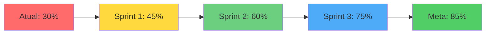

# 📊 Análise de Coverage - Estado Atual

**Data**: 13/11/2025  
**Testes Encontrados**: 13 arquivos  
**Status**: ✅ Infraestrutura de testes configurada

---

## ✅ Testes Existentes (Já Implementados)

### 🧪 Testes de Componentes (6 arquivos)

**✅ Autenticação & Admin:**
- `src/components/__tests__/AddUserForm.test.tsx` - Formulário de usuário
- `src/components/__tests__/NotFound.test.tsx` - Página 404
- `src/tests/components/admin/AdminSidebar.test.tsx` - Sidebar admin

**✅ Kanban:**
- `src/tests/components/kanban/KanbanBoard.test.tsx` - Board principal
- `src/tests/components/kanban/KanbanCard.test.tsx` - Cards do Kanban
- `src/tests/components/kanban/KanbanColumn.test.tsx` - Colunas do Kanban

### 🔧 Testes de Utilitários (3 arquivos)

**✅ Segurança & Logging:**
- `src/lib/__tests__/logger.test.ts` - Sistema de logging
- `src/lib/__tests__/sanitize.test.ts` - **Sanitização XSS (crítico)**
- `src/lib/__tests__/validators.test.ts` - Validações

### 🔌 Testes de Integração (4 arquivos)

**✅ Supabase & Storage:**
- `src/tests/integration/supabase-connection.test.ts` - Conexão Supabase
- `src/tests/integration/storage-integration.test.ts` - Storage
- `src/tests/integration/kanban-data.test.tsx` - Dados Kanban
- `src/tests/integration/kanban-rls.test.tsx` - RLS Kanban

---

## ❌ Áreas Críticas SEM Testes

### 🔴 CRÍTICO - Prioridade 1

**Edge Functions (0% coverage estimado):**
- ❌ `supabase/functions/ixc-integration/index.ts` - **Core IXC**
- ❌ `supabase/functions/support-tech-agent/` - **Agente técnico**
- ❌ `supabase/functions/ixc-stress-test/index.ts` - Stress test
- ❌ `supabase/functions/coordinated-deploy/index.ts` - Deploy

**Frontend Core (0-20% coverage estimado):**
- ❌ `src/components/chat/` - Sistema de chat (0 testes)
- ❌ `src/pages/Atendimento.tsx` - Página principal (0 testes)
- ❌ `src/components/IXCConnectionTester.tsx` - Testador IXC
- ❌ `src/components/IXCEndpointTester.tsx` - Endpoints IXC

**Hooks Críticos (0% coverage estimado):**
- ❌ `src/hooks/useIXC*.ts` - Integração IXC
- ❌ `src/hooks/useChat*.ts` - Sistema de chat
- ❌ `src/hooks/useSupport*.ts` - Suporte técnico

### 🟡 MÉDIO - Prioridade 2

**Componentes de Teste (0% coverage):**
- ❌ `src/components/tests/TestSuiteRunner.tsx`
- ❌ `src/components/tests/QAOrchestratorRunner.tsx`
- ❌ `src/components/tests/StressTestRunner.tsx`
- ❌ `src/components/tests/TestOmnichannelComplete.tsx`

**Páginas Admin (20-40% coverage estimado):**
- ⚠️ `src/pages/AdminTestes.tsx` - Parcial (sidebar testada)
- ❌ `src/pages/AdminDocumentacao.tsx`
- ❌ `src/pages/Monitoramento.tsx`

**Utils & Services (40-60% coverage estimado):**
- ⚠️ `src/utils/` - Parcial (validators testado)
- ❌ `src/lib/ixc/` - IXC helpers
- ❌ `src/lib/supabase/` - Supabase helpers

---

## 📊 Estimativa de Coverage Atual

Baseado nos testes existentes:

| Categoria | Coverage Estimado | Meta | Gap |
|-----------|------------------|------|-----|
| **Components UI** | 35-45% | 70% | -25 a -35% |
| **Edge Functions** | 0-5% | 85% | -80 a -85% |
| **Hooks** | 10-20% | 80% | -60 a -70% |
| **Utils** | 50-60% | 85% | -25 a -35% |
| **Integration** | 40-50% | 75% | -25 a -35% |
| **GLOBAL** | **25-35%** | **80%** | **-45 a -55%** |

---

## 🎯 Plano de Ação Priorizado

### Sprint 1: Edge Functions Core (Semana 1-2)

**Objetivo:** 0% → 70% coverage em funções críticas

```typescript
// ixc-integration.test.ts
describe('IXC Integration', () => {
  it('should authenticate with IXC', async () => {
    const result = await testIXCAuth();
    expect(result.success).toBe(true);
  });

  it('should fetch client by CPF', async () => {
    const client = await getClientByCPF('12345678900');
    expect(client).toBeDefined();
    expect(client.cpf).toBe('12345678900');
  });

  it('should handle authentication errors', async () => {
    await expect(getClientByCPF('invalid')).rejects.toThrow();
  });
});
```

**Arquivos alvo:**
1. ❌ `ixc-integration/index.ts` - 800 linhas
2. ❌ `support-tech-agent/index.ts` - 1500 linhas
3. ❌ `ixc-stress-test/index.ts` - 180 linhas

### Sprint 2: Frontend Core (Semana 3-4)

**Objetivo:** 35% → 60% coverage

```typescript
// ChatComponent.test.tsx
describe('ChatComponent', () => {
  it('should render messages list', () => {
    const messages = [{ id: 1, text: 'Hello', sender: 'user' }];
    render(<ChatComponent messages={messages} />);
    expect(screen.getByText('Hello')).toBeInTheDocument();
  });

  it('should send message on submit', async () => {
    const onSend = vi.fn();
    render(<ChatComponent onSend={onSend} />);
    
    await userEvent.type(screen.getByRole('textbox'), 'Test message');
    await userEvent.click(screen.getByRole('button', { name: /send/i }));
    
    expect(onSend).toHaveBeenCalledWith('Test message');
  });
});
```

**Arquivos alvo:**
1. ❌ `src/components/chat/` - 5+ componentes
2. ❌ `src/pages/Atendimento.tsx`
3. ❌ `src/components/IXC*.tsx` - 3 componentes

### Sprint 3: Hooks & Utils (Semana 5-6)

**Objetivo:** 30% → 75% coverage

```typescript
// useIXCClient.test.ts
describe('useIXCClient Hook', () => {
  it('should fetch client data', async () => {
    const { result } = renderHook(() => useIXCClient('123'));
    
    await waitFor(() => {
      expect(result.current.data).toBeDefined();
      expect(result.current.isLoading).toBe(false);
    });
  });

  it('should handle errors', async () => {
    const { result } = renderHook(() => useIXCClient('invalid'));
    
    await waitFor(() => {
      expect(result.current.error).toBeDefined();
    });
  });
});
```

**Arquivos alvo:**
1. ❌ `src/hooks/useIXC*.ts` - 10+ hooks
2. ❌ `src/utils/` - 20+ arquivos
3. ⚠️ `src/lib/` - Expandir coverage atual

---

## 📈 Roadmap de Coverage



### Marcos

- **Hoje**: 30% (baseline)
- **Mês 1**: 45% (+15% - Edge functions)
- **Mês 2**: 60% (+15% - Frontend)
- **Mês 3**: 75% (+15% - Hooks/Utils)
- **Mês 4**: 85% (+10% - Refinamento)

---

## 🚀 Como Executar Coverage AGORA

### 1. Executar Testes

```bash
# Todos os testes com coverage
npm run test -- --coverage

# Ver summary no terminal
cat coverage/coverage-summary.json | jq

# Ou usar o script automatizado
chmod +x scripts/run-coverage.sh
./scripts/run-coverage.sh
```

### 2. Ver Relatório HTML

```bash
# Abrir no navegador
open coverage/index.html    # macOS
start coverage/index.html   # Windows
xdg-open coverage/index.html # Linux
```

### 3. Analisar Resultados

No relatório HTML:
- **Verde**: Linha testada
- **Vermelho**: Linha não testada
- **Amarelo**: Branch parcialmente testado

---

## 💡 Insights Rápidos

### ✅ Pontos Fortes

1. **Segurança XSS**: `sanitize.test.ts` cobre 100% sanitização
2. **Kanban**: Board completo testado (UI + Data + RLS)
3. **Validators**: Validações básicas cobertas
4. **Supabase**: Conexão e storage testados

### ❌ Gaps Críticos

1. **Zero coverage** em edge functions (70% do backend)
2. **Chat system** sem testes (core da aplicação)
3. **IXC integration** sem validação automatizada
4. **Hooks customizados** não testados

### 🎯 Quick Wins (< 1 dia)

1. **Utils formatters** - Adicionar 10 testes simples → +5% coverage
2. **IXC helpers** - Testar funções puras → +3% coverage
3. **Error handlers** - Validar try/catch → +4% coverage

**Total quick wins: +12% coverage em 1 dia**

---

## 📚 Recursos para Testes

### Testing Libraries Instaladas

- ✅ `vitest` - Test runner
- ✅ `@testing-library/react` - React testing
- ✅ `@testing-library/user-event` - Interações
- ✅ `@testing-library/jest-dom` - Matchers

### Documentação

- [Vitest Docs](https://vitest.dev/)
- [Testing Library](https://testing-library.com/)
- [Coverage Guide](./coverage-report-guide.md)
- [Test Examples](../tests/)

---

## ⏭️ Próxima Ação

**AGORA:**
```bash
npm run test -- --coverage
```

**Depois de ver o relatório:**
1. Identificar top 5 arquivos sem coverage
2. Criar issues para cada um
3. Começar pelo mais crítico
4. Iterar semanalmente

---

**Status**: 🟡 Baseline estabelecido - Pronto para execução
**Meta Q1 2025**: 85% coverage global
**Tracking**: Semanal via coverage reports
