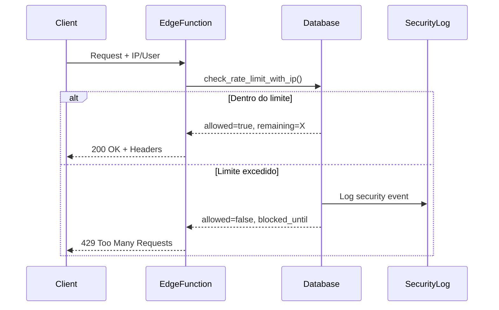

# Sistema de Rate Limiting Unificado

## 📋 Visão Geral

Sistema completo de controle de taxa (rate limiting) para proteger endpoints críticos contra:
- **Ataques de força bruta** (brute force)
- **Abuse de APIs** (scraping massivo)
- **DoS/DDoS** (negação de serviço)
- **Resource exhaustion** (esgotamento de recursos)

## 🏗️ Arquitetura

### Componentes

1. **Banco de Dados** (`rate_limits` table)
   - Armazena contadores por usuário/IP
   - Cleanup automático de registros expirados
   - Índices otimizados para performance

2. **Edge Function** (`rate-limit-check`)
   - Middleware serverless para verificação
   - Extrai IP do cliente automaticamente
   - Retorna headers informativos

3. **Hook React** (`useRateLimiter`)
   - Interface unificada para frontend
   - Presets configurados por tipo de ação
   - Feedback visual automático

4. **Função Database** (`check_rate_limit_with_ip`)
   - Lógica core de rate limiting
   - Suporta user_id (autenticado) e IP (anônimo)
   - Logging de segurança integrado

## ⚙️ Configurações

### Endpoints Críticos

| Endpoint | Tentativas | Janela | Bloqueio | Severidade |
|----------|-----------|--------|----------|------------|
| **Login** | 5 | 15min | 60min | 🔴 Critical |
| **CPF Search** | 10 | 15min | 30min | 🟠 High |
| **File Upload** | 3 | 10min | 60min | 🟡 Medium |
| **Password Reset** | 3 | 60min | 120min | 🟠 High |

### Como Funciona



## 🚀 Uso

### Frontend (React)

```typescript
import { useRateLimiter } from '@/hooks/useRateLimiter';

function MyComponent() {
  const { withRateLimit, lastResult } = useRateLimiter();

  const handleAction = async () => {
    // Opção 1: Usar preset
    const result = await withRateLimit('cpf_search', async () => {
      // Sua ação aqui
      return await searchCPF(cpf);
    });

    // Opção 2: Configuração customizada
    const result2 = await withRateLimit({
      actionType: 'custom_action',
      maxAttempts: 5,
      windowMinutes: 10,
      blockMinutes: 30,
    }, async () => {
      // Sua ação aqui
      return await customAction();
    });

    if (!result) {
      // Rate limit bloqueado - toast já foi exibido automaticamente
      return;
    }

    // Processar resultado normalmente
  };

  return (
    <div>
      {lastResult && (
        <p>Tentativas restantes: {lastResult.remainingAttempts}</p>
      )}
      <button onClick={handleAction}>Executar Ação</button>
    </div>
  );
}
```

### Edge Functions

```typescript
import { createClient } from '@supabase/supabase-js';

Deno.serve(async (req) => {
  const supabase = createClient(url, key);

  // Extrair IP
  const clientIp = req.headers.get('x-forwarded-for')?.split(',')[0].trim();

  // Verificar rate limit
  const { data, error } = await supabase.rpc('check_rate_limit_with_ip', {
    action_type_param: 'my_action',
    ip_address_param: clientIp,
    max_attempts: 5,
    window_minutes: 15,
    block_minutes: 60,
  });

  if (!data.allowed) {
    return new Response(
      JSON.stringify({ error: 'Rate limit exceeded' }),
      { 
        status: 429,
        headers: {
          'Retry-After': data.retry_after_seconds.toString(),
        }
      }
    );
  }

  // Prosseguir com a ação...
});
```

### SQL Direto

```sql
-- Verificar rate limit
SELECT * FROM check_rate_limit_with_ip(
  'custom_action',    -- action_type
  '192.168.1.1'::inet, -- ip_address (NULL para usar auth.uid())
  5,                   -- max_attempts
  15,                  -- window_minutes
  60                   -- block_minutes
);

-- Resultado: 
-- {
--   "allowed": true,
--   "remaining_attempts": 3
-- }
```

## 📊 Headers de Resposta

Todas as respostas incluem headers informativos:

```http
HTTP/1.1 200 OK
X-RateLimit-Limit: 10
X-RateLimit-Remaining: 7
X-RateLimit-Reset: 2025-11-13T05:15:00Z
```

Quando bloqueado:

```http
HTTP/1.1 429 Too Many Requests
Retry-After: 1800
X-RateLimit-Limit: 10
X-RateLimit-Remaining: 0
X-RateLimit-Reset: 2025-11-13T05:30:00Z
```

## 🔒 Segurança

### RLS Policies

```sql
-- Usuários podem ver apenas seus próprios limites
CREATE POLICY "Users can view their own rate limits"
  ON public.rate_limits FOR SELECT
  USING (auth.uid() = user_id);

-- Service role tem acesso total (edge functions)
CREATE POLICY "Service role can manage rate limits"
  ON public.rate_limits FOR ALL
  USING (auth.role() = 'service_role');
```

### Security Logs

Todos os eventos de rate limiting são logados:

```sql
-- Ver eventos recentes
SELECT * FROM security_logs
WHERE event_type IN ('rate_limit_blocked', 'rate_limit_exceeded')
ORDER BY created_at DESC
LIMIT 100;
```

## 🧹 Manutenção

### Cleanup Automático

Trigger automático limpa registros expirados:

```sql
-- Executado após cada INSERT
CREATE TRIGGER trigger_cleanup_rate_limits
  AFTER INSERT ON public.rate_limits
  EXECUTE FUNCTION cleanup_expired_rate_limits();

-- Deleta registros com mais de 24h
DELETE FROM public.rate_limits
WHERE window_start < now() - interval '24 hours'
  AND (blocked_until IS NULL OR blocked_until < now());
```

### Monitoramento

```sql
-- Taxa de bloqueio por ação
SELECT 
  action_type,
  COUNT(*) as total_attempts,
  COUNT(*) FILTER (WHERE blocked_until IS NOT NULL) as blocked,
  ROUND(
    (COUNT(*) FILTER (WHERE blocked_until IS NOT NULL)::numeric / COUNT(*)) * 100, 
    2
  ) as block_rate_percent
FROM rate_limits
WHERE created_at > now() - interval '24 hours'
GROUP BY action_type
ORDER BY blocked DESC;

-- Top IPs bloqueados
SELECT 
  ip_address,
  action_type,
  COUNT(*) as blocks,
  MAX(blocked_until) as last_block
FROM rate_limits
WHERE blocked_until IS NOT NULL
  AND created_at > now() - interval '7 days'
GROUP BY ip_address, action_type
ORDER BY blocks DESC
LIMIT 20;
```

## 📈 Performance

- **Índices otimizados** para queries rápidas
- **Cleanup automático** previne crescimento descontrolado
- **Edge functions** com latência < 100ms
- **Caching** de resultados no cliente

## 🎯 Benefícios

✅ **Proteção contra abuse**
- Brute force attacks bloqueados
- Scraping massivo prevenido
- DoS mitigado

✅ **Experiência do usuário**
- Feedback claro de limites
- Headers informativos
- Retry guidance

✅ **Observabilidade**
- Logs completos de segurança
- Métricas de bloqueio
- Alertas automatizados

✅ **Escalabilidade**
- Performance constante
- Cleanup automático
- Edge functions serverless

## 🔧 Troubleshooting

### Usuário bloqueado indevidamente?

```sql
-- Resetar bloqueio específico
UPDATE rate_limits
SET blocked_until = NULL,
    attempts = 0,
    window_start = now()
WHERE user_id = 'user-uuid'
  AND action_type = 'login';
```

### IP bloqueado permanentemente?

```sql
-- Remover bloqueio de IP
DELETE FROM rate_limits
WHERE ip_address = '192.168.1.1'::inet
  AND action_type = 'cpf_search';
```

### Ajustar limites temporariamente?

```typescript
// No código, usar configuração customizada
await withRateLimit({
  actionType: 'urgent_action',
  maxAttempts: 100, // Aumentar temporariamente
  windowMinutes: 60,
  blockMinutes: 5,
}, async () => {
  // Ação crítica
});
```

## 📚 Referências

- [Documentação Supabase RLS](https://supabase.com/docs/guides/auth/row-level-security)
- [Rate Limiting Best Practices](https://cloud.google.com/architecture/rate-limiting-strategies-techniques)
- [OWASP: Blocking Brute Force Attacks](https://owasp.org/www-community/controls/Blocking_Brute_Force_Attacks)
