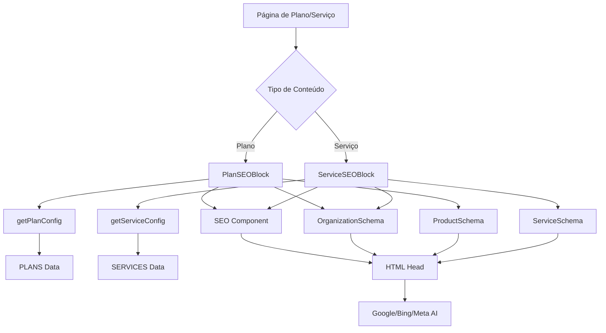
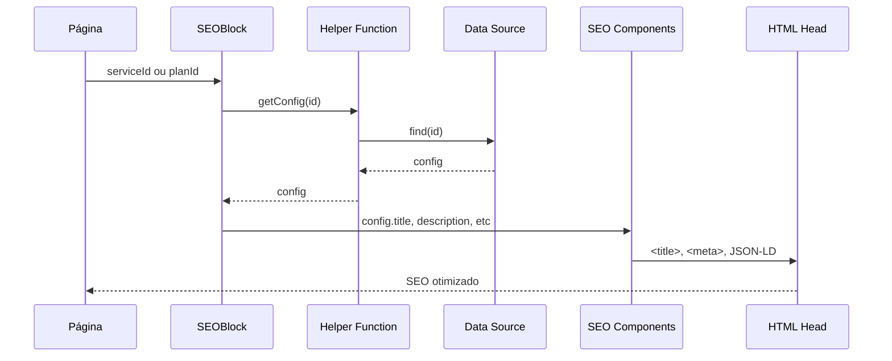
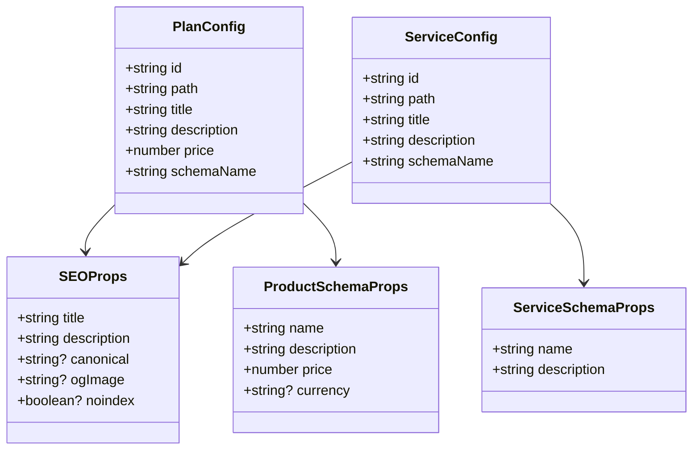
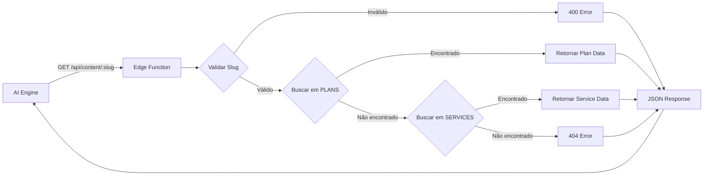
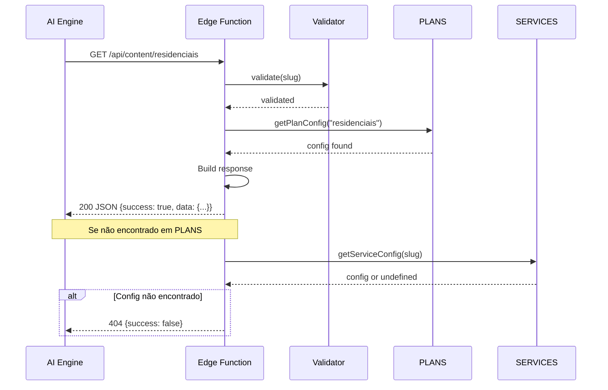
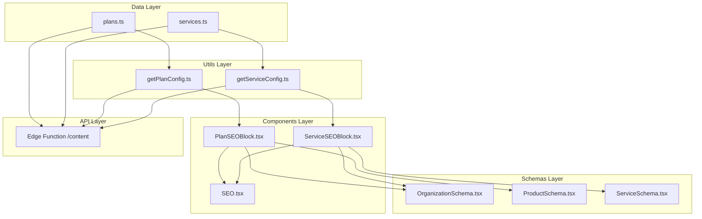
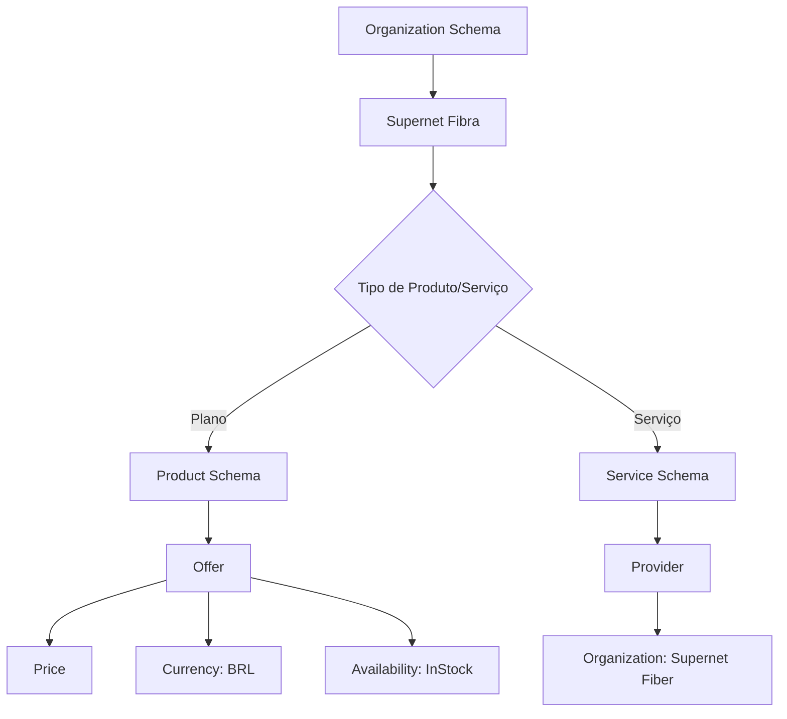
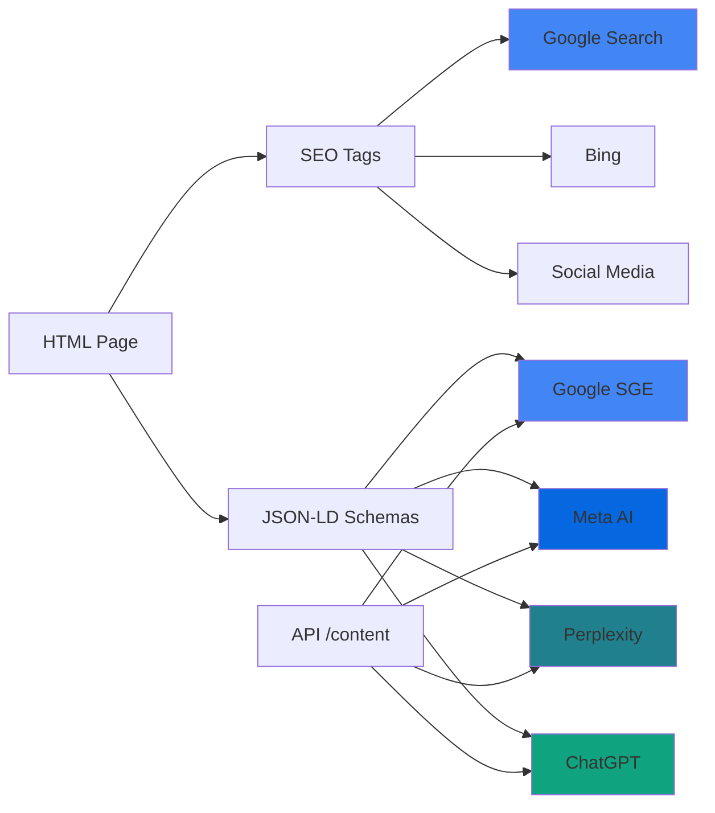

# Arquitetura Visual — Sistema SEO & AEO

## 1. Arquitetura do Sistema de SEO

## 2. Fluxo de Dados - SEO Blocks

## 3. Estrutura de Dados

## 4. API Content Flow

## 5. Fluxo de Requisição AEO API

## 6. Componentes e Dependências

## 7. Schema JSON-LD - Hierarquia

## 8. Integração com Mecanismos de Busca

