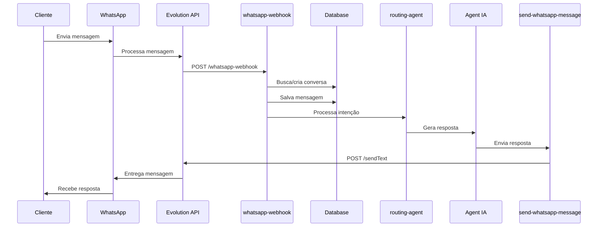
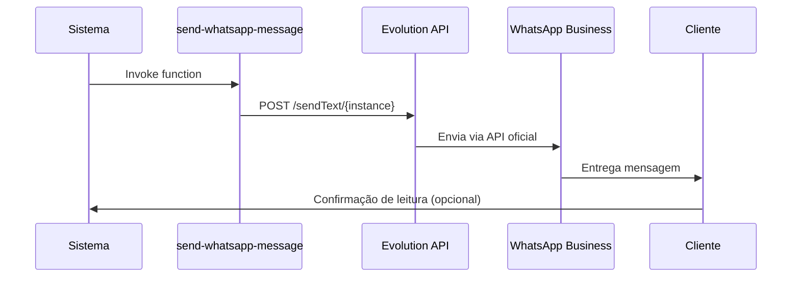

# 📱 Guia de Integração WhatsApp Business

## Visão Geral

Este guia detalha como configurar e usar a integração WhatsApp Business via Evolution API no sistema.

## 🔧 Configuração Inicial

### 1. Credenciais Evolution API

As seguintes credenciais já estão configuradas como secrets:

- **API Key**: `EVOLUTION_API_KEY`
- **Base URL**: `EVOLUTION_API_BASE_URL` → `https://evo.rodolforomao.com.br/`
- **Número**: `EVOLUTION_PHONE_NUMBER` → `5561933008252`
- **Instância**: `SDR2`

### 2. Configurar Webhook na Evolution API

O webhook é essencial para receber mensagens do WhatsApp e processá-las automaticamente.

#### URL do Webhook:
```
https://mxdupkbpxjcfxdgrwknp.supabase.co/functions/v1/whatsapp-webhook
```

#### Passo a Passo:

1. **Acessar Evolution API**
   - URL: https://evo.rodolforomao.com.br/
   - Faça login com suas credenciais

2. **Navegar para Webhooks**
   - Selecione a instância `SDR2`
   - Vá para seção "Webhooks" ou "Configurações"

3. **Adicionar Webhook**
   - Cole a URL do webhook fornecida acima
   - Marque o evento: `messages.upsert`
   - Salve as configurações

4. **Verificar Status**
   - Acesse `/admin/whatsapp-setup` no sistema
   - Clique em "Testar Integração"

## 📊 Componentes do Sistema

### Edge Functions

#### 1. `whatsapp-webhook`
- **Função**: Recebe mensagens do WhatsApp
- **Fluxo**:
  1. Recebe webhook da Evolution API
  2. Extrai dados do cliente (nome, telefone, mensagem)
  3. Busca ou cria conversa no banco
  4. Salva mensagem recebida
  5. Invoca `routing-agent` para processar
  6. Envia resposta via `send-whatsapp-message`

**Código:**
```typescript
// Evento: messages.upsert
const customerPhone = webhook.data.key.remoteJid.replace('@s.whatsapp.net', '');
const customerMessage = webhook.data.message.conversation || 
                       webhook.data.message.extendedTextMessage?.text;
```

#### 2. `send-whatsapp-message`
- **Função**: Envia mensagens WhatsApp
- **Endpoint**: `/message/sendText/{instanceName}`
- **Parâmetros**:
  ```json
  {
    "phone": "5561999999999",
    "message": "Olá! Como posso ajudar?",
    "instanceName": "SDR2"
  }
  ```

### Tabelas do Banco

#### `conversations`
```sql
- id: UUID
- customer_name: TEXT
- customer_phone: TEXT (único por canal)
- customer_email: TEXT
- channel: TEXT ('whatsapp', 'webchat', 'email')
- status: TEXT ('active', 'waiting', 'resolved', 'closed')
- department: TEXT
- assigned_agent_id: UUID
- last_message_at: TIMESTAMP
```

#### `conversation_messages`
```sql
- id: UUID
- conversation_id: UUID (FK)
- sender_type: TEXT ('customer', 'agent', 'ai')
- content: TEXT
- created_at: TIMESTAMP
```

### Componentes UI

#### 1. `WhatsAppSetup`
- **Rota**: `/admin/whatsapp-setup`
- **Recursos**:
  - Verificar status da instância
  - Guia de configuração do webhook
  - Teste de integração
  - Status em tempo real

#### 2. `WhatsAppConversations`
- **Rota**: `/admin/whatsapp`
- **Recursos**:
  - Lista de conversas WhatsApp
  - Filtro por status
  - Histórico de mensagens
  - Real-time updates

#### 3. `WhatsAppTester`
- **Rota**: `/admin/whatsapp-test`
- **Recursos**:
  - Enviar mensagens de teste
  - Testar diferentes instâncias
  - Verificar formato de mensagens

## 🔄 Fluxo de Mensagens

### Recebimento (Cliente → Sistema)



### Envio (Sistema → Cliente)



## 🧪 Testando a Integração

### 1. Teste Básico de Envio
```typescript
await supabase.functions.invoke('send-whatsapp-message', {
  body: {
    phone: "5561999999999",
    message: "Teste de mensagem",
    instanceName: "SDR2"
  }
});
```

### 2. Teste de Webhook
1. Configure o webhook na Evolution API
2. Envie uma mensagem para o número do WhatsApp Business
3. Verifique se a mensagem aparece em `/admin/whatsapp`
4. Verifique se o sistema respondeu automaticamente

### 3. Teste de Agentes
1. Configure os agentes em `/admin/agents`
2. Envie mensagens com diferentes intenções:
   - "Quero contratar" → Sales Agent
   - "Problemas com internet" → Support Tech Agent
   - "Boleto atrasado" → Support Financial Agent

## 🚨 Troubleshooting

### Erro: Circuit Breaker OPEN
**Causa**: Muitas tentativas falhas na Evolution API  
**Solução**: Aguarde 60 segundos ou reset manual em `/admin/ixc-integration`

### Erro: "Webhook não configurado"
**Causa**: Webhook não foi adicionado na Evolution API  
**Solução**: Siga o passo a passo em "Configurar Webhook"

### Erro: "Instance not found"
**Causa**: Nome da instância incorreto  
**Solução**: Verifique se o nome é exatamente `SDR2`

### Mensagens não chegam
**Verificações**:
1. Status da instância em `/admin/whatsapp-setup`
2. Webhook configurado corretamente
3. Logs da edge function `whatsapp-webhook`
4. Número formatado corretamente (DDI + DDD + Número)

## 📈 Monitoramento

### Logs de Edge Functions
```bash
# Ver logs do webhook
supabase functions logs whatsapp-webhook

# Ver logs de envio
supabase functions logs send-whatsapp-message
```

### Métricas Importantes
- Taxa de resposta automática
- Tempo médio de resposta
- Conversas ativas por agente
- Erros de integração

## 🔐 Segurança

### Secrets Management
- Todos os secrets são armazenados no Supabase
- Nunca exponha API keys no código frontend
- Use `verify_jwt = false` apenas para webhooks públicos

### Validação de Webhook
- Verifique origem das requisições
- Valide formato dos dados recebidos
- Implemente rate limiting se necessário

## 📚 Recursos Adicionais

- [Evolution API Docs](https://doc.evolution-api.com/)
- [WhatsApp Business API](https://developers.facebook.com/docs/whatsapp)
- [Supabase Edge Functions](https://supabase.com/docs/guides/functions)

---

**Status da Integração**: ✅ Pronto para uso  
**Última Atualização**: 2025-01-09
